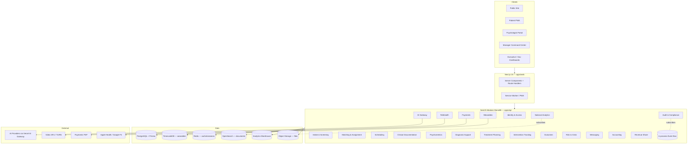

# 00 — Architecture Overview

## 1. Architectural thesis

VPSY OS is a **modular monolith** organized as a set of **Domain-Driven-Design bounded contexts**, each implemented with **hexagonal (ports-and-adapters) architecture**, communicating in-process through a **typed event bus** that is abstracted so any context can later be extracted into an independent service with zero domain-logic changes.

This choice is deliberate:

- **Country-scale, but one team to start.** A microservice fleet on day one buys distributed-systems tax (network partitions, eventual consistency, cross-service transactions) with no organizational benefit yet.
- **Clinical safety demands strong consistency.** Assignment, risk escalation, consent, and payment flows must be transactional. A modular monolith gives us ACID where it matters and events where it doesn't.
- **Extraction must be mechanical.** By enforcing context boundaries in code (no cross-context imports of internals; interaction only through published contracts and events), the day we need to scale Telehealth or National Analytics independently, we lift a module out — we do not untangle a big ball of mud.



## 2. Layered / hexagonal structure of a context

Every bounded context follows the same internal shape. Using **Intake & Screening** as the worked example:

```
apps/api/src/modules/intake/
├── domain/                  # Pure domain — no framework, no I/O
│   ├── entities/            # Intake, ScreeningResult (aggregates)
│   ├── value-objects/       # RiskScore, SeverityBand, UrgencyScore
│   ├── events/              # IntakeSubmitted, RiskFlagRaised
│   └── ports/               # Interfaces the domain needs (repos, clock, ai-port)
├── application/             # Use cases orchestrating the domain
│   ├── submit-intake.usecase.ts
│   ├── run-screening.usecase.ts
│   └── request-assignment.usecase.ts
├── infrastructure/          # Adapters implementing the ports
│   ├── prisma-intake.repository.ts
│   ├── ai-gateway.adapter.ts
│   └── event-bus.publisher.ts
└── interface/               # Inbound adapters
    ├── intake.controller.ts # HTTP
    └── intake.subscriber.ts # reacts to events from other contexts
```

**Dependency rule:** `interface → application → domain ← infrastructure`. The domain depends on nothing. Adapters depend inward. This is what makes the module portable and unit-testable without a database.

## 3. Communication patterns

| Pattern | When used | Mechanism |
|---------|-----------|-----------|
| **Synchronous command** | Same-transaction, must-succeed-together (submit intake, take payment, approve assignment) | Direct application-service call within a request/DB transaction |
| **Domain event** | "This happened; others may care" (IntakeSubmitted → Matching prepares candidates; RiskFlagRaised → Risk context + Audit + Notifications) | Typed in-process event bus, transactional outbox for durability |
| **Query** | Read models / dashboards | CQRS-style read repositories, some backed by the analytics warehouse |
| **External integration** | LLM, video, PSP, wearables | Anti-corruption-layer adapters behind ports |

### Transactional outbox

Events are written to an `outbox` table **in the same DB transaction** as the state change, then relayed to subscribers by a poller. This guarantees "state changed ⇔ event emitted" — critical for audit completeness and for the future NATS extraction (the relay just changes its target).

## 4. Multi-tenancy model

VPSY is multi-tenant at **country → clinic-network → clinic** granularity.

- **Isolation strategy:** shared database, shared schema, **row-level tenancy** enforced by a mandatory `tenantId` on every tenant-scoped table **plus Postgres Row-Level Security (RLS)** policies as defense-in-depth. A tenant context is derived from the authenticated principal and injected into every repository; RLS is the backstop if application code ever forgets.
- **Data residency:** country tenants can be pinned to region-specific database clusters (EU data stays in EU) via a tenant→region routing map. The Prisma client is resolved per-region.
- **Noisy-neighbour & scale:** heavy tenants (national deployments) can be promoted to a dedicated database with no code change — the same RLS + routing abstraction applies.

## 5. Read vs write paths (CQRS-lite)

We do **not** adopt full event-sourcing (clinical records need a canonical mutable-but-audited store). We adopt **CQRS-lite**:

- **Write path:** normalized Prisma aggregates, ACID, emits events.
- **Read path:** purpose-built read models — patient timeline, manager triage board, executive KPIs — materialized from events into denormalized tables / the warehouse for fast dashboards.
- **Analytics path:** de-identified projections stream to the warehouse for National Analytics; no PHI leaves the operational store un-tokenized.

## 6. AI as a bounded context, not a library

The **AI Gateway** is its own context and its own deployable seam. Rules:

- **No AI code touches the database directly.** It receives PHI-minimized, purpose-scoped payloads through ports and returns *suggestions*.
- **Every inference is logged** (`AIRecommendation` + `AIModelVersion`) with prompt version, model version, inputs hash, and the human decision that followed.
- **CDS-Hooks-style triggers:** AI surfaces at workflow moments — open case, review assessment, write note, update plan, handle risk — never as an always-on autonomous actor.

## 7. Non-functional targets

| Concern | Target |
|---------|--------|
| Availability (clinical core) | 99.9% (three nines) |
| Session-join latency (telehealth) | < 2s median to media flowing |
| Risk-flag propagation | < 1s intake-submit → manager risk board |
| Read-dashboard p95 | < 400ms |
| RPO / RTO | RPO ≤ 5 min, RTO ≤ 30 min |
| Audit completeness | 100% of clinical mutations produce an event |
| PHI at rest | AES-256; PHI in transit TLS 1.2+ |

## 8. Why this scales to "national infrastructure"

The path from a two-clinician pilot to a national deployment is a **configuration and topology** change, not an architecture change:

1. **Pilot** — single region, single DB, all modules in one process.
2. **Growth** — read replicas, Redis cache, warehouse for dashboards.
3. **National** — per-country DB clusters (residency), extract Telehealth + National Analytics + AI Gateway into their own deployments (the event bus becomes NATS), OpenSearch cluster for document scale.

Each step is unlocked by the boundaries we enforce on day one.
