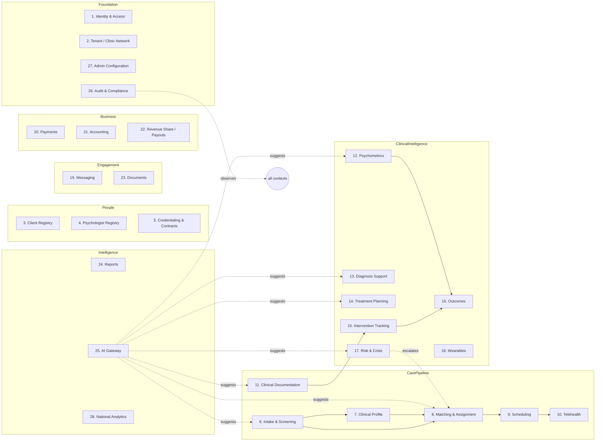
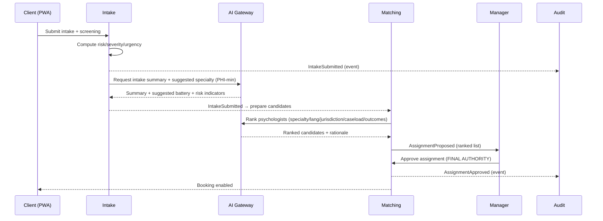

# 01 — Bounded Contexts

> **Canonical numbering:** context **numbers** in this document are historical and were later superseded. The authoritative numbering is the **30-context scheme in [`13-roadmap-and-phases.md`](13-roadmap-and-phases.md)**, which `BUILD-STATUS.md` and `10-10-PROGRAM.md` key off. When a task or status references "context N," use the roadmap's numbering — not the numbers in the map below. (Reconciling the two schemes into one shared table is a tracked doc task.)

VPSY OS is decomposed into **~30 bounded contexts**. Each is a hard module boundary in `apps/api/src/modules/<context>`. Contexts never import each other's internals — they interact only via published contracts (`packages/contracts`) and domain events.

## Context map

## Context catalogue

Legend — **Kind:** `Core` (competitive differentiator), `Supporting` (needed, not differentiating), `Generic` (buy/adapt).

| # | Context | Kind | Core responsibility | Key aggregates | Emits |
|---|---------|------|---------------------|----------------|-------|
| 1 | **Identity & Access** | Generic | AuthN, sessions, 2FA, RBAC/ABAC decisioning | User, Role, Permission, Session | UserRegistered, RoleAssigned |
| 2 | **Tenant / Clinic Network** | Supporting | Country/network/clinic hierarchy, residency routing, tenant config | Tenant, Clinic, ClinicNetwork | ClinicCreated, ResidencyChanged |
| 3 | **Client Registry** | Core | Client master record, demographics, contacts, consents | Client, EmergencyContact, Consent | ClientRegistered, ConsentGranted |
| 4 | **Psychologist Registry** | Core | Clinician profiles, specialties, languages, availability metadata | Psychologist, Specialty | PsychologistOnboarded |
| 5 | **Credentialing & Contracts** | Core | License verification, jurisdiction, malpractice, contract & compensation terms | Credential, Contract, RevenueShareRule | CredentialVerified, ContractActivated |
| 6 | **Intake & Screening** | Core | Presenting problem, symptom/risk screening, substance/trauma screens | Intake, ScreeningResult | IntakeSubmitted, RiskFlagRaised |
| 7 | **Clinical Profile** | Core | Goals, preferences, severity/urgency, suitability for virtual care | ClinicalProfile | ProfileCompiled |
| 8 | **Matching & Assignment** | Core | AI-ranked psychologist candidates; **manager is final authority** | Assignment, MatchCandidate | AssignmentProposed, AssignmentApproved |
| 9 | **Scheduling** | Supporting | Availability, booking, recurrence, time-zone, waitlist, no-show rules | Appointment, AvailabilitySlot | AppointmentBooked, NoShowRecorded |
| 10 | **Telehealth** | Supporting | Secure video/audio sessions, waiting room, session lifecycle | Session, WaitingRoomTicket | SessionStarted, SessionEnded |
| 11 | **Clinical Documentation** | Core | Session notes, formulation, continuity summaries (FHIR-aligned) | SessionNote, Formulation | NoteSigned |
| 12 | **Psychometrics** | Core | Questionnaires, IRT/CAT, norms, validity, longitudinal scoring | Questionnaire, QuestionnaireResponse, PsychometricScore, ItemBank | AssessmentScored |
| 13 | **Diagnosis Support** | Core | *Non-diagnostic* differential hypotheses, referral flags | DiagnosisHypothesis | HypothesisSuggested |
| 14 | **Treatment Planning** | Core | Problem list, goals, intervention plan, review cadence | TreatmentPlan, Goal | PlanActivated, GoalUpdated |
| 15 | **Intervention Tracking** | Core | Every intervention, modality, rationale, response, effectiveness | Intervention, Homework | InterventionDelivered |
| 16 | **Outcomes** | Core | Symptom trends, response, dropout/deterioration/relapse risk | OutcomeMeasure, OutcomeTrend | OutcomeRecorded, DeteriorationDetected |
| 17 | **Risk & Crisis** | Core | SI/HI/self-harm/abuse/psychosis flags → **human escalation** | RiskFlag, Escalation, SafetyPlan | EscalationOpened, EscalationResolved |
| 18 | **Wearables** | Supporting | Physiological signals as *context*, not diagnosis | WearableDevice, WearableMetric | MetricIngested, ArousalPatternDetected |
| 19 | **Messaging** | Generic | Secure clinician↔client messaging, notifications | Thread, Message | MessageSent |
| 20 | **Payments** | Generic | Invoices, session/package billing, subscriptions, refunds | Invoice, Payment | PaymentCaptured, RefundIssued |
| 21 | **Accounting** | Supporting | Ledger, chart of accounts, AR/AP, revenue recognition, tax | AccountingEntry, LedgerAccount | EntryPosted |
| 22 | **Revenue Share / Payouts** | Core | Compensation computation and clinician payouts | Payout, RevenueShareRule | PayoutComputed, PayoutReleased |
| 23 | **Documents** | Generic | Secure uploads, reports, file lifecycle | Document | DocumentUploaded |
| 24 | **Reports** | Supporting | Client/psychologist/manager/executive/national reporting | Report | ReportGenerated |
| 25 | **AI Gateway** | Core | Governed inference for all 8 AI agents, PHI-safe, audited | AIRecommendation, AIModelVersion, PromptVersion | RecommendationProduced |
| 26 | **Audit & Compliance** | Core | Tamper-evident audit log, consent versioning, compliance evidence | AuditEvent | (terminal sink) |
| 27 | **Admin Configuration** | Supporting | Feature flags, catalogs, specialty taxonomy, config | ConfigEntry, FeatureFlag | ConfigChanged |
| 28 | **National Analytics** | Core | De-identified population mental-health intelligence | PopulationMetric | (read model) |
| 29 | **CRM & Referrals** | Core | Leads, referrers (doctors/schools/employers/courts/institutions), acquisition pipeline, campaigns, engagement + unified communication history | Lead, Referrer, Campaign, PipelineStage, EngagementActivity | LeadCaptured, ReferralReceived, LeadConverted |
| 30 | **Communications Hub** | Supporting | Telephony (SIP/IP phones), SMS/text hubs, inbound/outbound + click-to-call, provider abstraction, unified comms log; async voice/video messages | PhoneNumber, CallSession, SmsMessage, MediaMessage | CallCompleted, SmsDelivered, MediaMessageSent |

> **Telehealth (12) is in-house real-time A/V:** a self-hosted **WebRTC SFU** (mediasoup/LiveKit-class) for video *and* voice calls, waiting room, and network-adaptive fallback — not a third-party embed. See `docs/technical/08-telehealth-and-realtime.md`.
>
> **Messaging (14) carries async media:** `MediaMessage` lets a client and psychologist exchange **offline (store-and-forward) voice and video messages** — recorded, encrypted at rest, consent-scoped, delivered when the recipient is next online, with optional transcript. See `docs/technical/15-communications-and-telephony.md`.

## Interaction contracts (selected)

### Intake → Matching → Manager (the spine)

### Risk escalation (safety-critical, synchronous)

`RiskFlagRaised` is **never** handled by AI counseling. It synchronously opens an `Escalation`, notifies the on-call manager/clinician, and writes an immutable audit trail. AI's role is limited to *detection surfacing* with confidence and quoted evidence.

## Boundary rules (enforced in code + CI)

1. A module may import from `packages/contracts` and `packages/database` — never from another module's `domain/`, `application/`, or `infrastructure/`.
2. Cross-context effects go through the event bus or a published application-service interface only.
3. Shared vocabulary lives in `packages/contracts` as DTOs + zod schemas; there is **no** shared mutable domain model across contexts (each context owns its interpretation).
4. An ESLint boundary rule + dependency-cruiser check fails CI on any illegal cross-context import.
