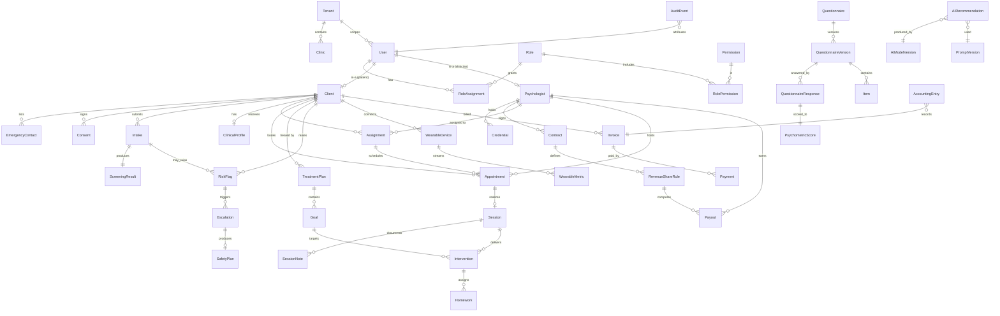

# 02 — Data Model

The canonical schema lives in [`packages/database/prisma/schema.prisma`](../../packages/database/prisma/schema.prisma). This document explains the **backbone** — the ~50 core entities, their relationships, and the conventions every table obeys.

## Universal conventions

Every table carries these unless explicitly exempt:

| Column | Type | Purpose |
|--------|------|---------|
| `id` | `cuid` | Opaque primary key (never expose sequential IDs) |
| `tenantId` | FK → Tenant | Row-level tenancy; enforced by app + Postgres RLS |
| `createdAt` / `updatedAt` | timestamptz | Lifecycle |
| `deletedAt` | timestamptz? | Soft delete (clinical data is retained, never hard-deleted) |
| `createdBy` / `updatedBy` | FK → User | Attribution for audit |

**Clinical mutations are append-friendly:** notes, assessments, and interventions are versioned rather than overwritten where clinical/legal integrity requires it. The `AuditEvent` table is strictly append-only and hash-chained.

## Domain map

## Entity groups

### Group A — Identity, Tenancy, Access
- **Tenant** — country/network root. `residencyRegion`, `config` (JSON), `status`.
- **Clinic** — a clinic within a tenant; `timezone`, `type` (virtual|physical|hybrid).
- **User** — the auth principal; `email`, `phone`, `hashedPassword`, `mfaEnabled`, `locale`, `timezone`, `status`. A User may project into a Client and/or Psychologist.
- **Role** / **Permission** / **RolePermission** / **RoleAssignment** — RBAC. Roles: `CLIENT, PSYCHOLOGIST, MANAGER, SUPERVISOR, ADMIN, FINANCE, EXECUTIVE, GOVERNMENT`. Permissions are `context:action` strings (e.g. `assignment:approve`). ABAC attributes ride on the assignment (`jurisdiction`, `clinicId`).

### Group B — People
- **Client** — patient master record: `demographics` (JSON: dob, sex, gender, address), `riskLevel`, `preferredLanguage`, `culturalContext`, `status`.
- **EmergencyContact** — name, relation, phone, `isPrimary`.
- **Consent** — `type` (`TELEPSYCHOLOGY, DATA_PROCESSING, RECORDING, RESEARCH, CRISIS_POLICY`), `version`, `grantedAt`, `revokedAt`, `documentUrl`. **Versioned** — a new consent version supersedes but never deletes the prior.
- **Psychologist** — clinician profile: `specialties[]`, `languages[]`, `bio`, `yearsExperience`, `acceptingClients`, `caseloadCap`, `outcomeIndex`.
- **Credential** — `licenseNumber`, `jurisdiction`, `issuingBody`, `expiresAt`, `verificationStatus`, `malpracticeStatus`.
- **Contract** — `type` (`SALARY, PER_SESSION, REVENUE_SHARE, TIERED_COMMISSION`), `baseRate`, `commissionPct`, `equityGrant`, `supervisorId`, `effectiveFrom/To`, `status`.

### Group C — Care pipeline
- **Intake** — `presentingProblem`, `symptomHistory` (JSON), `medicationHistory`, `substanceUseScreen` (JSON), `traumaExposure`, `previousTherapy`, `functionalImpairment` (JSON), `status`.
- **ScreeningResult** — computed: `riskScore`, `severityBand` (`LOW|MODERATE|HIGH|SEVERE`), `urgencyScore`, `suggestedSpecialty`, `virtualCareSuitable`, `contraindications[]`, `aiSummaryId`.
- **ClinicalProfile** — `goals[]`, `preferredTherapistGender/Language/Style`, `therapyFormat` (`INDIVIDUAL|COUPLE|FAMILY|GROUP`), `severityEstimate`, `culturalReligiousNotes`.
- **Assignment** — `clientId`, `psychologistId?`, `status` (`PROPOSED|APPROVED|ACTIVE|TRANSFERRED|CLOSED`), `proposedBy` (`AI`), `approvedBy` (Manager `User`), `candidates` (JSON ranked list + rationale), `rank`.
- **Appointment** — `assignmentId`, `startsAt`, `endsAt`, `timezone`, `format`, `status` (`BOOKED|CONFIRMED|COMPLETED|NO_SHOW|CANCELLED`), `recurrenceRule`, `isUrgent`.
- **AvailabilitySlot** — psychologist availability windows for booking optimization.
- **Session** — realization of an appointment: `startedAt`, `endedAt`, `modality` (`VIDEO|AUDIO|IN_PERSON`), `waitingRoomJoinedAt`, `emergencyLocationConfirmed`, `recordingConsentId?`, `recordingUrl?`.
- **SessionNote** — `session`, `content` (structured JSON: SOAP/DAP), `signedAt`, `signedBy`, `version`, `continuitySummary`. Immutable once signed; edits create a new version.
- **Formulation** — case formulation linked to a client, AI-assisted, clinician-owned.

### Group D — Clinical intelligence
- **DiagnosisHypothesis** — `client`, `hypothesis` (text using non-diagnostic language), `confidence`, `evidence[]`, `referralFlags[]`, `clinicianConfirmed` (bool), `aiRecommendationId`. **Never** a definitive diagnosis field; this is a support artifact.
- **TreatmentPlan** — `client`, `problemList` (JSON), `sessionFrequency`, `measurementSchedule`, `riskPlan`, `reviewDate`, `status`, `version`.
- **Goal** — `plan`, `description`, `targetMetric`, `baseline`, `target`, `status`, `progressPct`.
- **Intervention** — the differentiator object: `session?`, `clinicalTarget`, `type` (`CBT|DBT|ACT|SCHEMA|EMDR_REFERRAL|EXPOSURE|BEHAVIORAL_ACTIVATION|MINDFULNESS|PSYCHOEDUCATION|SLEEP_HYGIENE|COUPLES|FAMILY|CRISIS_SAFETY|RELAPSE_PREVENTION`), `modality`, `durationMin`, `rationale`, `clientResponse`, `outcomeMeasureId?`, `followUpDate`, `effectivenessRating`, `adverseEffects`, `aiRecommendationId?`, `clinicianApproved`.
- **Homework** — `intervention`, `description`, `dueDate`, `completionPct`, `clientReport`.
- **OutcomeMeasure** / **OutcomeTrend** — point-in-time and windowed symptom/response metrics; `dropoutRisk`, `deteriorationRisk`, `relapseRisk`, `therapeuticResponse`.
- **RiskFlag** — `client`, `intake?`, `type` (`SUICIDAL_IDEATION|SELF_HARM|HOMICIDAL|DOMESTIC_VIOLENCE|ABUSE_NEGLECT|PSYCHOSIS|MANIA|SEVERE_SUBSTANCE|MEDICAL_EMERGENCY`), `severity`, `source` (`SCREENING|AI|CLINICIAN|WEARABLE`), `evidence`, `status`.
- **Escalation** — `riskFlag`, `openedAt`, `assignedTo`, `resolvedAt`, `resolution`, `slaBreached`.
- **SafetyPlan** — `client`, `warningSigns[]`, `copingStrategies[]`, `supportContacts[]`, `professionalContacts[]`, `environmentSafety`, `version`.

### Group E — Psychometrics
- **ItemBank** — a calibrated pool for a construct (e.g. depression). `construct`, `irtModel` (`RASCH|2PL|3PL|GRM`), `language`.
- **Item** — `itemBank`, `stem`, `responseOptions` (JSON), `discrimination` (a), `difficulty` (b), `guessing` (c), `dif` (JSON), `active`.
- **Questionnaire** — logical instrument (e.g. "PHQ-style depression screen"), `licensing` (`PUBLIC_DOMAIN|LICENSED|PROPRIETARY`), `scoringMethod` (`CLASSICAL|IRT|CAT`).
- **QuestionnaireVersion** — a published, frozen version; `norms` (JSON), `cutoffs` (JSON), `validityScales` (JSON), `items[]`.
- **QuestionnaireResponse** — the FHIR-aligned source-of-truth snapshot: `answers` (JSON), `completedAt`, `administrationMode` (`STATIC|CAT`), `validityFlags`, `responseTimeMs`.
- **PsychometricScore** — computed: `rawScore`, `thetaEstimate`, `standardError`, `percentile`, `severityBand`, `interpretation` (clinician-facing), `reliabilityAtTheta`.

### Group F — Engagement & documents
- **Thread** / **Message** — secure messaging (`senderId`, `body` encrypted-at-rest, `readAt`).
- **Document** — `ownerType`, `ownerId`, `category`, `storageKey`, `mimeType`, `sizeBytes`, `virusScanStatus`.
- **Report** — `type`, `scope` (client|psychologist|manager|executive|national), `parameters`, `generatedAt`, `storageKey`.

### Group G — Business & finance
- **Invoice** — `client`, `lineItems` (JSON), `amount`, `currency`, `status` (`DRAFT|OPEN|PAID|REFUNDED|VOID`), `dueDate`, `packageId?`, `subscriptionId?`.
- **Payment** — `invoice`, `amount`, `method`, `pspRef`, `status`, `capturedAt`.
- **AccountingEntry** — double-entry: `ledgerAccount`, `debit`, `credit`, `invoiceId?`, `payoutId?`, `postedAt`. Money is `Decimal(18,4)` — **never floats**.
- **LedgerAccount** — chart of accounts node.
- **RevenueShareRule** — `contract`, `basis` (`SESSION|REVENUE|GROUP_SPLIT`), `pct`, `seniorOverridePct`, `supervisorSharePct`, `clinicSharePct`, `referralSharePct`, `countryRules` (JSON).
- **Payout** — `psychologist`, `period`, `computedAmount`, `rulesApplied` (JSON), `status`, `releasedAt`.

### Group H — AI, audit, compliance, analytics
- **AIModelVersion** — `provider`, `model`, `version`, `capability`, `activatedAt`, `evalMetrics` (JSON).
- **PromptVersion** — `agent`, `version`, `template`, `guardrails` (JSON), `activatedAt`.
- **AIRecommendation** — `agent` (the 8 agent types), `inputHash`, `output` (JSON), `confidence`, `modelVersionId`, `promptVersionId`, `humanDecision` (`ACCEPTED|MODIFIED|REJECTED|PENDING`), `decidedBy`, `linkedEntityType/Id`.
- **AuditEvent** — `actorId`, `action`, `entityType`, `entityId`, `before`/`after` (JSON, PHI-tokenized), `ip`, `userAgent`, `prevHash`, `hash` (SHA-256 chain), `occurredAt`. **Append-only.**
- **PopulationMetric** — de-identified aggregate for National Analytics: `region`, `metric`, `value`, `window`, `cohortSize` (k-anonymity floor enforced).

### Group I — CRM, Communications & Async Media
- **Lead** — a prospective client before registration: `source` (`WEB|REFERRAL|CAMPAIGN|INSTITUTION`), `contact` (JSON), `presentingInterest`, `pipelineStageId`, `ownerId`, `status`. Converts into a `Client`.
- **Referrer** — an external referring entity: `type` (`DOCTOR|SCHOOL|EMPLOYER|COURT|INSTITUTION|SELF`), `organizationName`, `contact` (JSON), `agreementId?`. Referrals are attributed for reporting and revenue share.
- **Campaign** — an acquisition/engagement campaign: `channel`, `audience`, `startsAt/endsAt`, `metrics` (JSON).
- **PipelineStage** — configurable CRM funnel stage (`order`, `name`, `isWon`, `isLost`).
- **EngagementActivity** — a unified timeline item across CRM + comms: `subjectType/Id`, `kind` (`CALL|SMS|EMAIL|MEDIA_MESSAGE|NOTE|MEETING`), `direction` (`INBOUND|OUTBOUND`), `summary`, `occurredAt`, `actorId`.
- **PhoneNumber** — a provisioned number: `e164`, `provider` (`sip|twilio|vonage|self_hosted`), `capabilities[]` (`VOICE|SMS`), `assignedTo?` (clinic/user).
- **CallSession** — a telephony call log (SIP/IP phone or click-to-call): `direction`, `fromE164`, `toE164`, `clientId?`, `psychologistId?`, `startedAt`, `endedAt`, `durationSec`, `status`, `recordingConsentId?`, `recordingStorageKey?`, `providerRef`.
- **SmsMessage** — an SMS via a text hub: `direction`, `toE164`, `fromE164`, `body`, `status` (`QUEUED|SENT|DELIVERED|FAILED`), `providerRef`, `templateId?`, `clientId?`.
- **MediaMessage** — **async (store-and-forward) voice/video message** between client and psychologist: `threadId`, `senderId`, `kind` (`VOICE|VIDEO`), `storageKey` (encrypted at rest), `durationSec`, `mimeType`, `transcript?`, `sizeBytes`, `deliveredAt?`, `readAt?`, `consentId?`. Consent-scoped; PHI-encrypted; retention-governed.

> **Real-time A/V (Telehealth 12)** does not add persistent media by default — a `Session` gains `mediaRoomId`, `sfuRegion`, and `connectionQuality` (JSON); a recording is written only when `recordingConsentId` is present (see `08-telehealth-and-realtime.md`).

## Enumerations (selected)

See `schema.prisma` for the authoritative list. Key clinical enums (`RiskType`, `InterventionType`, `SeverityBand`, `AssignmentStatus`, `ConsentType`) are shared with the frontend via `packages/contracts` so UI and DB never drift.

## Indexing & performance notes

- Composite index `(tenantId, status)` on every workqueue table (Intake, Assignment, RiskFlag, Escalation) — powers manager boards.
- `(clientId, occurredAt)` on Session, OutcomeMeasure, WearableMetric — powers patient timelines.
- Wearable metrics live in **TimescaleDB hypertables** partitioned by time; only device registry + rollups live in Postgres.
- `AuditEvent` is partitioned monthly and never updated.
