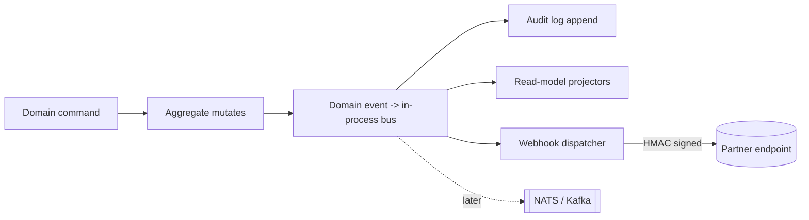

# 04 — API Design

> VPSY OS public and internal API surface. This document is the contract that every
> bounded context implements and every client (web PWA, mobile, partner integration,
> AI gateway) consumes.

## 1. Design principles

1. **Resource-oriented REST over HTTP/1.1 and HTTP/2**, JSON by default, with a
   FHIR-compatible projection for clinical resources (`Observation`,
   `QuestionnaireResponse`, `CarePlan`).
2. **Tenant-first**. Every request is scoped to exactly one tenant (organization).
   The tenant is resolved from the auth token and cross-checked against an explicit
   header. Cross-tenant reads are impossible by construction.
3. **AI assists, clinicians decide.** No endpoint mutates a clinical record as a
   direct result of a model output. AI outputs are *proposals* that require a
   licensed clinician to approve (see `05-ai-clinical-layer.md`).
4. **Everything auditable.** Any state change on a clinical, financial, or consent
   resource emits a domain event that is persisted to the append-only audit log.
5. **Predictable and boring.** Consistent naming, consistent envelopes, consistent
   errors. Surprises are bugs.

## 2. Base URL, versioning, and content negotiation

```
https://api.vpsy.health/v1/{resource}
```

- **Versioning** is in the URL path (`/v1`, `/v2`). We use URL versioning rather
  than header versioning because it is cache-friendly, explicit in logs, and trivial
  to route at the gateway. Breaking changes bump the major version. Additive changes
  (new optional fields, new endpoints) do **not** bump the version.
- **Deprecation policy**: a version is supported for a minimum of 18 months after its
  successor ships. Deprecated endpoints return `Deprecation` and `Sunset` headers
  (RFC 8594) plus a `Link` header pointing at migration docs.
- **Content types**: request and response bodies are `application/json`. Clinical
  resources may be requested as `application/fhir+json` via the `Accept` header,
  which returns the US-Core-profiled representation.

```http
GET /v1/questionnaire-responses/qr_01H... HTTP/2
Accept: application/fhir+json
```

## 3. Resource naming conventions

- Collections are **plural, kebab-case nouns**: `/intake-requests`,
  `/session-notes`, `/psychometric-scores`.
- Resource identifiers are **prefixed ULIDs** so the type is legible in logs and
  errors: `pat_01HZ...` (patient/client), `case_01HZ...`, `sess_01HZ...`,
  `qr_01HZ...` (questionnaire response), `pay_01HZ...`.
- Sub-resources nest one level deep maximum: `/cases/{caseId}/notes`. Beyond one
  level we use top-level collections with filters (`/session-notes?caseId=...`).
- Actions that are not naturally CRUD use a **`:verb` suffix** (Google AIP style)
  rather than inventing RPC endpoints: `POST /cases/{id}:assign`,
  `POST /sessions/{id}:start`, `POST /ai-recommendations/{id}:approve`.

| HTTP verb | Semantics |
|-----------|-----------|
| `GET`     | Safe, idempotent read. Never mutates. |
| `POST`    | Create a resource, or invoke a `:verb` action. |
| `PUT`     | Full replacement of a resource (rare; mostly config). |
| `PATCH`   | Partial update using JSON Merge Patch (RFC 7386). |
| `DELETE`  | Soft-delete (sets `deletedAt`); hard-delete is an admin-only ops path. |

## 4. Standard request headers

| Header | Required | Purpose |
|--------|----------|---------|
| `Authorization: Bearer <jwt>` | yes | OIDC access token. Carries `sub`, `tenant_id`, `roles`, `scopes`. |
| `X-VPSY-Tenant` | yes | Tenant ULID. Must equal the `tenant_id` claim in the token, else `403`. |
| `X-Request-Id` | no | Client-supplied trace id; echoed back and used in OpenTelemetry spans. If absent the gateway generates one. |
| `Idempotency-Key` | conditional | Required on all non-idempotent `POST` that create money movement, clinical records, or messages (see §8). |
| `X-VPSY-Actor-Context` | no | Optional JSON of on-behalf context (e.g. supervising clinician acting for a resident). Recorded in the audit event. |
| `Accept-Language` | no | BCP-47 tag for localized questionnaires, norms, and error messages. |

The double-check between the `tenant_id` claim and `X-VPSY-Tenant` is deliberate:
it turns a stolen token replayed against the wrong tenant into an immediate,
loud `403` instead of a silent data leak.

## 5. Response envelope

**Single resource** — the resource is returned at the top level (no wrapper) so
FHIR projections stay clean:

```json
{
  "id": "case_01HZX9...",
  "type": "case",
  "status": "active",
  "clientId": "pat_01HZ...",
  "createdAt": "2026-07-05T10:22:04.120Z",
  "updatedAt": "2026-07-05T10:22:04.120Z"
}
```

**Collections** use a consistent cursor-paginated envelope:

```json
{
  "data": [ { "id": "sess_01..." }, { "id": "sess_02..." } ],
  "page": {
    "cursor": "eyJvIjoyMH0",
    "nextCursor": "eyJvIjo0MH0",
    "hasMore": true,
    "limit": 20
  },
  "meta": { "totalEstimate": 340 }
}
```

## 6. Pagination, filtering, sorting

- **Pagination is cursor-based** (opaque, base64url-encoded keyset cursor).
  Offset pagination is not offered on large collections because it drifts and is
  slow. `?limit=` defaults to 20, max 100.
- **Filtering** uses explicit query parameters per field plus a small operator
  suffix grammar: `field[op]=value`.

```
GET /v1/sessions?status=completed&startsAt[gte]=2026-07-01&startsAt[lt]=2026-08-01&clinicianId=usr_01H...
```

  Supported operators: `eq` (default), `ne`, `gt`, `gte`, `lt`, `lte`, `in`
  (comma list), `contains` (text). Unknown fields or operators return `422`.
- **Sorting**: `?sort=-startsAt,createdAt` (leading `-` = descending). Only
  indexed fields are sortable; others return `422`.
- **Sparse fieldsets**: `?fields=id,status,clientId` to trim payloads.
- **Full-text search** on documents/notes is delegated to OpenSearch and exposed
  via `GET /v1/search?q=...&type=session-note`, which returns highlighted snippets,
  never raw PHI beyond the requesting user's authorization scope.

## 7. Error envelope

A single machine-readable shape, aligned to RFC 9457 (Problem Details) with VPSY
extensions:

```json
{
  "error": {
    "type": "https://errors.vpsy.health/validation/field-invalid",
    "code": "VALIDATION_FIELD_INVALID",
    "title": "One or more fields are invalid.",
    "status": 422,
    "requestId": "req_01HZ...",
    "detail": "phq9.item_9 must be an integer 0-3.",
    "errors": [
      { "field": "phq9.item_9", "code": "OUT_OF_RANGE", "message": "Expected 0-3, got 7." }
    ]
  }
}
```

| Status | `code` family | When |
|--------|---------------|------|
| 400 | `BAD_REQUEST` | Malformed JSON, missing required header. |
| 401 | `UNAUTHENTICATED` | Missing/expired/invalid token. |
| 403 | `FORBIDDEN` / `TENANT_MISMATCH` | Authenticated but not authorized (RBAC/ABAC), or tenant header mismatch. |
| 404 | `NOT_FOUND` | Resource does not exist *within the caller's tenant*. We return 404 (not 403) for cross-tenant ids to avoid leaking existence. |
| 409 | `CONFLICT` / `IDEMPOTENCY_REPLAY_MISMATCH` | Optimistic-lock version conflict, or idempotency key reused with a different body. |
| 422 | `VALIDATION_*` | Semantically invalid payload. |
| 423 | `LOCKED` | Record locked (e.g. signed clinical note is immutable). |
| 429 | `RATE_LIMITED` | See §9. |
| 451 | `LEGAL_HOLD` | Resource under legal/retention hold; mutation refused. |
| 503 | `AI_UNAVAILABLE` | AI gateway degraded; core clinical flows still succeed without AI. |

`5xx` responses never include stack traces or PHI. The `requestId` is the only
correlation key a client needs to give support.

## 8. Idempotency

Any `POST` that creates a clinical record, a payment, an outbound message, or an
AI recommendation **requires** an `Idempotency-Key` (a client-generated UUID/ULID).

- The gateway stores `(tenantId, endpoint, idempotencyKey) -> {requestHash, responseSnapshot}` in Redis with a 24h TTL, then persisted for 30 days.
- Same key + same request body ⇒ the original response is replayed (`Idempotent-Replayed: true` header).
- Same key + **different** body ⇒ `409 IDEMPOTENCY_REPLAY_MISMATCH`.
- Concurrent requests with the same key ⇒ the second blocks briefly then replays,
  so a double-tap on "Charge card" never double-charges.

## 9. Rate limiting

- **Token-bucket per principal** (user or API client) **and per tenant**, enforced
  at the gateway with Redis.
- Default tiers: interactive user `600 req/min`; server-to-server client
  `3000 req/min`; AI-gateway callbacks exempt but circuit-broken.
- Standard headers on every response: `RateLimit-Limit`, `RateLimit-Remaining`,
  `RateLimit-Reset` (RFC draft), and `Retry-After` on `429`.
- Expensive endpoints (CAT scoring, analytics exports, bulk FHIR) have dedicated,
  lower buckets and may return `202 Accepted` with a job resource instead.

## 10. Async jobs

Long operations (bulk export, cohort analytics, PDF report generation) return:

```json
{ "id": "job_01HZ...", "status": "queued", "pollUrl": "/v1/jobs/job_01HZ..." }
```

Clients poll `GET /v1/jobs/{id}` or subscribe to the `job.completed` webhook.

## 11. Module → endpoint map (28 bounded contexts)

VPSY OS is a modular monolith (NestJS, hexagonal, DDD). Each bounded context owns a
URL namespace, its own Prisma schema module, and its own domain events.

| # | Bounded context | Primary namespace(s) | Notes |
|---|-----------------|----------------------|-------|
| 1 | Identity & Access | `/auth`, `/users`, `/roles`, `/sessions-auth` | OIDC, RBAC/ABAC policy admin. |
| 2 | Tenancy & Org | `/tenants`, `/clinics`, `/departments` | Country/tenant config, feature flags. |
| 3 | Client (Patient) Registry | `/clients`, `/clients/{id}/contacts` | Demographics, FHIR `Patient`. |
| 4 | Consent & Legal | `/consents`, `/legal-holds`, `/authorizations` | Consent-as-record, revocation. |
| 5 | Intake & Triage | `/intake-requests`, `/triage` | First contact, screening. |
| 6 | Case Management | `/cases`, `/cases/{id}:assign` | Clinical case lifecycle. |
| 7 | Scheduling | `/appointments`, `/availability`, `/waitlists` | Calendar, resources. |
| 8 | Assignment & Allocation | `/assignments`, `/allocation-suggestions` | Clinician↔client matching. |
| 9 | Sessions & Encounters | `/sessions`, `/sessions/{id}:start` | FHIR `Encounter`. |
| 10 | Clinical Notes | `/session-notes`, `/notes/{id}:sign` | Immutable once signed. |
| 11 | Treatment Planning | `/care-plans`, `/goals`, `/interventions` | FHIR `CarePlan`. |
| 12 | Psychometrics | `/questionnaires`, `/questionnaire-responses`, `/psychometric-scores` | See `07`. |
| 13 | Risk & Crisis | `/risk-flags`, `/safety-plans`, `/escalations` | Human-reviewed. |
| 14 | Telehealth | `/tele-sessions`, `/tele-sessions/{id}:token` | See `08`. |
| 15 | Messaging | `/threads`, `/messages` | Secure clinician↔client. |
| 16 | Documents | `/documents`, `/documents/{id}:sign` | Uploads, e-sign, OpenSearch. |
| 17 | Wearables & Signals | `/devices`, `/observations`, `/signal-streams` | See `09`. |
| 18 | Outcomes & Measurement | `/outcome-tracks`, `/outcome-scores` | Longitudinal MBC. |
| 19 | AI Gateway (proxy) | `/ai/recommendations`, `/ai/{id}:approve` | See `05`. |
| 20 | Billing & Payments | `/invoices`, `/payments`, `/payments:charge` | Stripe-backed. |
| 21 | Insurance & Claims | `/claims`, `/eligibility-checks`, `/eras` | X12/FHIR claims. |
| 22 | Inventory & ERP | `/items`, `/purchase-orders`, `/stock` | Clinic supplies. |
| 23 | HR & Credentialing | `/staff`, `/licenses`, `/supervision` | License expiry gates. |
| 24 | Referrals | `/referrals`, `/referral-networks` | In/out referral. |
| 25 | Reporting & Analytics | `/reports`, `/dashboards`, `/exports` | Warehouse-backed. |
| 26 | Notifications | `/notification-prefs`, `/notifications` | Multi-channel. |
| 27 | Audit & Compliance | `/audit-events`, `/compliance-reports` | Append-only, read APIs. |
| 28 | Admin & Config | `/feature-flags`, `/webhooks`, `/api-clients` | Tenant self-service admin. |

## 12. Webhooks and the event model

The internal event bus is in-process first (NestJS `EventEmitter` abstraction),
with the same event contracts publishable to NATS/Kafka later without changing
producers. Outbound **webhooks** are the external projection of selected domain
events.

- **Envelope** (CloudEvents 1.0):

```json
{
  "specversion": "1.0",
  "id": "evt_01HZ...",
  "type": "vpsy.session.completed",
  "source": "/tenants/ten_01H/contexts/sessions",
  "subject": "sess_01HZ...",
  "time": "2026-07-05T11:03:00Z",
  "tenantId": "ten_01H...",
  "data": { "sessionId": "sess_01HZ...", "clinicianId": "usr_...", "durationMin": 50 }
}
```

- **Delivery**: signed with HMAC-SHA256 in `X-VPSY-Signature: t=<ts>,v1=<hex>`.
  Consumers verify signature and timestamp (5-min window) to stop replay.
- **Reliability**: at-least-once, exponential backoff (max 24h), dead-letter after
  final failure. Consumers must be idempotent on `id`.
- **Catalog (subset)**: `vpsy.intake.received`, `vpsy.case.assigned`,
  `vpsy.session.started`, `vpsy.session.completed`, `vpsy.note.signed`,
  `vpsy.assessment.scored`, `vpsy.risk.flag.raised`, `vpsy.ai.recommendation.created`,
  `vpsy.ai.recommendation.approved`, `vpsy.payment.succeeded`, `vpsy.consent.revoked`.



## 13. AuthN / AuthZ

- **AuthN**: OIDC (Authorization Code + PKCE for the PWA, client-credentials for
  server clients). Access tokens are short-lived JWTs (≤15 min); refresh tokens are
  rotating and revocable. mTLS optional for high-trust partner clients.
- **AuthZ**: layered.
  - **RBAC** for coarse roles: `client`, `clinician`, `supervisor`, `intake-coordinator`, `manager`, `billing`, `tenant-admin`, `system`.
  - **ABAC** for fine rules evaluated per request: *is this clinician assigned to
    this case?*, *is this client's consent active?*, *is the clinician's license
    current for this jurisdiction?* Policies are declarative and centrally tested
    (see `12-testing-strategy.md`, RBAC/ABAC suite).
- **Scopes** narrow tokens further for delegated/API access
  (`psychometrics:read`, `notes:write`, `payments:charge`).
- **Break-glass**: emergency access is possible but always creates a high-severity
  audit event and notifies the compliance officer.

## 14. Sample endpoint specs

### 14.1 Create an intake request

```http
POST /v1/intake-requests
Authorization: Bearer <jwt>
X-VPSY-Tenant: ten_01H...
Idempotency-Key: 6f9c...-uuid
Content-Type: application/json

{
  "client": { "firstName": "A.", "lastName": "R.", "dob": "1994-02-11", "locale": "es-MX" },
  "channel": "web",
  "presentingConcern": "panic episodes, sleep disruption",
  "consentIds": ["cons_01H..."],
  "screeners": ["phq9", "gad7"]
}
```

```json
201 Created
{
  "id": "intk_01HZ...",
  "status": "received",
  "clientId": "pat_01HZ...",
  "triageQueue": "general-adult",
  "aiIntakeSummaryStatus": "pending",
  "createdAt": "2026-07-05T09:00:00Z"
}
```

### 14.2 Assign a case to a clinician

```http
POST /v1/cases/case_01HZ...:assign
{
  "clinicianId": "usr_01H...",
  "rationale": "specialty match: panic disorder; language es-MX",
  "allocationSuggestionId": "alloc_01H..."   // optional AI suggestion being accepted
}
```

`403` if the target clinician's license is expired for the client's jurisdiction
(ABAC), or if the assigner lacks `assignment:write`.

### 14.3 Start / complete a session

```http
POST /v1/sessions/sess_01HZ...:start        -> 200 { "status": "in_progress", "startedAt": "..." }
POST /v1/sessions/sess_01HZ...:complete
{ "durationMin": 50, "modality": "telehealth", "attendance": "attended" }
```

### 14.4 Submit and score a psychometric response

```http
POST /v1/questionnaire-responses
{
  "questionnaireVersionId": "qv_phq9_v3",
  "clientId": "pat_01HZ...",
  "context": { "caseId": "case_01H...", "sessionId": "sess_01H..." },
  "items": [ {"linkId":"phq9.1","value":2}, {"linkId":"phq9.9","value":1} ],
  "completedAt": "2026-07-05T10:20:00Z"
}
```

```json
201 Created
{
  "id": "qr_01HZ...",
  "scoreId": "psc_01HZ...",
  "score": { "total": 14, "band": "moderate", "validity": "valid" },
  "interpretationMode": "clinician_only",
  "note": "Scores are decision support; clinical interpretation required."
}
```

### 14.5 Charge a payment (idempotent, money-moving)

```http
POST /v1/payments:charge
Idempotency-Key: 2b1e...-uuid
{
  "invoiceId": "inv_01H...",
  "amount": { "value": 120.00, "currency": "USD" },
  "method": "card",
  "paymentMethodId": "pm_stripe_..."
}
```

Returns `201` with `pay_...`; a replay with the same key returns the identical
result and `Idempotent-Replayed: true`. Emits `vpsy.payment.succeeded`.

## 15. OpenAPI and SDKs

- The full spec is generated from NestJS decorators + Zod schemas into
  **OpenAPI 3.1**, published at `/v1/openapi.json` and rendered docs at `/docs`.
- Typed SDKs (TypeScript first) are generated in CI and versioned with the API.
- Contract tests (Pact) run in CI to prevent drift between the spec, the server,
  and consumers (see `12-testing-strategy.md`).
```
