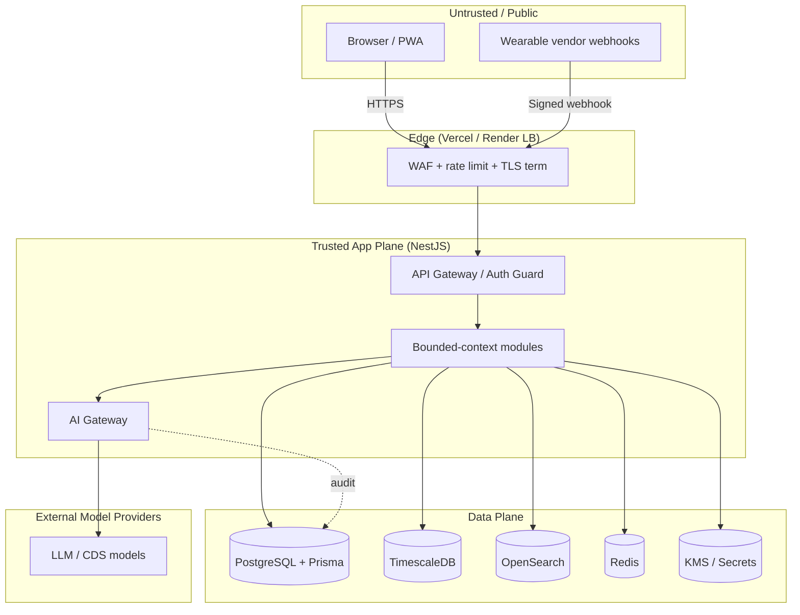
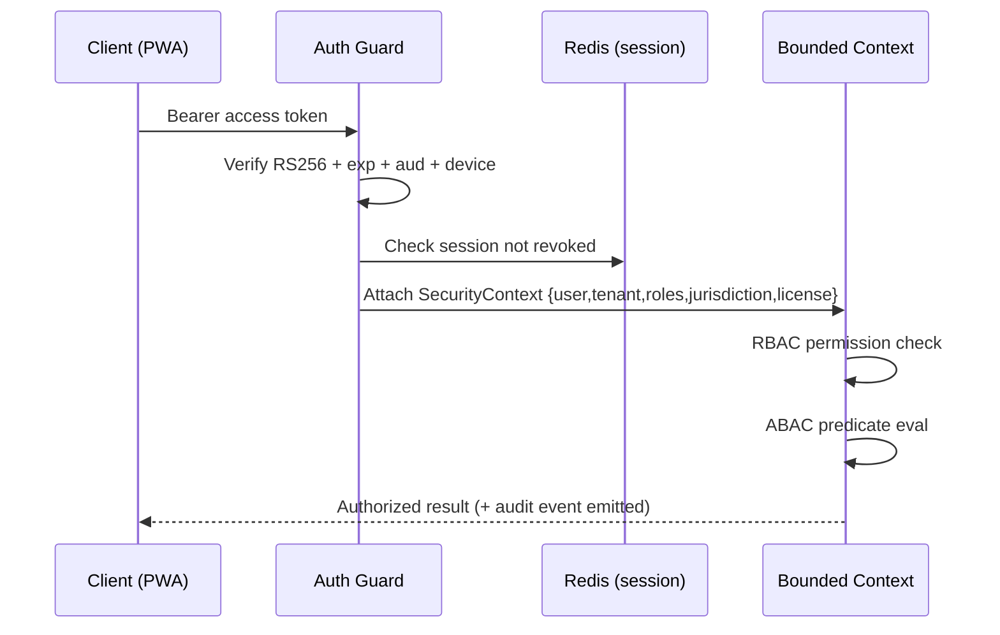
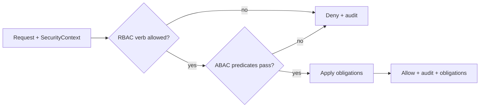
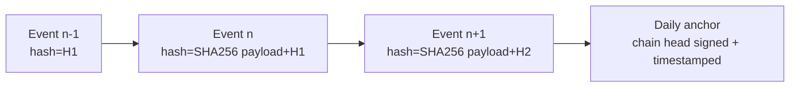
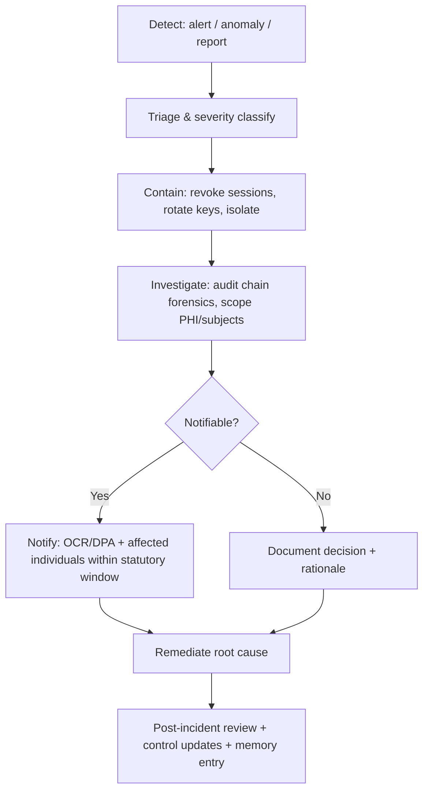
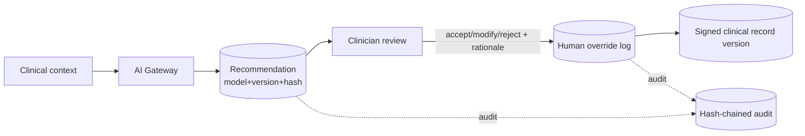

# 06 — Security & RBAC

> **VPSY OS** — Clinical Psychology Operating System
> **Core principle:** *AI assists, licensed clinicians decide. Every clinical action produces an audit event.*

This document defines the security architecture, authorization model (RBAC + ABAC),
tamper-evident clinical record, consent lifecycle, cryptography, data classification,
retention/residency, breach response, and AI accountability controls for VPSY OS.

It is written against the approved stack: **NestJS** (modular monolith, hexagonal, DDD),
**PostgreSQL + Prisma**, **Redis**, in-process event bus (→ NATS later), **Next.js 15**
portals, **JWT** auth with **RBAC + ABAC** and tenant isolation, **OpenTelemetry**.

---

## 1. Security Objectives & Trust Boundaries

VPSY OS is multi-tenant, country-scale behavioral-health infrastructure. It processes the
most sensitive category of personal data — mental-health records, diagnoses, risk/crisis
signals, and biometric wearable streams. The security posture is therefore **assume-breach,
defense-in-depth, least-privilege, and provably auditable**.

### 1.1 Security goals (CIA + accountability)

| Goal | What it means in VPSY | Primary controls |
|------|----------------------|------------------|
| Confidentiality | PHI is never exposed across tenant, jurisdiction, or role boundary | Tenant isolation, RBAC+ABAC, field-level encryption, TLS |
| Integrity | Clinical records cannot be silently altered | Append-only store + hash-chained audit, WORM exports |
| Availability | Crisis workflows stay reachable | HA Postgres, Redis failover, degraded-mode read paths |
| Accountability | Every clinical + AI action is attributable | Immutable audit log, human-override log, model-version stamps |
| Privacy | Data minimization + purpose limitation | Consent state gating, data classification, residency routing |

### 1.2 Trust boundaries

Each arrow crossing a boundary is authenticated, authorized, encrypted, rate-limited, and
logged. The AI Gateway is a **hard boundary**: no bounded context calls a model provider
directly — all inference is brokered, logged, and de-identified through it.

---

## 2. Threat Model

We model threats with **STRIDE** per trust boundary and prioritize with a
DREAD-style qualitative rating. The most consequential asset classes are:
**PHI-at-rest**, **PHI-in-transit**, **the clinical record's integrity**, **credentials/keys**,
and **AI recommendation provenance**.

### 2.1 STRIDE summary

| Threat (STRIDE) | Example in VPSY | Mitigations |
|-----------------|-----------------|-------------|
| **S**poofing | Stolen JWT; impersonating a psychologist | Short-lived access tokens, refresh rotation, device binding, MFA for clinician/admin roles, license-state check on every clinical write |
| **T**ampering | Editing a past session note to hide an error | Append-only clinical store, hash-chained audit, no hard `UPDATE`/`DELETE` on clinical tables (correction = new versioned entry) |
| **R**epudiation | Clinician denies making a risk decision | Immutable audit event with actor, role, license, IP, device, timestamp; human-override log signed |
| **I**nformation disclosure | Cross-tenant PHI leak; over-broad query | Row-level tenant scoping enforced in repository layer, ABAC consent/sensitivity gates, field-level encryption for special categories |
| **D**enial of service | Flood on telehealth signaling / crisis endpoint | Edge rate limiting, per-tenant quotas, priority lane for Risk&Crisis, autoscaling, circuit breakers |
| **E**levation of privilege | Manager escalates to clinical-write | Deny-by-default RBAC, no clinical permissions on non-licensed roles, ABAC license-state predicate, admin actions dual-controlled |

### 2.2 Key abuse cases

- **Insider curiosity** ("VIP client lookup") → break-glass access requires justification,
  is flagged, and triggers a proactive audit alert to the tenant DPO.
- **Compromised clinician laptop** → device posture check, session inactivity timeout,
  re-auth for sensitive actions (diagnosis finalization, record export).
- **Malicious wearable webhook** → HMAC-signed payloads, replay-nonce, schema validation,
  quarantine of anomalous streams before ingestion into TimescaleDB.
- **Prompt injection via client-authored intake text** → AI Gateway input sanitization,
  instruction/context separation, output must be labeled *recommendation* and cannot
  auto-execute a clinical action.

### 2.3 Assets → controls traceability

| Asset | Classification | Confidentiality control | Integrity control |
|-------|---------------|-------------------------|-------------------|
| Session notes / clinical documentation | PHI-Restricted | Field encryption + ABAC | Append-only + hash chain |
| Diagnosis records | PHI-Restricted | ABAC (clinician only) | Versioned, signed finalize |
| Risk/crisis assessments | PHI-Critical | Priority ACL + break-glass audit | Immutable, replicated |
| Wearable biometrics | PHI-Sensitive | Timescale row scoping + encryption | Signed ingestion |
| AI recommendations | PHI-derived | AI Gateway log ACL | Model-version + input-hash stamp |
| Credentials / license data | Confidential | Encrypted, minimal exposure | Verification event chain |
| Secrets / keys | Secret | KMS, never in DB/logs | Rotation + access audit |

---

## 3. Authentication & Session Security

### 3.1 Identity & Access context

Authentication is owned by the **Identity & Access** bounded context. VPSY issues
**short-lived JWT access tokens** (≤15 min) paired with **rotating refresh tokens**
(HttpOnly, Secure, SameSite=Strict cookies) held server-side by reference (opaque handle in
Redis), enabling instant revocation.

| Control | Setting |
|---------|---------|
| Access token TTL | 15 minutes |
| Refresh token TTL | 8 hours (clinician), 30 days (client, if consented) |
| Refresh rotation | One-time-use; reuse detection revokes the family |
| MFA | Mandatory: Psychologist, Supervisor, Manager, Admin, Finance, Executive, Government. Optional-but-encouraged: Client |
| Step-up auth | Diagnosis finalize, record export, payout approval, break-glass |
| Idle timeout | 15 min clinician portals, 30 min client |
| Absolute session cap | 8 hours; forces re-auth |
| Device binding | Access token bound to device fingerprint + client attestation |

### 3.2 Token claims

JWT carries only **non-PHI** claims: `sub` (user id), `tenantId`, `roles[]`,
`jurisdiction`, `licenseState` (for clinicians), `sessionId`, `authLevel` (aal1/aal2),
`iat/exp`. All authorization data beyond coarse roles is resolved server-side to prevent
stale-claim privilege drift. Tokens are signed **RS256** with keys held in KMS and rotated
quarterly (JWKS endpoint publishes the active + next key).

---

## 4. Authorization — RBAC + ABAC

Authorization is a **two-stage gate**: coarse **RBAC** (does this role hold this permission
verb on this bounded context?) followed by fine-grained **ABAC** (does this specific request
satisfy jurisdiction, tenant, sensitivity, consent, and license predicates?). Both must pass.
Default is **deny**.

### 4.1 Roles

The 8 authenticated roles plus the anonymous public visitor:

1. **Client** — the person receiving care (patient).
2. **Psychologist** — licensed clinician delivering care.
3. **Supervisor** — licensed clinician overseeing other clinicians / trainees.
4. **Manager** — clinic operations (non-clinical) management.
5. **Admin** — tenant technical/configuration administrator.
6. **Finance** — billing, payments, reconciliation (no clinical content).
7. **Executive** — cross-clinic business oversight (aggregate, de-identified).
8. **Government** — regulator / national-analytics consumer (aggregate only).

### 4.2 Permission verbs

`read`, `create`, `update`, `finalize`, `export`, `approve`, `configure`, `read_aggregate`.
Note that clinical contexts have **no `delete`** — corrections create versioned entries.

### 4.3 RBAC role × context permission matrix

Legend: **R**=read, **C**=create, **U**=update(=new version), **F**=finalize/sign,
**X**=export, **A**=approve, **G**=configure, **Σ**=read de-identified aggregate, **—**=no access,
**own**=own record only, **br**=break-glass only.

| Bounded Context | Client | Psychologist | Supervisor | Manager | Admin | Finance | Executive | Government |
|-----------------|:------:|:------------:|:----------:|:-------:|:-----:|:-------:|:---------:|:---------:|
| Identity & Access | R(own) | R(own) | R(own) | R | RCUG | R(own) | R(own) | — |
| Tenant / Clinic Network | — | R | R | R | RCUG | — | R | Σ |
| Client Registry | R(own) | RCU | RCU | R | R | R(billing) | Σ | Σ |
| Psychologist Registry | R | R(own)U(own) | RCU | R | RCU | — | R | Σ |
| Credentialing & Contracts | — | R(own) | R | RCU | RCUG | R(contract) | R | Σ |
| Intake & Screening | RC(own) | RCU | RCU | R | — | — | Σ | Σ |
| Clinical Profile | R(own) | RCU | RCU | — | — | — | Σ | Σ |
| Matching & Assignment | R(own) | R | RCUA | RCUA | G | — | Σ | — |
| Scheduling | RCU(own) | RCU | RCU | RCUG | G | R | Σ | — |
| Telehealth | R(own,join) | RC(join) | RC(join) | R | G | — | — | — |
| Clinical Documentation | R(own,shared) | RCUF | RCUF | — | — | — | — | Σ |
| Psychometrics | RC(own,assigned) | RCUF | RCUF | — | — | — | Σ | Σ |
| Diagnosis Support | R(own,shared) | RCUF | RCUF | — | — | — | Σ | Σ |
| Treatment Planning | R(own) | RCUF | RCUF | — | — | — | Σ | Σ |
| Intervention Tracking | RC(own) | RCU | RCU | — | — | — | Σ | Σ |
| Outcomes | R(own) | RCU | RCU | R | — | — | Σ | Σ |
| Risk & Crisis | R(own,limited) | RCUF | RCUFA | R(alert) | — | — | Σ(rate) | Σ |
| Wearables | RCU(own) | R(consented) | R(consented) | — | G | — | Σ | Σ |
| Messaging | RC(own) | RC | RC | R(meta) | G | — | — | — |
| Payments | R(own) | R(own) | — | R | — | RCUA | Σ | — |
| Accounting | — | — | — | R | — | RCUF | Σ | — |
| Revenue Share / Payouts | R(own) | R(own) | — | R | — | RCUA | Σ | — |
| Documents | RCU(own) | RCU | RCU | R | G | R(fin) | — | — |
| Reports | R(own) | R | R | R | R | R(fin) | RΣ | Σ |
| AI Gateway | —(consumes) | R(logs own) | R(logs) | R(meta) | RG | — | Σ | Σ |
| Audit & Compliance | R(own access log) | R(own) | R(team) | R(ops) | R | R(fin) | R(meta) | R(compliance) |
| Admin Configuration | — | — | — | R | RCUG | — | — | — |
| National Analytics | — | — | — | — | — | — | Σ | Σ |

> The matrix is the **source of truth** expressed as a policy artifact
> (`policy/rbac.matrix.ts`), unit-tested so any code path that grants access is proven to
> intersect this table. Adding a permission requires a policy change + test, not an ad-hoc guard.

### 4.4 ABAC attributes & predicates

RBAC decides *capability*; ABAC decides *this specific instance*. Attributes:

| Attribute | Source | Example predicate |
|-----------|--------|-------------------|
| `jurisdiction` | Tenant + client residence | `subject.jurisdiction == resource.jurisdiction OR cross-border-consent` |
| `tenantId` | Token + resource | `subject.tenantId == resource.tenantId` (hard, non-overridable) |
| `sensitivity` | Data classification tag | `resource.sensitivity <= subject.clearance` |
| `consentState` | Consent context | `resource.requiresConsent ⇒ consent.active AND consent.scope ⊇ purpose` |
| `licenseState` | Credentialing context | `clinical.write ⇒ subject.license.status == ACTIVE AND covers(jurisdiction, specialty)` |
| `relationship` | Assignment | `subject is assignedClinician(resource.clientId) OR supervises(assignedClinician)` |
| `purpose` | Request intent | `purpose ∈ {care, billing, safety}` and matched to consent scope |
| `emergencyOverride` | Break-glass flag | grants time-boxed read + mandatory justification + high-severity audit |

Policy is evaluated by a central **PolicyEngine** (pure function, no I/O) so decisions are
deterministic, testable, and explainable. Every decision returns
`{allow, matchedRule, obligations[]}`; obligations (e.g., "redact SSN", "watermark export",
"emit break-glass alert") are enforced by the calling module.

### 4.5 Licensing / jurisdiction-aware access

Clinical **writes** are gated on a live license predicate resolved from the Credentialing &
Contracts context: the clinician's license must be `ACTIVE`, unexpired, cover the client's
**jurisdiction** (state/country), and match the **scope of practice** for the action.
Cross-border telehealth is allowed only where a jurisdiction pair is explicitly permitted in
Admin Configuration and the client has given cross-border consent. License lapse
auto-revokes clinical write capability without a code change (attribute-driven).

---

## 5. Tamper-Evident Clinical Record

The clinical record is **append-only and hash-chained**. There is no in-place mutation of
clinical facts; a correction is a new version that references its predecessor. This delivers
non-repudiation and detectable tampering while preserving the full clinical history required
by HIPAA and medico-legal review.

### 5.1 Append-only + versioning

- Clinical tables (documentation, diagnosis, treatment plan, risk assessment) are
  **insert-only** at the domain level. Prisma models expose no `update`/`delete` on facts;
  the repository layer rejects them.
- Each record has `version`, `supersedesId`, `authoredBy`, `authoredAt`, `licenseSnapshot`,
  and a `finalizedAt`/`signature` when signed.
- A "delete" is a `retracted` version with reason, still readable in history.

### 5.2 Hash-chained audit

Every clinical (and administrative) event is written to an **immutable audit log**. Each
entry stores a SHA-256 hash of `(payload || prevHash)`, forming a chain. A daily
**anchor** commits the chain head (Merkle-style) so any retroactive edit breaks verification.

Audit event schema (non-PHI in indexable fields; PHI referenced by id only):

| Field | Purpose |
|-------|---------|
| `eventId`, `prevHash`, `hash` | Chain integrity |
| `actorId`, `actorRole`, `licenseSnapshot` | Who + authority |
| `tenantId`, `jurisdiction` | Scope |
| `action`, `context`, `resourceId`, `resourceVersion` | What |
| `purpose`, `consentRef`, `abacRuleMatched` | Why authorized |
| `ip`, `deviceId`, `sessionId`, `authLevel` | Session forensics |
| `outcome`, `obligationsApplied` | Result |
| `occurredAt` | When (server clock, monotonic) |

The audit log is a **write path with no application delete**; retention holds and legal holds
prevent expiry. Verification jobs recompute the chain nightly and alert on divergence.

---

## 6. Consent Management & Versioning

Consent is a **first-class, versioned artifact**, not a boolean. Every consent has a
`policyVersion`, `scope[]` (purposes: care, billing, research, wearables, cross-border,
AI-assisted-analysis), `grantedAt`, `expiresAt`, `revocable`, and an audit trail of
grant/modify/revoke events.

- **Purpose limitation:** access predicates check `purpose ∈ consent.scope`. Wearable
  ingestion, AI-assisted analysis, and cross-border transfer each require a distinct scope.
- **Versioning:** when a consent policy changes, existing grants remain bound to the version
  they accepted; re-consent is prompted; processing under a superseded version is blocked
  unless still valid.
- **Revocation:** immediate; downstream derived artifacts (e.g., AI analyses) are flagged and
  their further use suspended. Revocation does not delete historical clinical facts (legal
  retention) but stops new processing.
- **Minors / guardianship:** consent captures guardian relationship and jurisdiction-specific
  age-of-consent rules from Admin Configuration.

---

## 7. Cryptography

| Layer | Control |
|-------|---------|
| In transit (external) | TLS 1.3 only, HSTS, modern cipher suites, cert pinning for wearable webhooks |
| In transit (internal) | mTLS between services when split to NATS/K8s; loopback in monolith |
| At rest (DB) | Postgres TDE / disk encryption (AES-256) on Render/managed volumes |
| Field-level (special category) | Application-layer envelope encryption for special-category fields (diagnosis codes, risk notes) using per-tenant DEKs wrapped by a KMS master key |
| Backups | Encrypted with separate backup KMS key; tested restores |
| Search | OpenSearch stores only tokenized/non-PHI or encrypted-at-rest indices; free-text PHI search is scoped + audited |
| Keys | KMS-managed, envelope encryption, per-tenant DEK isolation, quarterly rotation, re-wrap on rotation |
| Hashing | SHA-256 (audit chain); Argon2id for any local secret hashing |

**Crypto-shredding:** per-tenant / per-client DEKs enable cryptographic erasure — destroying
a DEK renders that subject's field-level ciphertext unrecoverable, supporting GDPR erasure
where legal retention does not compel keeping plaintext.

---

## 8. Secrets Management

- **No secrets in code, env files committed, or logs.** Secrets live in a managed store
  (Render/Vercel encrypted env + external KMS/secret manager for signing keys and DEK master).
- **Rotation:** JWT signing keys quarterly (with overlap window via JWKS), DB creds and
  service tokens on schedule and on incident.
- **Access:** service identities pull secrets at boot via short-lived tokens; human access to
  production secrets requires break-glass with approval + audit.
- **Detection:** pre-commit secret scanning + CI secret scanning; leaked secrets trigger
  automated rotation runbook.
- **Redaction:** structured-logging middleware redacts known-sensitive keys and never logs
  request bodies for clinical contexts (only ids + audit references).

---

## 9. PHI Data Classification

| Class | Definition | Examples | Handling |
|-------|-----------|----------|----------|
| **PHI-Critical** | Immediate-harm sensitivity | Risk/crisis assessments, suicidality flags | Field encryption, priority ACL, break-glass audit, replicated |
| **PHI-Restricted** | Core clinical content | Diagnoses, session notes, treatment plans | Field encryption, ABAC clinician-only, append-only |
| **PHI-Sensitive** | Health-derived data | Wearable biometrics, psychometric scores | Encryption, consent-scoped, ABAC |
| **PHI-Basic** | Identifying + care linkage | Name, DOB, contact, assignment | Tenant-scoped, encrypted at rest |
| **Confidential** | Business/credential | License data, contracts, pricing | RBAC, encrypted |
| **Secret** | Keys/creds | DEKs, signing keys, tokens | KMS only, never persisted in app DB |
| **Public** | Non-sensitive | Marketing site content | Standard controls |

Classification tags drive ABAC `sensitivity` predicates, logging redaction, export
watermarking, and residency routing. De-identification (Safe Harbor / expert determination)
is required before data crosses into Executive/Government aggregate views.

---

## 10. Data Retention & Residency by Country

Retention and residency are **configuration-driven per tenant + jurisdiction** (Admin
Configuration), not hardcoded, because clinical-record retention statutes vary widely.

| Jurisdiction | Adult clinical record retention (illustrative default) | Residency requirement |
|--------------|---------------------------------|----------------------|
| US (HIPAA + state) | 6 yrs federal min; state may extend (e.g., 7–10 yrs) | US region |
| EU (GDPR + national health law) | National medical-record law (often 10+ yrs) | EU region (data residency) |
| UK | ~8 yrs after last contact (adults) | UK/EU region |
| Canada | Province-specific (often 10 yrs) | Canada region |
| Minors | Until age of majority + statutory tail | Home region |

- **Residency routing:** each tenant is pinned to a region; PHI storage (Postgres, Timescale,
  OpenSearch, backups) and inference (AI Gateway provider region) stay in-region. Cross-border
  transfer requires an explicit legal basis (adequacy/SCCs) + consent scope.
- **Retention engine:** records carry `retentionClass` + `retainUntil`; legal holds override
  expiry; expiry triggers crypto-shredding of field-level PHI while preserving de-identified
  audit metadata where lawful.

---

## 11. Breach Response Workflow

VPSY targets HIPAA Breach Notification Rule and GDPR Art. 33/34 timelines (GDPR: notify
supervisory authority within **72 hours** of awareness where risk to rights/freedoms).

| Phase | Owner | Max target | Artifacts |
|-------|-------|-----------|-----------|
| Detect | On-call SecOps | Continuous | Alert, audit anomaly |
| Triage | Incident Commander | 1 hr | Severity, scope estimate |
| Contain | SRE + SecOps | 4 hr | Revocations, key rotation log |
| Investigate | SecOps + DPO | 24 hr | Forensic timeline from immutable audit chain |
| Notify | DPO + Legal | ≤72 hr (GDPR) / per HIPAA | Regulator + individual notices |
| Remediate | Eng | Per severity | Root-cause fix, control test |
| Review | All | 2 weeks | Blameless post-mortem, control mapping update |

The **immutable, hash-chained audit log** is the forensic backbone: it establishes exactly
which records were accessed, by whom, under what authority, and whether any tampering
occurred.

---

## 12. AI Accountability Controls

Because *AI assists, clinicians decide*, the AI Gateway enforces controls that make every
recommendation attributable, overridable, and monitorable.

### 12.1 AI recommendation logs

Every model call through the AI Gateway logs: `requestId`, `agent` (e.g., differential-
hypothesis, risk-triage), `modelId`, `modelVersion`, `promptTemplateVersion`,
`inputHash` (de-identified), `outputHash`, `confidence`, `citations`, `latency`,
`policyChecksPassed`, `consentScope`. No clinical action is executed by AI; outputs are
persisted as **recommendations** with a status of `pending_clinician_review`.

### 12.2 Human override logs

When a clinician accepts, edits, or rejects an AI recommendation, an override event records
`recommendationId`, `clinicianId`, `licenseSnapshot`, `decision` (accept/modify/reject),
`rationale`, and links to the resulting clinical record version. This creates a defensible
chain: *AI suggested → licensed human decided → record signed*.

### 12.3 Model version tracking & registry

A **model registry** records every model/version deployed: provider, version, intended use,
risk classification (EU AI Act), evaluation results, approved jurisdictions, and rollout
state. Recommendation logs stamp the exact `modelVersion`, enabling retrospective analysis if
a model is later found deficient (recall + re-review of affected recommendations).

### 12.4 Bias & performance monitoring (post-market)

- Continuous monitoring of accepted-vs-overridden rates, calibration (predicted vs observed),
  and **subgroup performance** (age, sex, jurisdiction) to detect drift or bias.
- Threshold breaches raise alerts and can auto-gate an agent to `advisory-only` or disabled
  pending review.
- Monitoring outputs feed the EU AI Act post-market surveillance file and WHO LMM governance
  reporting (see `14-compliance-and-governance.md`).

---

## 13. Security Testing & Assurance

| Activity | Cadence |
|----------|---------|
| SAST + dependency scanning | Every PR (CI) |
| Secret scanning | Pre-commit + CI |
| DAST / auth fuzzing | Nightly on staging |
| Policy (RBAC/ABAC) unit tests | Every PR; matrix is fully covered |
| Audit-chain verification job | Nightly |
| Penetration test (external) | Semi-annual + pre-major-release |
| Access recertification | Quarterly per tenant |
| Tabletop breach exercise | Quarterly |
| Threat-model review | Per new bounded context / AI agent |

---

## 14. Summary

Security in VPSY OS is not a layer but the substrate: deny-by-default RBAC narrowed by
attribute-aware ABAC (jurisdiction, tenant, sensitivity, consent, license); an append-only,
hash-chained clinical record that makes tampering detectable and clinician decisions
non-repudiable; envelope encryption with per-tenant keys enabling crypto-shredding;
versioned consent with strict purpose limitation; jurisdiction-aware licensing gates on every
clinical write; and an AI Gateway that logs, labels, and subordinates every recommendation to
a licensed human decision. Together these controls operationalize the core principle and the
regulatory anchors detailed in `14-compliance-and-governance.md`.
