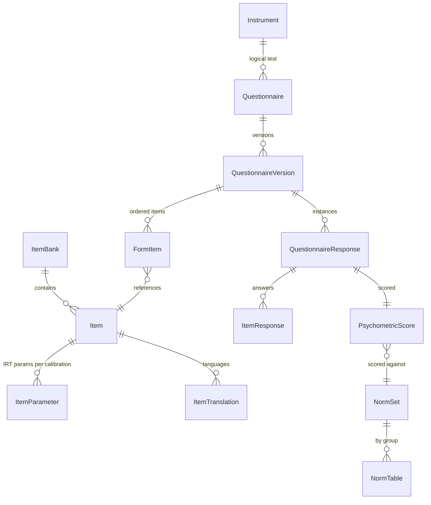
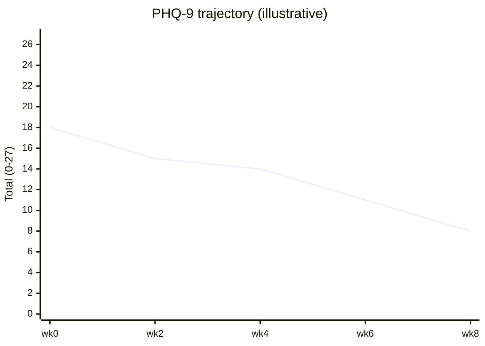

# 07 — Psychometrics Engine

> A general-purpose measurement platform, not a clone of any copyrighted test.
> VPSY OS **builds the engine** (item banks, IRT/CAT scoring, norms, validity,
> longitudinal tracking) and **plugs in instruments** — public-domain (PHQ-9,
> GAD-7, WHO-5, PCL-5, EPDS, AUDIT), openly-licensed (PROMIS item banks), or
> **premium instruments under proper license** (never reproduced without one).
> Measurement properties are reported in the **COSMIN** framework; adaptive testing
> follows the **PROMIS/CAT** tradition.

## 1. Scope and non-goals

**In scope:** static (fixed-form) questionnaires; norm-referenced and criterion
(cutoff) scoring; classical test theory (CTT) statistics; item response theory (IRT)
calibration and scoring; computerized adaptive testing (CAT); validity/consistency
scales; longitudinal outcome tracking (measurement-based care); multi-language forms;
culture-specific norms; differential item functioning (DIF) and measurement
invariance; item-bank management; test versioning; clinician-only interpretation.

**Explicit non-goals / legal guardrails:**
- **Do NOT clone or embed copyrighted instruments** — no reproduction of MMPI/MMPI-2/-A,
  WAIS/WISC, BDI/BDI-II, MCMI, Rorschach, or any test whose items/norms are
  proprietary. The engine stores such tests **only** when a valid license record
  exists, and content is gated behind that license.
- Norms and cutoffs for licensed tests are loaded from the publisher's licensed
  materials, never re-derived from scraped data.
- Interpretation output is **clinician-only** by default; clients see scores/results
  only through a clinician-mediated view.

## 2. Instrument licensing model

Every instrument carries a license classification that gates storage, scoring, and
display:

| Class | Examples | Handling |
|-------|----------|----------|
| `public_domain` | PHQ-9, GAD-7, WHO-5, PCL-5, EPDS, AUDIT | Ship built-in. |
| `open_license` | PROMIS item banks (CC/HealthMeasures terms) | Ship with attribution + terms. |
| `premium_licensed` | Publisher-copyrighted tests | Content loaded **only** if `LicenseGrant` active for tenant; usage metered; blocked on expiry. |
| `custom_tenant` | Tenant's own clinic questionnaires | Tenant-owned, tenant-scoped. |

```
GET /v1/questionnaires?class=premium_licensed  -> only returns items the tenant is licensed for
```

A `premium_licensed` questionnaire with no active `LicenseGrant` returns `403
LICENSE_REQUIRED` at both fetch and scoring time. License usage emits audit events
for royalty reconciliation.

## 3. Data model

FHIR-aligned (`Questionnaire`, `QuestionnaireResponse`, `Observation`) with a
psychometric extension layer. Prisma/PostgreSQL; heavy item banks and calibration
matrices in dedicated tables.



### 3.1 Core tables (illustrative)

```prisma
model Instrument {
  id            String   @id                 // instr_...
  key           String                       // "phq9", "promis-anxiety"
  title         String
  licenseClass  LicenseClass
  construct     String                       // "depression severity"
  scoringModel  ScoringModel                 // CTT_SUM | IRT_2PL | IRT_GRM | CAT
  clinicianOnly Boolean  @default(true)
  tenantId      String?                      // null = platform-global
}

model Questionnaire {
  id           String  @id                    // q_...
  instrumentId String
  status       PubStatus                      // draft|active|retired
}

model QuestionnaireVersion {
  id            String  @id                   // qv_...
  questionnaireId String
  semver        String                        // "3.0.0"
  effectiveFrom DateTime
  languageSet   String[]                      // ["en","es-MX","ar"]
  itemOrder     String[]                      // FormItem ids (static forms)
  scoringSpec   Json                          // formula / IRT config / CAT policy
  norming       Json                          // pointer(s) to NormSet(s)
  immutable     Boolean @default(true)        // frozen once responses exist
}

model ItemBank {
  id           String @id                     // bank_...
  construct    String                         // "anxiety"
  calibrationId String                        // active calibration
}

model Item {
  id           String @id                     // item_...
  bankId       String
  stem         String                         // canonical (source) language
  responseType ResponseType                   // likert5|binary|slider|numeric
  reverse      Boolean @default(false)
}

model ItemParameter {                         // IRT params, per calibration
  id           String @id
  itemId       String
  calibrationId String
  model        IrtModel                        // GRM|2PL|3PL|GPCM
  a            Float                            // discrimination
  b            Float[]                          // difficulty/thresholds
  c            Float?                           // guessing (3PL)
  seEstimates  Json
}

model QuestionnaireResponse {
  id            String @id                     // qr_...
  qVersionId    String
  clientId      String
  caseId        String?
  sessionId     String?
  administration AdminMode                      // self|clinician|proxy
  startedAt     DateTime
  completedAt   DateTime?
  responses     Json                            // {linkId:value} raw
  status        RespStatus                       // in_progress|complete|invalidated
}

model PsychometricScore {
  id            String @id                     // psc_...
  responseId    String  @unique
  rawScore      Float?
  theta         Float?                          // IRT ability estimate
  se            Float?                          // standard error of theta
  standardized  Json                            // {tScore, zScore, percentile}
  band          String?                         // instrument-defined band
  cutoffFlags   Json                            // {caseness:true, cutoff:10}
  validity      Json                            // {status, inconsistencyIndex, ...}
  normSetId     String?
  interpretationMode InterpMode @default(CLINICIAN_ONLY)
}
```

### 3.2 Norms

```prisma
model NormSet {
  id          String @id                       // norm_...
  instrumentId String
  population   String                            // "US adult", "MX adult female"
  culture      String?                           // culture-specific norms
  language     String?
  source       String                            // provenance / publication
  method       NormMethod                         // linear|area|IRT-linked
}
model NormTable {
  id        String @id
  normSetId String
  group     Json                                  // {sex, ageBand, region}
  mapping   Json                                  // raw/theta -> {T, z, percentile}
}
```

## 4. Static (fixed-form) scoring

For CTT instruments the engine computes:
- **Raw sum / mean** with reverse-keying and missing-item handling (configurable:
  prorate if ≤ *k* missing, else invalidate).
- **Subscale scores** per `scoringSpec`.
- **Standardized scores** (T, z, percentile) via the selected `NormSet`.
- **Cutoff / caseness flags** (e.g. PHQ-9 ≥ 10 → "screen-positive for MDD; requires
  clinical confirmation" — never "has MDD").

`scoringSpec` example (PHQ-9):

```json
{
  "model": "CTT_SUM",
  "items": ["phq9.1","...","phq9.9"],
  "range": [0, 27],
  "bands": [
    {"max": 4, "label": "minimal"},
    {"max": 9, "label": "mild"},
    {"max": 14, "label": "moderate"},
    {"max": 19, "label": "moderately severe"},
    {"max": 27, "label": "severe"}
  ],
  "cutoffs": [{"name": "caseness", "gte": 10}],
  "safetyItems": [{"linkId": "phq9.9", "gte": 1, "route": "risk-signal"}],
  "missing": {"prorateMaxMissing": 1}
}
```

Note the `safetyItems` hook: item 9 (self-harm) routing to the Crisis/Risk agent is
part of the scoring contract (§05).

## 5. IRT scoring

- Supported models: **2PL**, **3PL**, **Graded Response Model (GRM)** and
  **Generalized Partial Credit (GPCM)** for polytomous Likert items.
- **Ability estimation**: EAP (Expected A Posteriori) by default for stability with
  short forms; MLE/WLE available. Returns `theta` and its standard error `se`.
- **Calibration**: item parameters are estimated offline (marginal maximum
  likelihood) on approved calibration samples and stored per `calibrationId`; the
  engine *scores* against fixed parameters, it does not silently re-estimate at
  runtime. Recalibration is an explicit, versioned event.
- **Linking/equating**: cross-version and cross-language equating stored so scores
  are comparable across `QuestionnaireVersion`s (essential for longitudinal tracking).
- **Score conversion**: `theta` → T-score/percentile via the instrument's linking
  constants (PROMIS-style: T = 50 + 10·θ on the reference metric).

## 6. Computerized Adaptive Testing (CAT)

CAT selects items from a calibrated `ItemBank` to measure with fewer items.

```mermaid
flowchart TB
  S[Start: prior theta] --> SEL[Select next item\nmax Fisher information at current theta]
  SEL --> EXP[Exposure & content constraints]
  EXP --> ADMIN[Administer item]
  ADMIN --> UPD[Update theta + SE (EAP)]
  UPD --> STOP{Stop?}
  STOP -->|SE <= target OR maxItems OR minItems&content met| DONE[Finalize theta, T-score]
  STOP -->|no| SEL
```

**Item selection**: maximum Fisher information at the current θ estimate, subject to:
- **Exposure control** (e.g. Sympson–Hetter / randomesque) so a few items aren't
  over-used and the bank isn't compromised.
- **Content balancing** (blueprint constraints across subdomains).
- **Item eligibility** (language available, not previously administered, not
  enemy-set with an administered item).

**Stopping rules** (any configurable, combined): SE(θ) ≤ target (e.g. 0.3),
max items reached, min items + content blueprint satisfied, or time budget.

**CAT policy** is stored in `scoringSpec`:

```json
{
  "model": "CAT",
  "irtModel": "GRM",
  "bankId": "bank_anxiety_v4",
  "selection": "max_information",
  "exposure": {"method": "randomesque", "n": 3},
  "content": [{"domain":"physiological","min":2},{"domain":"cognitive","min":2}],
  "stop": {"targetSE": 0.30, "minItems": 4, "maxItems": 12},
  "prior": {"mean": 0, "sd": 1}
}
```

CAT administration is a stateful server-driven flow:
`POST /questionnaire-responses:startCat` → repeated
`POST /questionnaire-responses/{id}:nextItem` (returns next item or `done`) →
final `PsychometricScore`.

## 7. Validity, reliability, and response quality

### 7.1 Validity scales / response-consistency detection
Generic, instrument-agnostic checks (that do **not** require cloning proprietary
validity scales):
- **Inconsistency index**: correlation of responses across paired similar/reversed
  items; flag if below threshold.
- **Infrequency / attention checks**: optional embedded low-endorsement items or
  directed-response items ("select 'often'").
- **Response-time anomalies** (too fast to have read), **straight-lining**
  (invariant responses), **long-string** detection.
- **Person-fit statistics** (e.g. lz*) for IRT forms — improbable response patterns.
- **Missingness / effort**: completion ratio, back-navigation churn.

Outputs land in `PsychometricScore.validity`:

```json
{ "status": "questionable", "inconsistencyIndex": 0.42,
  "flags": ["straight_lining","fast_completion"], "personFitLz": -2.7,
  "message": "Response validity is questionable; interpret with caution." }
```

Invalid responses set `status: invalidated` and are excluded from outcome trends.

### 7.2 Reliability & measurement properties (COSMIN)
The engine computes and **reports measurement properties in the COSMIN framework**
so instrument quality is transparent:
- **Reliability**: Cronbach's α / McDonald's ω (CTT), IRT marginal reliability and
  conditional SE(θ) across the trait range, test–retest ICC where data exist.
- **Validity**: structural validity (factor structure), construct validity
  (convergent/discriminant correlations), content validity metadata.
- **Responsiveness**: ability to detect change (effect sizes, SRM) — key for MBC.
- **Interpretability**: MID/MCID, floor/ceiling effects.
These are surfaced on an **instrument dashboard** (`GET /instruments/{id}/properties`)
and versioned with each calibration.

## 8. Fairness: DIF and measurement invariance

- **DIF analysis**: per item, across groups (language, sex, age band, culture) using
  logistic-regression DIF and IRT-based methods (e.g. Lord's χ², area between item
  characteristic curves). Items flagged for salient DIF are quarantined from CAT
  selection and reviewed.
- **Measurement invariance**: multi-group CFA testing configural → metric → scalar
  invariance before comparing scores across groups/languages; the level achieved is
  recorded so cross-group comparisons are only made where justified.
- **Culture-specific norms**: separate `NormSet`s per population; the engine never
  silently applies one culture's norms to another — norm selection is explicit and
  audited.

## 9. Multi-language forms

- Item text lives in `ItemTranslation` (per `Item`, per BCP-47 locale) with
  translation provenance (forward/back-translation, cognitive-interview status).
- A `QuestionnaireVersion` declares its `languageSet`; `Accept-Language` (§04)
  selects the rendered locale; if unavailable, falls back per a configured chain,
  never silently mixing languages within a form.
- Cross-language equating (via anchor items / invariance results) makes scores
  comparable where invariance holds; where it doesn't, results are labeled
  non-comparable.

## 10. Longitudinal outcome tracking (measurement-based care)

- Repeated administrations of the same construct form an **`OutcomeTrack`**
  (`GET /outcome-tracks?clientId=&construct=depression`), returning a time series of
  comparable scores (raw and standardized), with change statistics:
  **Reliable Change Index (RCI)** and clinically significant change vs. cutoffs.
- Trajectories feed the **Outcome Intelligence** AI agent (§05) which presents
  "on-track / off-track vs. expected benchmark" as *context*, never as a verdict.
- Only `valid` responses are included; version/language changes are equated so the
  trend is not an artifact of instrument change.



## 11. Test & item versioning

- **Immutability**: once a `QuestionnaireResponse` exists against a
  `QuestionnaireVersion`, that version is frozen. Any change to items, scoring, or
  norms creates a **new** version (semver: patch = wording typo w/ equating held,
  minor = added optional item/translation, major = scoring/structure change).
- Each `PsychometricScore` records the exact `qVersionId`, `calibrationId`, and
  `normSetId` used — so a score is always reproducible and interpretable years later.
- **Item bank management**: items carry lifecycle (`draft → calibrating → active →
  retired`), calibration history, exposure statistics, and DIF status. Retiring an
  item never rewrites historical scores.

## 12. Interpretation mode & access control

- `PsychometricScore.interpretationMode = CLINICIAN_ONLY` by default. The raw
  clinical interpretation (bands, caseness, validity caveats) is visible to licensed
  clinicians; clients receive a clinician-mediated summary only.
- Premium/licensed interpretive content is additionally gated by `LicenseGrant`.
- Every score view and every interpretation emits an audit event (who saw what,
  when) per §04/§05.

## 13. Sample API flows

```http
# Score a completed static form (see §04.14.4)
POST /v1/questionnaire-responses            -> 201 {scoreId, band, validity}

# Start an adaptive assessment
POST /v1/questionnaire-responses:startCat
{ "questionnaireVersionId":"qv_promis_anx_v4", "clientId":"pat_01H..." }
-> 201 { "id":"qr_01H...", "nextItem": { "linkId":"item_...", "stem":"...", "options":[...] } }

# Answer + get next
POST /v1/questionnaire-responses/qr_01H...:nextItem
{ "linkId":"item_...", "value":3 }
-> 200 { "theta":-0.4, "se":0.41, "nextItem": {...} }   // or { "done":true, "scoreId":"psc_..." }

# Instrument measurement properties (COSMIN report)
GET /v1/instruments/instr_promis_anx/properties
-> 200 { "reliability": {...}, "validity": {...}, "responsiveness": {...}, "dif": [...] }
```

This engine gives VPSY OS a defensible, publisher-respecting measurement core:
rigorous IRT/CAT scoring, transparent COSMIN-grade property reporting, fairness via
DIF/invariance, and outcome tracking that powers measurement-based care — while the
clinician remains the sole interpreter of what any number means.
```
