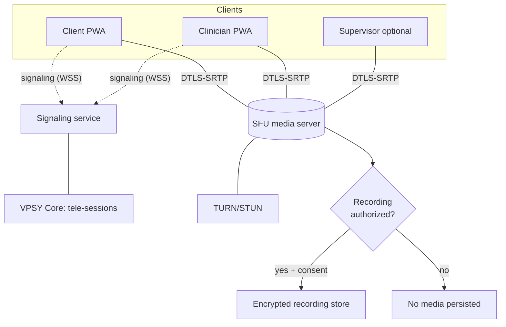
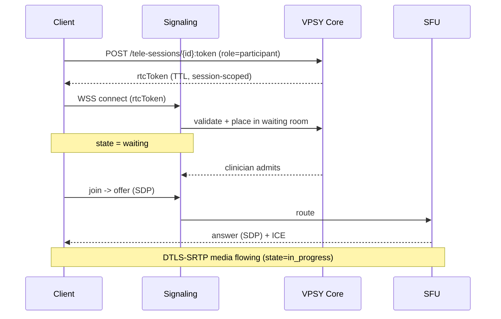
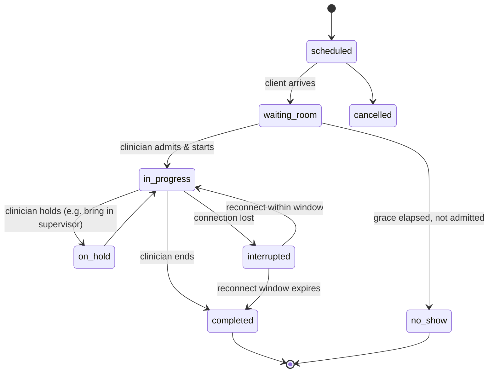

# 08 — Telehealth & Real-Time

> Secure, HIPAA-aligned video and audio-only clinical sessions, plus the real-time
> substrate (signaling, presence, in-session collaboration). HHS OCR permits
> telehealth — including **audio-only** — when conducted consistently with the HIPAA
> Privacy, Security, and Breach Notification Rules; this design encodes those
> safeguards structurally.

> **This is in-house real-time media, not a third-party embed.** VPSY runs its own
> **WebRTC SFU** (mediasoup/LiveKit-class) for both **video and voice** — there is no
> Zoom/Doxy.me-style embed anywhere in the product (`business/00-vision-and-category.md`
> §1). The same SFU, signaling service, and STUN/TURN infrastructure described below is
> shared with the Communications Hub (context 30) for ad hoc, non-scheduled voice/video
> calls, and with SIP/IP-phone telephony for the PSTN phone-bridge fallback (§11). See
> `15-communications-and-telephony.md` §5 for how the two contexts share one media
> substrate, and §6 for the complementary **asynchronous** (store-and-forward)
> voice/video messages (`MediaMessage`) used when a live connection isn't the right tool.

## 1. Goals and constraints

- **Confidential by default**: end-to-end encrypted media where topology allows;
  always encrypted in transit; no unauthorized recording.
- **Audio-only fallback is first-class**, not an afterthought — required for
  low-bandwidth clients and phone-only access, and explicitly permitted by OCR.
- **Clinician-controlled lifecycle**: waiting room, admit, start, hold, end, with a
  full auditable state machine.
- **Emergency-ready**: the clinician can confirm the client's physical location at
  session start so that, in a crisis, local emergency services can be directed
  correctly (a known telehealth safety gap we close explicitly).
- **Recording is the exception**, gated by law + consent, never the default.
- **Degradation, not failure**: video → audio-only → async is the fallback ladder.

## 2. Media architecture: WebRTC + SFU

We use **WebRTC** with a **Selective Forwarding Unit (SFU)** rather than a mesh or an
MCU.

| Option | Why / why not |
|--------|---------------|
| P2P mesh | Fine for 1:1 but no server-side recording control, poor for 3+ (supervision, group), NAT-fragile. Kept as an *optimization* for pure 1:1 when both peers are directly reachable. |
| **SFU (chosen)** | Scales to group/supervised sessions, selective simulcast layers per subscriber, server can enforce recording policy and produce compliant recordings, better for mobile bandwidth adaptation. |
| MCU | Server-side mixing is CPU-heavy and breaks E2EE; rejected. |

**Chosen SFU**: an open, self-hostable SFU (LiveKit/mediasoup-class) deployed on our
Kubernetes-ready infra so media stays within our HIPAA boundary and under BAA. The
SFU terminates DTLS-SRTP and forwards encrypted RTP; for 1:1 sessions we can enable
**Insertable Streams E2EE** so the SFU forwards frames it cannot decrypt. When
server-side recording is legally authorized, that specific session uses
transport-encryption-only mode (SFU can access media) with explicit consent.



## 3. Signaling architecture

- **Transport**: secure WebSocket (`wss://rtc.vpsy.health`) authenticated with a
  **short-lived, session-scoped RTC token** minted by core
  (`POST /v1/tele-sessions/{id}:token`). The token encodes tenant, session id, role
  (host/participant/observer), and grant TTL (≤ session length + grace).
- **Protocol**: JSON signaling messages — `join`, `offer`, `answer`, `ice-candidate`,
  `simulcast-preference`, `mute`, `screen-share-start/stop`, `leave`. SDP is
  negotiated per WebRTC; the signaling service never touches media.
- **Presence & realtime**: the same signaling channel carries presence (in-waiting,
  admitted, in-call, disconnected), connection-quality events, and in-session
  chat/notes fan-out. Backed by Redis pub/sub so multiple signaling pods share state;
  abstracted so NATS can replace it at scale.
- **Reconnection**: ICE restart + token re-mint on transient drop; the session state
  machine tolerates brief disconnects without ending the encounter.



## 4. STUN / TURN and encryption

- **STUN** for host/server-reflexive candidate discovery.
- **TURN** (coturn or managed, under BAA) as relay for clients behind symmetric NATs
  or restrictive firewalls; TURN over TLS on 443 for hostile networks. TURN
  credentials are ephemeral (HMAC time-limited), never static.
- **Encryption**:
  - Signaling: WSS (TLS 1.2+).
  - Media: **DTLS-SRTP** mandatory (SRTP with AES-GCM). Unencrypted RTP is refused.
  - Optional **E2EE** via Insertable Streams (frame encryption with keys the SFU
    never sees) for 1:1 confidential sessions.
  - TURN relayed media remains SRTP-encrypted end-to-end between peers/SFU; the TURN
    server relays ciphertext.
- Keys are per-session; no key reuse across encounters.

## 5. Session lifecycle & state machine

A `tele-session` mirrors the clinical `session`/`Encounter` (§04 context 9/14) and
tracks its own connectivity lifecycle.



Every transition emits an audit event (`vpsy.telesession.<state>`), timestamped, with
participant list and connection-quality snapshot.

## 6. Waiting room

- Clients land in a **virtual waiting room** — authenticated, but with **no media
  connection to the clinician** until the clinician explicitly admits them.
- Shows identity verification prompt, consent status, tech-check (mic/cam/bandwidth),
  and an estimated wait.
- The clinician sees the queue with client-ready status and admits one at a time;
  admitting is an auditable action. This prevents "walking into" the wrong session
  and enforces one-encounter-at-a-time confidentiality.

## 7. Consent reminders

- Before media starts, the session checks the **Consent context** (§04.4) for an
  active telehealth consent for this client/tenant/jurisdiction. If absent or
  expired, the client is prompted to review and record consent; the clinician sees
  consent status and can capture verbal consent (recorded as a consent event).
- Consent covers: telehealth modality, recording (separately, opt-in), and any
  supervisor/observer presence — each an explicit toggle, each audited.
- Consent revocation mid-session immediately stops any recording and is logged.

## 8. Emergency location confirmation

At `waiting_room → in_progress`, the clinician confirms the client's **current
physical location** (address/locality) and a local emergency contact. Rationale:
telehealth clients may be anywhere; if a crisis (see §05 Crisis/Risk agent) occurs,
staff must be able to direct the correct local emergency services.

- Captured as structured fields on the session; required (or explicitly waived with
  reason) before start.
- Location + emergency contact are surfaced instantly if a risk flag escalates
  during the session.
- Stored as PHI, access-controlled and audited; not shared beyond clinical necessity.

## 9. Recording — only when legally/clinically allowed

Recording is **off by default** and structurally gated:

1. **Legal check**: recording allowed for the session's jurisdiction (one/two-party
   consent laws captured in tenant config).
2. **Consent**: explicit, separate, opt-in client consent recorded before capture;
   all participants notified; on-screen "recording" indicator.
3. **Clinical justification**: reason recorded (e.g. supervision, client's own
   request).

Only when all three pass does the SFU produce a recording, written to an
**encrypted-at-rest** store (per-recording key, KMS-managed), tagged with retention
policy, access-controlled, fully audited (creation, every access, deletion). E2EE
sessions cannot be server-recorded — recording implies the transport-encryption mode
with disclosed consent. Revoking consent stops and can purge per policy.

## 10. In-session tooling

- **In-session notes**: clinician writes structured notes in a side panel during the
  session; drafts autosave locally and to core, become a signed `session-note`
  (§04.10) afterward. The Session-Note Assistant (§05.3) can draft from these.
- **Screen sharing**: clinician→client (e.g. showing psychoeducation material) and,
  with permission, client→clinician; screen-share tracks are separate SFU tracks and
  are never recorded unless the recording policy above is satisfied.
- **Shared assessment**: a questionnaire (§07) can be pushed to the client's screen
  and completed in-session, results flowing to the psychometrics engine.
- **Connection quality UI**: real-time bitrate/packet-loss surfaced so the clinician
  can proactively switch to audio-only.

## 11. Audio-only fallback

- Explicit **"switch to audio-only"** control and **automatic** downgrade when video
  bandwidth is insufficient (video track dropped, audio SRTP retained).
- Fully supported clinical modality (OCR-permitted): the session is marked
  `modality: audio_only`, consent covers it, and the encounter is otherwise
  first-class (notes, billing, outcomes).
- Phone-bridge option: for clients with no smartphone/data, a PSTN dial-in via a
  BAA-covered SIP gateway bridges into the SFU as an audio participant; caller
  identity is verified against the waiting-room code. This gateway **is** the same
  IP-phone (SIP) telephony infrastructure specified in `15-communications-and-telephony.md`
  §3 — one SIP/PSTN boundary, not a separate integration.

## 12. No-show and attendance tracking

- Grace timer (tenant-configurable, e.g. 15 min): if the client never reaches
  `admitted`, session transitions to `no_show`, emitting `vpsy.telesession.no_show`.
- Attendance outcomes: `attended`, `late`, `no_show`, `cancelled`,
  `technical_failure` — the last distinguishes "client tried but tech failed" from a
  true no-show (matters for billing and clinical follow-up).
- No-shows feed scheduling, billing (no-show policy), and outreach workflows;
  patterns can trigger care-team follow-up.

## 13. Post-session summary

On `completed`, the system assembles a post-session summary:
- Duration, modality, attendance, participants, connection-quality summary.
- Clinician's signed note (with AI-assist provenance if used).
- Any assessments completed and their scores.
- Any risk flags raised and their disposition.
- Client-facing summary (clinician-approved) with next appointment and any homework.
- Billing artifact handed to the Billing context; encounter closed in the clinical
  record. Emits `vpsy.session.completed` (§04.12).

## 14. HIPAA safeguards summary

| Safeguard | Implementation |
|-----------|----------------|
| Access control | Session-scoped RTC tokens; role-based admit; waiting-room isolation. |
| Transmission security | TLS signaling; mandatory DTLS-SRTP media; optional E2EE. |
| Audit controls | Every lifecycle transition, admit, recording access, consent change logged (immutable). |
| Integrity | SRTP authentication; signed tokens; tamper-evident audit log. |
| Minimum necessary | No media before admit; recording off by default; observers only with consent. |
| Person authentication | OIDC + identity verification in waiting room; TURN creds ephemeral. |
| BAA coverage | SFU, TURN, and any SIP/PSTN gateway run under BAA within our boundary. |
| Breach readiness | Emergency location capture; consent-revocation kill-switch; retention/purge policy on recordings. |

Audio-only, video, and phone-bridge are all supported modalities under these
safeguards, consistent with HHS OCR guidance that telehealth (including audio-only)
is permissible when delivered in line with the HIPAA Rules.
```
