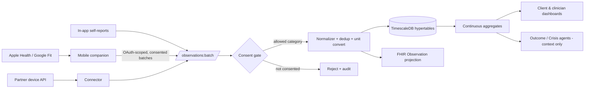

# 09 — Wearables & Time-Series

> Continuous physiological and behavioral signals give clinicians **context** between
> sessions. VPSY OS ingests wearable and self-report data, stores it as
> high-resolution time-series (TimescaleDB), and surfaces it as **decision-support
> context — never as a diagnosis**. Every stream is **consent-gated**, and correlation
> insights are framed as patterns to *consider*, in line with the core principle:
> AI assists, clinicians decide.

## 1. Principles

1. **Context, not diagnosis.** A rising resting heart rate or fragmented sleep is
   shown as an observation with a plain caveat ("physiological signal; not a clinical
   conclusion"), never rendered as "the client is anxious/depressed."
2. **Consent-first.** No stream is ingested, stored, or displayed without an active,
   granular consent for *that* data category. Revocation stops ingestion and can
   purge history.
3. **Client-owned.** Clients see their own data on an insight dashboard and control
   sharing. Sharing with the care team is an explicit, revocable grant.
4. **Signal quality is data.** We store provenance, device, and confidence so noisy
   consumer-grade data isn't over-interpreted.
5. **FHIR-aligned.** Metrics map to FHIR `Observation` (US Core / vital-signs
   profiles) for interoperability; raw high-frequency samples live in TimescaleDB.

## 2. Sources and ingestion

Two ingestion styles, both landing in the **Wearables & Signals** bounded context
(§04 context 17):

- **Aggregator sync** (Apple HealthKit / Google Fit / Health Connect style): the
  mobile PWA/companion reads user-authorized categories and pushes normalized batches
  to `POST /v1/observations:batch`. Apple/Google act as the on-device broker; we
  never scrape a vendor cloud without the user's platform-level authorization.
- **Direct device / API** (e.g. a partner ring/band with a server API under BAA):
  webhook or polling connector normalizes into the same canonical model.
- **Self-reports** (in-app): mood check-ins, panic self-reports, medication
  adherence — first-class signals authored by the client.



Ingestion is **idempotent** (device sample id + timestamp dedup), validates units and
ranges, tags each point with `deviceId`, `source`, and a `quality` score.

## 3. Metrics catalog

| Category | Metric | Unit | Typical use as *context* |
|----------|--------|------|--------------------------|
| Cardiac | Heart rate (HR) | bpm | Arousal/panic context |
| Cardiac | Resting HR (RHR) | bpm | Trend; stress/illness/relapse context |
| Cardiac | Heart-rate variability (HRV) | ms (RMSSD/SDNN) | Autonomic tone; stress/recovery |
| Respiratory | Respiratory rate | breaths/min | Panic/arousal context |
| Sleep | Sleep duration/stages, latency, efficiency, WASO | min / % | Depression & mood context |
| Activity | Steps, active minutes, energy | count / min / kcal | Behavioral activation, withdrawal |
| Thermo | Skin/wrist temperature | °C (deviation) | Illness/cycle context |
| Composite | Vendor "stress score" | index | Coarse arousal proxy (label as vendor-derived) |
| Reproductive | Menstrual cycle phase | phase | Cycle-context for mood — **extra consent** |
| Self-report | Mood check-in | ordinal + tags | Primary EMA signal |
| Self-report | Panic/anxiety episode | event + severity | Acute event marking |
| Self-report | Medication adherence | taken/missed + time | Plan-adherence context |

Vendor-derived composites (e.g. "stress score") are stored but always labeled as
**vendor-computed proxies**, not clinical measures.

## 4. TimescaleDB schema

Raw samples go into **hypertables** partitioned by time (and space-partitioned by
tenant for isolation); rollups are **continuous aggregates**.

```sql
-- Canonical numeric samples (wide-column narrow-row design)
CREATE TABLE signal_samples (
  tenant_id     text        NOT NULL,
  client_id     text        NOT NULL,
  metric        text        NOT NULL,      -- 'hr','hrv_rmssd','sleep_efficiency',...
  ts            timestamptz NOT NULL,
  value         double precision NOT NULL,
  unit          text        NOT NULL,
  device_id     text,
  source        text        NOT NULL,      -- 'apple_health','google_fit','device:oura','self_report'
  quality       real,                       -- 0..1 confidence
  consent_id    text        NOT NULL,      -- the grant that authorized this point
  ingested_at   timestamptz NOT NULL DEFAULT now()
);
SELECT create_hypertable('signal_samples','ts',
        partitioning_column => 'tenant_id', number_partitions => 8,
        chunk_time_interval => INTERVAL '7 days');
CREATE INDEX ON signal_samples (tenant_id, client_id, metric, ts DESC);
ALTER TABLE signal_samples SET (timescaledb.compress,
        timescaledb.compress_segmentby = 'tenant_id, client_id, metric');
SELECT add_compression_policy('signal_samples', INTERVAL '14 days');
SELECT add_retention_policy('signal_samples', INTERVAL '24 months'); -- policy-driven

-- Discrete events (episodes, doses, check-ins)
CREATE TABLE signal_events (
  id          text PRIMARY KEY,
  tenant_id   text NOT NULL,
  client_id   text NOT NULL,
  kind        text NOT NULL,        -- 'panic_episode','mood_checkin','med_dose','cycle_marker'
  ts          timestamptz NOT NULL,
  payload     jsonb NOT NULL,       -- {severity, tags, medication, adherence,...}
  consent_id  text NOT NULL,
  source      text NOT NULL
);
SELECT create_hypertable('signal_events','ts', if_not_exists => TRUE);
```

Continuous aggregate (daily rollup used by dashboards/agents):

```sql
CREATE MATERIALIZED VIEW signal_daily
WITH (timescaledb.continuous) AS
SELECT tenant_id, client_id, metric,
       time_bucket('1 day', ts) AS day,
       avg(value) AS mean, min(value) AS min, max(value) AS max,
       percentile_cont(0.5) WITHIN GROUP (ORDER BY value) AS median,
       count(*) AS n, avg(quality) AS mean_quality
FROM signal_samples
GROUP BY tenant_id, client_id, metric, day;
SELECT add_continuous_aggregate_policy('signal_daily',
        start_offset => INTERVAL '30 days', end_offset => INTERVAL '1 hour',
        schedule_interval => INTERVAL '1 hour');
```

Design notes: compression after 14 days keeps long histories cheap; retention is a
**policy** (per tenant/jurisdiction, defaults conservative); tenant space-partitioning
plus `tenant_id` in every index enforces isolation at the storage layer, complementing
row-level authorization in the API.

## 5. Consent gating

- Consent is **per data category** (cardiac, sleep, activity, reproductive/menstrual,
  self-report) and per **audience** (self-only vs. share-with-care-team), captured in
  the Consent context (§04.4).
- The ingestion consent gate rejects any point whose category lacks an active grant
  (`consent_id` is mandatory on every row — unconsented data physically cannot be
  stored).
- **Menstrual/reproductive data requires a distinct, explicit opt-in** and can be
  shared or hidden independently; it is used only as mood-cycle context with the
  client's clear agreement.
- **Revocation**: stops future ingestion immediately; the client chooses whether to
  also purge history (retention/purge job honors it, audited).
- Every ingestion, view, and share-change emits an audit event.

## 6. Correlation use cases (context, not conclusions)

The platform computes **descriptive correlations and temporal patterns** and presents
them as prompts for clinical exploration. All are explicitly labeled non-diagnostic.

| Pattern | Signals combined | Framing shown to clinician |
|---------|------------------|----------------------------|
| Panic / anxiety context | HR + respiratory rate spikes co-occurring with panic self-reports | "HR spikes align with 3 reported panic episodes this week — **consider exploring** triggers." |
| Sleep ↔ depression | Sleep efficiency/duration trend vs. PHQ-9 trajectory (§07) | "Declining sleep efficiency coincides with rising PHQ-9 — **may warrant** review." |
| Relapse early-warning | RHR drift + activity drop + missed check-ins/doses | "Composite deviation from the client's baseline; **suggest** proactive outreach." |
| Burnout | Chronically low HRV + high activity + poor sleep | "Sustained low HRV with high load — **context** for fatigue discussion." |
| Adherence context | Med-dose events vs. symptom self-reports | "Missed doses precede symptom upticks in the last month — **consider** discussing adherence." |

Implementation details:
- Correlations are computed **against the client's own baseline** (personal
  z-scores / change-from-rolling-median), not against population thresholds, to avoid
  pathologizing individual differences.
- Quality-weighted: low-`quality` or sparse data yields "insufficient data to
  characterize" rather than a spurious pattern.
- Acute self-reports (panic episode, and any self-harm content in check-ins) route to
  the **Crisis/Risk agent** (§05.6) for human attention — the one path that escalates,
  and even then only *raises attention*, never diagnoses or resolves.

## 7. Client insight dashboard

- Clients see their **own** trends (sleep, activity, HR/HRV, mood check-ins) with
  supportive, non-clinical language and no diagnostic labels.
- Clear controls: what's collected, what's shared with the care team, pause/stop, and
  purge.
- Gentle, non-alarming presentation; any concerning acute self-report surfaces
  crisis-support resources.
- Absent data renders as an em-dash / "no data" — never a `0` that could read as a
  real low value.

## 8. Clinician view

- A **context strip** on the case/session screen (a CDS-Hooks moment, §05): recent
  trends, deviations-from-baseline, and correlation cards — each with the
  "decision-support, not diagnosis; requires clinician judgment" caveat.
- Drill-down to raw/aggregated series, filterable by metric and window, with data
  provenance and quality shown so the clinician can weigh reliability.
- Nothing here writes to the clinical record automatically; the clinician decides
  what, if anything, is clinically meaningful and documents it in their own note.

## 9. Privacy, security, retention

- All wearable data is **PHI**: encrypted in transit (TLS) and at rest; access is
  RBAC/ABAC-gated (clinician must be assigned to the case *and* hold a share grant).
- Tenant isolation at storage (space partition) and query layers.
- Retention is jurisdiction- and tenant-configurable via Timescale retention
  policies; purge-on-revocation supported.
- De-identified, aggregated data may feed analytics/warehouse only under governance;
  **raw PHI is never used to train AI models** (§05).
- Every read/share/export of signal data is audited (§04 context 27).
```
