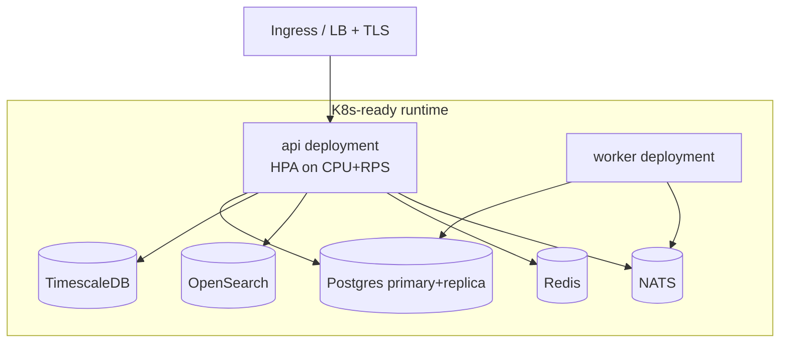
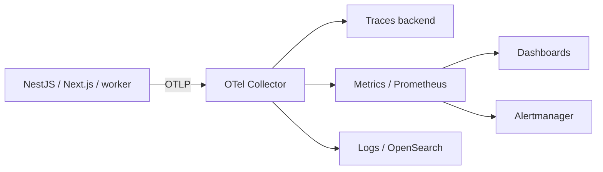
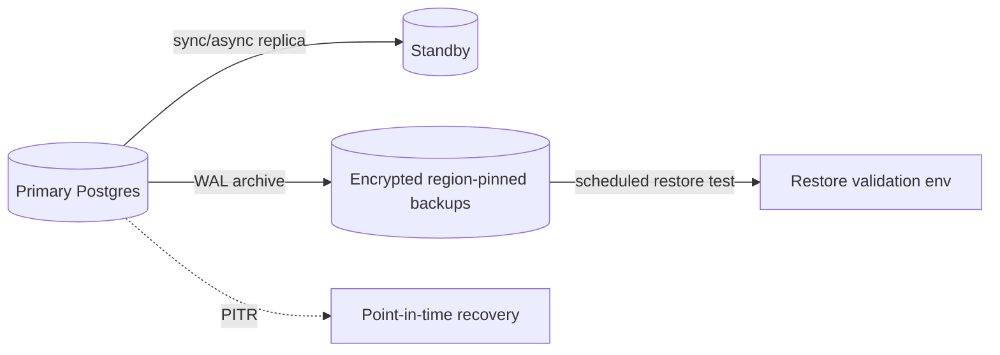
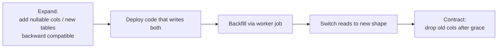

# 10 — Observability & DevOps

> **VPSY OS** — Clinical Psychology Operating System
> **Core principle:** *AI assists, licensed clinicians decide. Every clinical action produces an audit event.*

This document defines how VPSY OS is built, shipped, observed, and recovered: CI/CD,
environments, IaC, containerization, K8s readiness, OpenTelemetry (traces/metrics/logs),
SLOs/SLIs, alerting, backups & disaster recovery, progressive delivery, database migrations,
feature flags, secrets, and the on-call runbook.

Stack anchors: **Turborepo + pnpm**, **NestJS** modular monolith, **PostgreSQL + Prisma**,
**TimescaleDB**, **OpenSearch**, **Redis**, in-process event bus → **NATS**, deployed on
**Vercel (web)** + **Render (API/Postgres)**, **K8s-ready**, **OpenTelemetry** throughout.

---

## 1. DevOps Principles

1. **Everything as code** — infra, pipelines, dashboards, alerts, and runbooks live in the repo.
2. **Immutable, reproducible builds** — a build artifact is promoted unchanged dev → staging → prod.
3. **Progressive, reversible delivery** — canary/blue-green with fast rollback; no big-bang deploys.
4. **Observability is not optional** — no service ships without traces, metrics, logs, and an SLO.
5. **Safety-critical lanes** — Risk & Crisis and Telehealth have elevated availability targets and
   protected capacity.
6. **Compliance-aware operations** — production PHI access is broken-glass, audited, and region-pinned.

---

## 2. Monorepo & Build Topology

Turborepo orchestrates the pnpm workspace. Task graph is cache-aware so CI only rebuilds/tests
what changed.

```
vpsy/
├─ apps/
│  ├─ api/            # NestJS modular monolith (28 bounded contexts)
│  ├─ web/            # Next.js 15 App Router (8 portals + public)
│  └─ worker/         # background jobs, event consumers, scheduled tasks
├─ packages/
│  ├─ domain/         # DDD domain models, shared value objects
│  ├─ contracts/      # API/event schemas (zod/openapi), FHIR mappings
│  ├─ policy/         # RBAC matrix + ABAC engine (pure, testable)
│  ├─ observability/  # OTel setup, logger, correlation
│  ├─ config/         # env schema + validation
│  └─ ui/             # shadcn/ui design system
├─ infra/             # IaC (Terraform), k8s manifests, render.yaml, Dockerfiles
└─ turbo.json
```

Turbo pipeline: `lint → typecheck → test → build → e2e`. Remote cache shared across CI and
developer machines. Affected-only execution keeps PR feedback fast.

---

## 3. Environments

| Environment | Purpose | Data | Deploy trigger | Access |
|-------------|---------|------|----------------|--------|
| **Local** | Developer inner loop | Seeded synthetic (no PHI) | Manual (`pnpm dev`, docker-compose) | Developer |
| **Preview** | Per-PR ephemeral | Synthetic | Auto on PR (Vercel preview + Render preview) | Team |
| **Dev/Integration** | Shared integration | Synthetic | Auto on merge to `develop` | Team |
| **Staging** | Pre-prod, prod-like | Anonymized/synthetic, prod-shaped | Auto on merge to `main` | Team + QA |
| **Production** | Live PHI | Real PHI, region-pinned | Manual promotion (approval gate) | Break-glass only |

Staging mirrors production topology (same Postgres/Timescale/OpenSearch/Redis versions, same
K8s manifests / Render blueprint) so deploy behavior is representative. **No real PHI leaves
production**; lower environments use synthetic or irreversibly de-identified data.

---

## 4. CI/CD Pipeline

```mermaid
flowchart LR
    PR[Pull Request] --> L[Lint + Typecheck]
    L --> UT[Unit + policy tests]
    UT --> SEC[SAST + deps + secret scan]
    SEC --> B[Build artifacts + docker images]
    B --> PREV[Ephemeral preview deploy]
    PREV --> E2E[E2E + a11y + contract tests]
    E2E --> MERGE{Merge to main}
    MERGE --> STG[Deploy staging]
    STG --> SMOKE[Smoke + migration verify]
    SMOKE --> GATE{Manual approval}
    GATE --> CAN[Canary 5% prod]
    CAN --> HEALTH{SLO healthy?}
    HEALTH -- yes --> ROLL[Progressive 25→50→100%]
    HEALTH -- no --> RB[Auto rollback]
```



### 4.1 Pipeline gates

| Gate | Blocks merge/deploy if… |
|------|--------------------------|
| Lint/typecheck | Any error |
| Unit + policy tests | Coverage below threshold or RBAC/ABAC matrix test fails |
| Security scan | High/critical SAST, vulnerable dep, or leaked secret |
| Contract tests | API/event schema breaking change without version bump |
| Migration verify | Prisma migration not backward-compatible in expand phase |
| E2E + a11y | Critical journey fails; WCAG AA violation on core flows |
| Canary health | SLO error budget burn exceeds threshold during canary |

### 4.2 Branching & release

- Trunk-based with short-lived feature branches; `develop` (integration) and `main` (release).
- Conventional commits drive changelog + semver of internal packages.
- Every prod release is tagged and traceable to the exact artifact + git SHA + model registry
  state.

---

## 5. Containerization & K8s Readiness

- **Docker**: multi-stage builds (pnpm prune → build → distroless/slim runtime), non-root user,
  read-only filesystem, pinned base images, SBOM generated per image.
- **Render** hosts API + managed Postgres today via `render.yaml` blueprint (web on Vercel).
- **K8s-ready**: the API is stateless (session state in Redis), 12-factor, with liveness
  (`/healthz`), readiness (`/readyz`), and startup probes; graceful shutdown drains in-flight
  requests and event consumers. Manifests + Helm values live in `infra/` so migration to a
  managed K8s cluster is a deploy-target swap, not a rewrite.



| Concern | Implementation |
|---------|----------------|
| Health probes | `/healthz` (liveness), `/readyz` (deps reachable), startup probe |
| Autoscaling | HPA on CPU + request rate; min replicas ≥2 (HA); Risk/Crisis lane reserved capacity |
| Config | Env from secret store; validated by `packages/config` zod schema at boot (fail-fast) |
| Graceful shutdown | SIGTERM → stop accepting → drain → flush OTel → close pools |
| Resource limits | CPU/memory requests+limits; PodDisruptionBudget for HA |

---

## 6. Infrastructure as Code

- **Terraform** provisions cloud primitives (databases, networks, DNS, KMS keys, buckets,
  OpenSearch, Redis, region pinning) with remote state + locking. Environments are separate
  workspaces/state files.
- **render.yaml** blueprint declares API service, workers, cron jobs, and managed Postgres.
- **K8s manifests / Helm** describe the containerized runtime for cluster targets.
- All changes go through PR + plan review; `terraform plan` is posted to the PR; apply is gated.
- **Region/residency** is an IaC parameter per tenant-tier so PHI stays in-jurisdiction
  (see residency in `06-security-and-rbac.md`).

---

## 7. Observability — OpenTelemetry

A single `packages/observability` module initializes OTel SDK (traces, metrics, logs) with
consistent resource attributes (`service.name`, `service.version`, `deployment.environment`,
`tenant.id` as low-cardinality-safe hash). **PHI is never placed in telemetry** — only ids,
hashes, and classification tags.

### 7.1 Traces

- Distributed tracing across web → API → data stores → AI Gateway → model provider.
- Every request carries a `traceId` + `correlationId`; audit events reference the `traceId`
  so a clinical action can be tied to its full technical trace.
- Spans annotate bounded context, RBAC/ABAC decision, cache hit/miss, and model version
  (for AI Gateway spans) — without payloads.

### 7.2 Metrics

| Category | Example metrics |
|----------|-----------------|
| RED (per endpoint) | Request rate, error rate, duration (p50/p95/p99) |
| Saturation | CPU, memory, DB pool utilization, Redis hit rate, queue depth |
| Domain | Sessions started, notes finalized, risk assessments created, payouts processed |
| AI | Recommendations issued, accept/override rate, model latency, calibration drift |
| Availability | Uptime per critical lane (Telehealth, Risk & Crisis) |

### 7.3 Logs

- Structured JSON logs, correlation-id stamped, shipped to OpenSearch.
- **Redaction middleware** strips known PHI keys; clinical bodies are never logged (ids +
  audit refs only). Log retention respects data classification and residency.



---

## 8. SLIs, SLOs & Error Budgets

SLOs are tiered by criticality. Breaching an error budget freezes risky changes for that
service until burn recovers.

| Service / lane | SLI | SLO target | Error budget |
|----------------|-----|-----------|--------------|
| Risk & Crisis API | Availability + p95 latency | 99.95% / <300ms | 21.6 min/month |
| Telehealth signaling | Session-join success | 99.9% | 43.2 min/month |
| Core clinical API | Availability | 99.9% | 43.2 min/month |
| Web portals | LCP / availability | LCP <2.5s p75, 99.9% | 43.2 min/month |
| AI Gateway | Recommendation latency | p95 <4s, 99.5% | — |
| Scheduling/Payments | Availability | 99.5% | 3.6 h/month |
| Async jobs (worker) | Job success + freshness | 99.5%, <5 min lag | — |

- **Burn-rate alerting**: fast burn (2% budget in 1h) pages; slow burn (10% in 3d) tickets.
- Monthly SLO review feeds the roadmap; chronic breaches become reliability epics.

---

## 9. Alerting & On-Call

| Severity | Definition | Response | Notify |
|----------|-----------|----------|--------|
| **SEV1** | Crisis/Telehealth down, PHI exposure suspected, data integrity risk | Immediate page, Incident Commander | On-call + eng lead + DPO/SecOps |
| **SEV2** | Core clinical degraded, SLO fast-burn | Page | On-call |
| **SEV3** | Non-critical degradation, single-tenant issue | Ticket, business hours | Team |
| **SEV4** | Cosmetic / low impact | Backlog | Team |

Alerts are symptom-based (SLO burn, error rate, saturation) not noise-based; each alert links
to a runbook. Suspected PHI exposure always escalates to the breach workflow in
`06-security-and-rbac.md` regardless of technical severity.

---

## 10. Backups & Disaster Recovery

### 10.1 Targets

| Data store | RPO | RTO | Method |
|------------|-----|-----|--------|
| PostgreSQL (clinical) | ≤5 min | ≤1 h | Continuous WAL archiving + PITR, cross-AZ replica, region-pinned encrypted backups |
| TimescaleDB (wearables) | ≤15 min | ≤2 h | Continuous archiving + snapshots |
| OpenSearch (search) | Rebuildable | ≤4 h | Reindex from source of truth (Postgres) |
| Redis (cache/session) | N/A (ephemeral) | ≤15 min | Rebuild; sessions re-auth |
| Object storage (documents) | ≤15 min | ≤1 h | Versioned + cross-region replication (in-jurisdiction) |
| Audit chain | 0 (append-only, replicated) | ≤1 h | Synchronous replication + daily anchor |

### 10.2 DR strategy

- **Backups** are encrypted with a separate KMS key, region-pinned for residency, and
  **restore-tested** on a schedule (a backup is not trusted until restored).
- **Failover**: primary + standby Postgres with automated promotion; multi-AZ; documented
  region-failover runbook where a tenant tier requires it.
- **Crypto-shredding compatibility**: restores respect deleted DEKs (erased subjects stay
  erased).



---

## 11. Progressive Delivery

- **Blue-green** for the web tier (Vercel immutable deployments + instant alias switch).
- **Canary** for the API: 5% → 25% → 50% → 100%, each step gated on SLO health; automatic
  rollback on burn-rate breach or error spike.
- **Rollback** is a promotion of the previous known-good artifact (fast, deterministic) plus
  the DB contract/expand-migrate-contract discipline so schema never blocks rollback.

---

## 12. Database Migration Strategy (Prisma)

Migrations follow **expand → migrate → contract** so deploys and rollbacks are safe on a live
clinical system with append-only tables.



| Rule | Rationale |
|------|-----------|
| Every migration reviewed + `prisma migrate diff` in CI | Catch breaking/destructive changes |
| No destructive change in same deploy as code needing it | Preserve rollback safety |
| Backfills are idempotent, batched, resumable worker jobs | Country-scale volumes |
| Clinical fact tables never drop/rewrite history | Tamper-evidence + retention |
| Migrations applied via gated job before canary | Staging migration-verify gate |

Timescale hypertables and OpenSearch index mappings have parallel versioned migration flows.

---

## 13. Feature Flags

- Central flag service (config-driven, per-tenant/jurisdiction targeting) gates new bounded
  contexts, AI agents, and risky changes.
- **AI agents ship dark**: `off → shadow (log-only, no clinician exposure) → advisory → active`,
  each stage requiring monitoring evidence (calibration, override rates) before promotion.
- Flags are typed, audited on change, and cleaned up (no permanent flag debt); kill-switches
  exist for every AI agent and for external model providers.

---

## 14. Secrets in the Pipeline

- CI/CD uses short-lived OIDC-federated credentials to cloud providers — no long-lived keys in
  CI.
- Runtime secrets from the managed secret store / KMS; injected at deploy, never baked into
  images.
- Secret scanning pre-commit + CI; a detected leak triggers the automated rotation runbook.
- Production secret access by humans is break-glass, approved, and audited.

---

## 15. On-Call Runbook (Outline)

Each runbook is a living doc under `infra/runbooks/` linked from its alert.

1. **Acknowledge & classify** — confirm severity, open incident channel, assign Incident
   Commander. SEV1 auto-invites DPO/SecOps.
2. **Assess blast radius** — which tenants, which lanes, is Risk/Crisis or Telehealth affected,
   is PHI involved.
3. **Stabilize** — apply mitigation: scale out, shed load, flip feature flag / AI kill-switch,
   roll back to last good artifact.
4. **Communicate** — status page, affected-tenant notice; regulatory clock starts if PHI
   exposure suspected (hand to breach workflow).
5. **Diagnose** — use traces (traceId ↔ audit event), metrics burn charts, logs; identify root
   cause.
6. **Recover** — restore service, verify SLIs green, confirm data integrity via audit-chain
   verification.
7. **Post-incident** — blameless post-mortem within 2 weeks, action items tracked, controls +
   NEXUS memory updated to prevent recurrence.

### 15.1 Common runbook index

| Runbook | Trigger |
|---------|---------|
| Postgres failover | Primary unhealthy / SEV2 DB latency |
| PITR restore | Data corruption / accidental bad migration |
| AI agent kill-switch | Calibration drift / bias alert / provider outage |
| Telehealth degradation | Session-join SLO breach |
| Risk & Crisis capacity | Priority-lane saturation |
| Suspected PHI exposure | Any indication of unauthorized access |
| Secret rotation | Leak detected |
| Region failover | Regional provider outage |

---

## 16. Summary

VPSY OS operations are code-defined, cache-accelerated (Turborepo), and reproducible from a
single promoted artifact. OpenTelemetry gives unified traces/metrics/logs that never carry
PHI yet tie every clinical action to its technical trace via correlation ids. Tiered SLOs put
the strictest reliability on Risk & Crisis and Telehealth, enforced by burn-rate alerting and
error budgets. Backups are encrypted, region-pinned, and restore-tested with explicit RPO/RTO
targets; delivery is progressive and reversible; Prisma migrations follow expand/contract for
rollback safety on an append-only clinical store; and every AI agent ships behind a staged
feature flag with a kill-switch. Reliability and compliance are the same discipline here.
