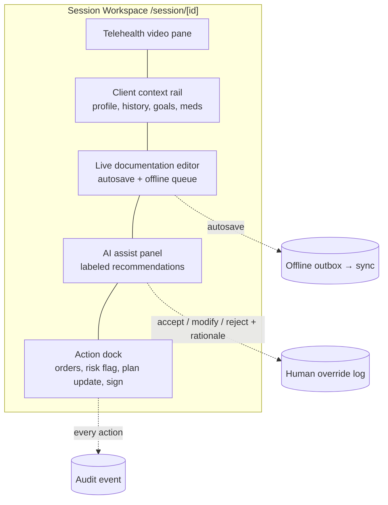

# 11 — Frontend Architecture

> **VPSY OS** — Clinical Psychology Operating System
> **Core principle:** *AI assists, licensed clinicians decide. Every clinical action produces an audit event.*

This document defines the VPSY OS frontend: **Next.js 15 App Router**, **PWA-first**, the eight
role-based portals plus the public site, the design system (**Tailwind + shadcn/ui**), the
mobile fixed bottom navigation, data-fetching strategy (**React Server Components** + **React
Query** where interactive), auth-gated routing, accessibility (**WCAG 2.2 AA**),
internationalization, component architecture, and the **Session Workspace** — the clinical
cockpit at the center of the product.

---

## 1. Design Goals

1. **Clinician time is sacred** — the UI removes friction from clinical work; the Session
   Workspace is one screen, not ten.
2. **PWA-first** — installable, offline-capable for intake/notes, resilient on poor connections
   (telehealth in rural clinics).
3. **Role-clarity** — eight portals, each showing only what a role may see/do, mirroring the
   RBAC/ABAC model server-side (the UI never becomes the security boundary).
4. **Futuristic premium clinical** — calm, precise, high-trust aesthetic; dense where experts
   need density, spacious where clients need reassurance.
5. **Accessible + multilingual by default** — WCAG 2.2 AA, RTL-ready, country-scale i18n.
6. **AI is labeled, never silent** — every AI-surfaced element is visibly marked as a
   recommendation requiring clinician action.

---

## 2. App Router Structure

Next.js 15 App Router with **route groups per portal**, server components by default, and a
shared `packages/ui` design system. Each portal is auth-gated by middleware + server-side
session resolution.

```
apps/web/
├─ app/
│  ├─ (public)/                # marketing, pricing, about, legal, contact
│  │  ├─ page.tsx
│  │  ├─ pricing/ · about/ · legal/ · contact/
│  ├─ (auth)/                  # login, mfa, forgot, consent, onboarding
│  ├─ (client)/                # Client portal
│  │  ├─ dashboard/ · appointments/ · sessions/ · messages/
│  │  ├─ assessments/ · exercises/ · wearables/ · billing/ · documents/
│  ├─ (psychologist)/          # Psychologist portal
│  │  ├─ dashboard/ · schedule/ · clients/
│  │  ├─ session/[id]/         # ← Session Workspace (the center)
│  │  ├─ documentation/ · psychometrics/ · risk/ · messages/
│  ├─ (supervisor)/            # caseload oversight, co-sign, review queues
│  ├─ (manager)/               # clinic ops, staffing, scheduling, matching
│  ├─ (admin)/                 # tenant config, users, feature flags
│  ├─ (finance)/               # payments, accounting, payouts, reconciliation
│  ├─ (executive)/             # cross-clinic aggregate dashboards
│  ├─ (government)/            # national analytics (aggregate, de-identified)
│  ├─ api/                     # route handlers (BFF: auth cookie exchange, uploads)
│  ├─ layout.tsx               # root: theme, i18n, providers, OTel web
│  └─ manifest.ts · sw.ts      # PWA
├─ components/                 # app-specific compositions
├─ lib/                        # api client, query hooks, auth, flags, i18n
└─ middleware.ts               # auth + role gating + tenant/locale resolution
```

### 2.1 Rendering strategy per surface

| Surface | Strategy | Why |
|---------|----------|-----|
| Public/marketing | Static + ISR | Fast, cacheable, SEO |
| Auth flows | Server components + server actions | Security, no token in client bundle |
| Dashboards | RSC for shell + streamed data | Fast first paint, progressive |
| Session Workspace | RSC shell + React Query islands | Real-time, offline-tolerant, optimistic |
| Analytics (exec/gov) | RSC + cached aggregate endpoints | Heavy, de-identified, read-mostly |

---

## 3. The Eight Portals + Public Site

Each portal is a route group with its own navigation, but all share the design system, auth,
and BFF. Server-side, the middleware resolves the session and asserts the requested route
group matches an allowed role; ABAC still governs data access at the API.

| Portal | Primary jobs-to-be-done | Signature screens |
|--------|------------------------|-------------------|
| **Public** | Explain, convert, comply | Landing, pricing, legal, clinician recruitment |
| **Client** | Attend care, self-report, stay engaged | Dashboard, appointments, join session, assessments, exercises, wearables, billing |
| **Psychologist** | Deliver care efficiently | **Session Workspace**, caseload, documentation, psychometrics, risk, schedule |
| **Supervisor** | Oversee quality & safety | Review queue, co-sign, risk escalations, trainee caseloads |
| **Manager** | Run the clinic | Staffing, matching/assignment, scheduling grid, utilization |
| **Admin** | Configure the tenant | Users/roles, clinic network, feature flags, integrations |
| **Finance** | Money in/out | Payments, invoices, accounting, revenue-share payouts, reconciliation |
| **Executive** | Steer the business | Cross-clinic KPIs, outcomes, growth (aggregate/de-identified) |
| **Government** | Population oversight | National analytics, access-rate, outcome trends (aggregate only) |

Portals degrade gracefully: a user with multiple roles sees a role switcher; the active role
scopes the entire session context and audit attribution.

---

## 4. The Session Workspace — Center of the System

The Session Workspace (`(psychologist)/session/[id]`) is where care actually happens. It fuses
telehealth, documentation, psychometrics, risk, treatment plan, and AI assistance into **one
focused surface** so the clinician never context-switches mid-session.



Design tenets of the workspace:

- **Single-screen, zero-loss**: notes autosave continuously; if the connection drops, edits
  queue in an offline outbox (IndexedDB) and sync on reconnect — clinicians never lose a note.
- **AI clearly subordinate**: the AI panel shows differential hypotheses, risk signals, and
  suggested plan edits, each stamped with model version and confidence, each requiring an
  explicit **accept / modify / reject + rationale** that writes a human-override log entry.
- **Safety always reachable**: a persistent risk/crisis affordance escalates without leaving
  the session.
- **Sign-off is deliberate**: finalizing a note is a step-up, explicit action that creates an
  immutable, signed clinical record version.

---

## 5. PWA Setup

| Feature | Implementation |
|---------|----------------|
| Installability | `app/manifest.ts` (name, icons, theme color, display=standalone, shortcuts to Session/Schedule) |
| Service worker | Precache app shell; runtime caching (stale-while-revalidate for reference data, network-first for clinical) |
| Offline forms | Intake, screening, and session notes persist to IndexedDB outbox; background sync flushes when online |
| Push notifications | Web Push for appointment reminders, risk escalations, message alerts (client + clinician), consent-gated |
| Update flow | SW `skipWaiting` with a user-visible "new version" prompt; never silently swap mid-session |
| Clinical safety | Clinical writes are **never** served from stale cache; offline writes are queued, not confirmed, and clearly marked "pending sync" |

Offline scope is deliberately bounded: reading reference material and drafting notes/intake
works offline; anything requiring authorization, payment, or finalization requires
connectivity and re-validation server-side.

---

## 6. Design System

Built on **Tailwind** + **shadcn/ui** primitives, wrapped in `packages/ui` with VPSY tokens.
Aesthetic target: **futuristic premium clinical** — deep, calm surfaces; precise typographic
scale; restrained accent color; generous focus states; motion that informs, never decorates.

### 6.1 Tokens

| Token group | Notes |
|-------------|-------|
| Color | Semantic tokens (`--surface`, `--surface-elevated`, `--content`, `--accent`, `--success`, `--warning`, `--danger`, `--risk-critical`). Risk states have a reserved, unmistakable palette. |
| Typography | Modular scale; high legibility for dense clinical text; tabular numerals for scores/vitals |
| Spacing/radius | 4px base grid; soft radii for calm, tighter density in clinician tools |
| Elevation | Layered translucent surfaces (the "premium" depth) with accessible contrast |
| Motion | Reduced-motion aware; purposeful transitions on state change only |

### 6.2 Dark mode

- Class-strategy dark mode (`data-theme`) with SSR-safe theme resolution (no flash).
- Both themes are first-class and contrast-audited; clinicians often work in low light.
- Risk/critical colors are tuned per theme to preserve unmistakable salience.

### 6.3 Component layers

```
packages/ui (primitives: Button, Input, Dialog, Table, Tabs, Toast, Sheet…)
        ↓ composed into
apps/web/components (domain compositions: CaseloadTable, RiskBanner, NoteEditor, AIRecCard…)
        ↓ assembled into
app/(portal)/**/page.tsx (route-level screens, mostly server components)
```

Domain compositions encode clinical UX rules once (e.g., `AIRecCard` always shows the label,
model version, and accept/modify/reject controls) so they cannot be rendered "unlabeled."

---

## 7. Mobile & Fixed Bottom Navigation

On mobile viewports each portal renders a **fixed bottom navigation bar** (thumb-reachable),
replacing the desktop side rail. It exposes 4–5 top destinations per role.

| Portal | Bottom nav (mobile) |
|--------|---------------------|
| Client | Home · Appointments · Session · Messages · More |
| Psychologist | Today · Caseload · Session · Risk · More |
| Manager | Overview · Schedule · Staff · Matching · More |
| Finance | Overview · Payments · Payouts · Reports · More |

The bar respects safe-area insets, hides on scroll-down / reveals on scroll-up in dense views,
and elevates the primary action (e.g., "Join Session") as a center affordance. Desktop swaps to
a collapsible side navigation with the same information architecture.

---

## 8. State & Data Fetching

**Server Components first**; client interactivity added only where needed. This keeps bundles
small, secrets server-side, and first paint fast.

| Concern | Approach |
|---------|----------|
| Reads (page shell, lists, detail) | RSC fetching from the API via a server-side typed client; streamed with Suspense |
| Interactive reads (live session, dashboards, search) | **React Query** islands — caching, background refetch, optimistic updates, retry/backoff |
| Mutations | Server Actions for form-style writes; React Query mutations for optimistic in-session writes with the offline outbox |
| Real-time | SSE/WebSocket for session presence, risk alerts, messaging; reconciled into React Query cache |
| Global UI state | Minimal client store (theme, role switch, offline status) — no PHI in client stores beyond the active view |
| Forms | Typed schemas (zod) shared with backend contracts; inline validation; a11y error summaries |

Data contracts come from `packages/contracts` (shared with the API), giving end-to-end type
safety and preventing UI/API drift.

---

## 9. Auth-Gated Routing

```mermaid
flowchart LR
    Req[Request] --> MW[middleware.ts]
    MW --> S{Valid session?}
    S -- no --> Login[/(auth)/login/]
    S -- yes --> R{Role allowed<br/>for route group?}
    R -- no --> Forbidden[403 / role switch]
    R -- yes --> C{Consent + MFA<br/>obligations met?}
    C -- no --> Step[Step-up / consent screen]
    C -- yes --> Page[Render portal page]
```

- Middleware resolves session (opaque refresh handle → server), tenant, locale, and role;
  rejects mismatched route groups before rendering.
- The client never holds the authorization decision — server components re-check permissions
  when fetching; the UI merely reflects them. **UI is not the security boundary.**
- Sensitive actions (finalize note, export, payout approval) trigger step-up re-auth screens.

---

## 10. Accessibility (WCAG 2.2 AA)

| Area | Commitment |
|------|-----------|
| Semantics | Landmarks, headings order, native controls via shadcn/Radix primitives |
| Keyboard | Full keyboard operability; visible focus; logical tab order; skip links |
| Contrast | AA contrast in both themes; verified in CI (axe) on core journeys |
| Screen readers | Labeled controls, live regions for autosave/risk alerts, error summaries |
| Motion | `prefers-reduced-motion` honored |
| Targets | ≥44px touch targets on mobile bottom nav and action docks |
| Forms | Programmatic labels, describedby errors, no color-only signaling |

Accessibility is CI-gated: axe checks and keyboard-path e2e run on core clinical journeys;
an AA violation on a core flow blocks merge (see `10-observability-and-devops.md`).

---

## 11. Internationalization & Localization

- App Router locale segmentation with server-side locale resolution (tenant/user preference,
  Accept-Language fallback).
- Message catalogs per locale; ICU pluralization; locale-aware dates, numbers, and clinical
  units.
- **RTL support** built into the design system (logical properties, mirrored layouts) for
  Arabic/Hebrew markets.
- Clinical content (instruments, consent text) is translation-managed with versioning so a
  localized consent form is tied to its policy version (ties into consent versioning in
  `06-security-and-rbac.md`).
- Country-scale readiness: locale is a first-class routing + residency dimension.

---

## 12. Performance

| Lever | Practice |
|-------|----------|
| Bundle | RSC-default, route-level code splitting, `packages/ui` tree-shaken, dynamic import for heavy panels (video, charts) |
| Images | `next/image`, responsive, modern formats |
| Fonts | Self-hosted, `next/font`, preloaded, no layout shift |
| Data | Streamed RSC + Suspense; React Query caching to avoid refetch storms |
| Web vitals | LCP <2.5s p75, INP <200ms, CLS <0.1; OTel web tracing reports RUM |
| Edge | Static/marketing on Vercel edge; clinical data always origin + authorized |

---

## 13. Component Architecture Principles

1. **Server by default, client by exception** — mark `"use client"` only for interactivity.
2. **Domain rules live in components** — clinical UX invariants (AI labeling, risk salience,
   sign-off ceremony) are encoded once and reused.
3. **Contracts over guesses** — shared zod/OpenAPI types eliminate UI/API drift.
4. **Composable, not clever** — small primitives → domain compositions → screens.
5. **Fail visible, never silent** — offline, pending-sync, and permission-denied states are
   explicit and reassuring.
6. **No PHI where it doesn't belong** — client stores hold the active view only; nothing PHI
   in URLs, logs, or analytics.

---

## 14. Summary

The VPSY OS frontend is a Next.js 15 App Router application organized as eight role-scoped
portals plus a public site, all sharing a Tailwind + shadcn/ui design system tuned to a
futuristic-premium-clinical aesthetic with first-class dark mode and RTL/i18n. It is PWA-first
with offline-capable intake and note-drafting backed by an IndexedDB outbox, and mobile-first
with a role-aware fixed bottom navigation. Rendering favors React Server Components with React
Query islands for live and interactive surfaces, all type-safe against shared contracts.
Everything orbits the **Session Workspace** — the single-screen clinical cockpit where
telehealth, documentation, psychometrics, risk, and clearly-labeled AI recommendations meet,
and where every clinician action and AI override produces an audit event. The UI reflects, but
never replaces, the server-enforced RBAC/ABAC security model.
