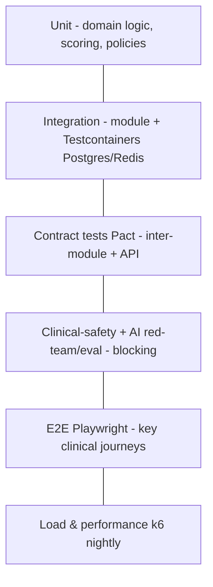

# 12 — Testing Strategy

> VPSY OS is safety-critical health infrastructure. Testing is not a phase; it is a
> gate. This document defines the test pyramid, the clinical-safety and AI-eval
> suites that are unique to a behavioral-health platform, authorization testing,
> PHI-safe test data, load testing, and the compliance evidence we generate from all
> of it. The non-negotiable rule from the project's Definition of Done applies:
> **done = tests pass + behavior confirmed + approved.**

## 1. Testing philosophy

- **Safety over coverage vanity.** A 100%-covered module that lets an AI emit a
  diagnosis, or lets a clinician read another tenant's chart, is a failing system.
  The clinical-safety and authorization suites are **blocking** in CI regardless of
  line coverage.
- **Fast feedback, deep gates.** Cheap tests run on every commit; expensive suites
  (e2e, load, red-team) run on PR/nightly, but all must be green before release.
- **No PHI in tests, ever.** All test data is synthetic or de-identified fixtures
  (§7). A test that requires real PHI is a design bug.
- **Determinism.** Flaky tests are treated as failures and quarantined immediately —
  a flaky safety test is indistinguishable from a broken safeguard.

## 2. The test pyramid



| Layer | Runner | Scope | Runs on |
|-------|--------|-------|---------|
| Unit | Jest/Vitest | Pure domain logic, aggregates, scoring math, policy fns | every commit |
| Integration | Jest + Testcontainers | Module ↔ Postgres/Redis/OpenSearch/Timescale | every commit |
| Contract | Pact + OpenAPI | Provider/consumer between bounded contexts and API↔clients | every PR |
| Clinical-safety | Jest + fixtures | Risk routing, "never diagnose", consent/license gates | every PR (blocking) |
| AI red-team & eval | custom harness | Agent safety, groundedness, crisis recall | PR + nightly (blocking) |
| E2E | Playwright | Intake→assign→session→note→bill journeys, telehealth | PR + nightly |
| Load | k6 | Throughput, latency SLOs, CAT/analytics | nightly + pre-release |

## 3. Unit tests

Focus on the parts where correctness is math or policy, not plumbing:
- **Psychometrics** (§07): CTT sums with reverse-keying and missing-item proration;
  IRT scoring (θ/SE against known item parameters — golden vectors); CAT item
  selection (max-information pick given a θ), stopping rules; norm→T-score mapping;
  RCI/clinically-significant-change math; validity indices (inconsistency,
  straight-lining, person-fit).
- **Domain aggregates**: session state machine, tele-session lifecycle transitions,
  idempotency behavior, invoice/payment math (NUMERIC, no float money).
- **Authorization policies**: ABAC predicates as pure functions (assigned-to-case,
  consent-active, license-current) with exhaustive truth tables.
- Property-based tests (fast-check) for scoring/statistics invariants (e.g. monotonic
  θ vs. raw, score bounds).

## 4. Integration tests

- Real dependencies via **Testcontainers**: PostgreSQL (+ Prisma migrations),
  Redis, OpenSearch, TimescaleDB. No mocking of the database — we test the actual SQL,
  migrations, hypertables, and continuous aggregates.
- Verify: repository queries respect tenant scoping; migrations apply cleanly and are
  reversible; event bus emits the expected domain events; outbox/webhook dispatch;
  Timescale ingestion dedup + retention/compression policies; OpenSearch indexing and
  authorization-filtered search.
- Each test runs in a transaction or a disposable schema for isolation and speed.

## 5. Contract testing between modules

The modular monolith will one day be pulled apart; contracts keep the seams honest
now.
- **Consumer-driven contracts (Pact)** between bounded contexts that call each other
  (e.g. Sessions → Billing, Psychometrics → AI gateway, Core → AI gateway).
- **API contract**: the generated **OpenAPI 3.1** spec is the source of truth;
  contract tests assert the server matches the spec and that generated SDK clients
  match too — drift fails CI.
- **Event contracts**: CloudEvents schemas (§04.12) are versioned; producer and
  consumer tests validate payloads against JSON Schema; a breaking event change
  requires a new type/version.
- **AI gateway contract**: the de-identified context bundle schema and the
  recommendation/card schema are contract-tested so core and gateway evolve safely.

## 6. Clinical-safety test suites (blocking)

These encode the platform's clinical promises as executable tests. A failure here
**blocks release**, full stop.

1. **"Never diagnose" enforcement** — feed agent outputs (real and adversarial)
   through the diagnostic-assertion and directive classifiers; assert zero leakage of
   banned patterns ("The patient has…", DSM/ICD as fact, imperative dosing) and that
   allowed hedged patterns ("consider evaluating for…", "requires clinician
   confirmation…") pass. (Ties to §05.3.)
2. **Human-in-the-loop invariants** — assert no clinical mutation is attributable to
   an AI actor; every AI-influenced change carries a clinician actor +
   `aiRecommendationId` + versions; a recommendation cannot self-approve.
3. **Crisis routing** — every configured `safetyItem` (e.g. PHQ-9 item 9), panic
   self-report, and crisis-language message routes to the Crisis/Risk agent and
   raises a flag requiring human acknowledgment; assert the flag can never be
   auto-resolved.
4. **Consent gates** — telehealth without active consent is blocked; wearable
   ingestion without a category grant is rejected; consent revocation stops
   ingestion/recording. (Ties to §08/§09.)
5. **License gates** — premium instruments blocked without an active `LicenseGrant`;
   clinician license-jurisdiction enforced on assignment. (Ties to §07/§04.)
6. **Immutability** — signed notes cannot be edited; scored `QuestionnaireVersion`s
   are frozen; audit log is append-only (attempted mutation fails and is itself
   audited).
7. **Interpretation mode** — psychometric interpretation never reaches a client
   surface except through a clinician-approved view.

## 7. PHI-safe test & synthetic data

- **No production PHI in any lower environment**, ever. Enforced by policy and by a
  CI scanner that fails builds containing anything resembling real identifiers/keys.
- **Synthetic data generation**: a seeded generator (e.g. Faker + Synthea-style
  clinical journeys) produces realistic-but-fake clients, cases, sessions,
  questionnaire responses, and wearable series. Reproducible via seed for
  deterministic tests.
- **Statistically-shaped synthetic signals** for wearables so correlation logic is
  exercised without real biometrics.
- **De-identified golden fixtures** for scoring (expert-reviewed, PHI-free) validate
  IRT/CAT/validity outputs against known-good vectors.
- Test databases are ephemeral and wiped after runs; any snapshot from prod is
  scrubbed through a de-identification pipeline before non-prod use (rarely needed
  given synthetic generation).

## 8. Authorization tests (RBAC/ABAC)

A dedicated, exhaustive suite because a single authorization gap is a reportable
breach.
- **RBAC matrix**: for each role × endpoint, assert allow/deny — table-driven so new
  endpoints must declare their expected authorization or the test fails.
- **ABAC scenarios**: clinician can read a case only if assigned; supervisor via
  supervision relationship; billing sees financials not clinical notes; a clinician
  with expired license is blocked from clinical actions; break-glass grants access but
  emits a high-severity audit event.
- **Tenant isolation**: parametrized cross-tenant probes — Tenant A's token +
  Tenant B's resource id must return `404` (not `403`, to avoid existence leaks);
  `X-VPSY-Tenant` mismatch vs. token → `403`; storage-layer isolation verified
  (queries can't return other tenants' rows even with a crafted filter).
- **Negative-first**: the suite asserts denials as rigorously as grants; a new field
  defaults to deny until a test proves it should be visible.

## 9. AI red-team and eval harness in CI

The §05 red-team suite and eval harness are wired into CI/CD as **release gates**:
- **Red-team**: jailbreak/injection, anchoring, multilingual crisis-miss, hallucination
  bait, scope-boundary, and allocation-bias probes. Any regression (esp. a crisis
  miss) fails the build.
- **Eval thresholds**: crisis-detection recall ≥ bar, diagnostic/directive leakage = 0,
  groundedness/citation coverage ≥ bar, allocation fairness within tolerance. A prompt
  or model version cannot be marked `approvedForProduction` without a passing offline
  eval run recorded in the registry.
- **Prompt/model change gate**: every registry change (prompt, model, safety-classifier,
  RAG index version) triggers the full eval + red-team run; staged rollout
  (shadow→canary→GA) with auto-rollback on online safety-metric regression.

## 10. E2E tests

Playwright drives the real PWA against a seeded stack for the journeys that matter:
- **Intake→care**: create intake → triage → assign clinician → schedule → run session
  → AI-assisted note draft → clinician edits & signs → invoice → payment.
- **Assessment**: administer a static form and a CAT, verify scoring and clinician-only
  interpretation surfacing.
- **Telehealth**: waiting room → admit → consent + emergency-location capture → media
  connect (SFU test harness) → audio-only fallback → end → post-session summary →
  no-show path.
- **Risk**: trigger a crisis signal → flag raised → human acknowledgment required.
- **Accessibility & PWA**: axe checks on key screens, offline/service-worker behavior,
  fixed bottom-nav on mobile viewports.

## 11. Load and performance testing

- **k6** scenarios against a production-like environment: sustained clinical load
  (concurrent sessions, note saves, assessment scoring), spike (start-of-hour session
  surges), and soak (memory/connection-leak detection).
- **Hotspot targets**: CAT scoring (server-driven, stateful), Timescale ingestion at
  batch volume, analytics/warehouse exports, telehealth signaling fan-out.
- **SLOs asserted**: API P95 latency budgets per endpoint class, ingestion throughput,
  CAT next-item latency, AI recommendation P95 (with graceful `503` fallback verified
  under gateway saturation).
- Results tracked over time (OpenTelemetry + warehouse); regressions vs. baseline fail
  the pre-release gate.

## 12. Compliance test evidence

Every gate produces durable **evidence artifacts** mapped to controls:

| Control area | Evidence generated |
|--------------|--------------------|
| Access control / least privilege | RBAC/ABAC matrix results, tenant-isolation probe reports |
| Audit integrity | Append-only audit tests, AI-provenance tests |
| Encryption/transport | TLS/DTLS-SRTP config tests, recording-encryption tests |
| Consent management | Consent-gate suite results (telehealth, wearables) |
| AI safety | Red-team + eval reports, registry approval records |
| Data handling | PHI-scanner reports, synthetic-data provenance |
| Availability/DR | Load/soak results, failover tests |

- Reports are versioned per release, linked to the git SHA and OpenAPI version, and
  retained as an **audit trail** for SOC 2 / ISO 27001 / HIPAA reviews.
- The **Audit & Compliance** context (§04.27) exposes read APIs so compliance reports
  can be assembled from live audit events plus these CI artifacts.
- **Release gate**: a build is releasable only when unit + integration + contract +
  clinical-safety + authorization + AI red-team/eval are green and the compliance
  evidence bundle is produced. Missing or failing evidence blocks deploy.

## 13. Ownership and cadence

- **Every bounded context** owns its unit/integration/contract tests; the platform
  team owns clinical-safety, authorization, AI-eval, load, and evidence tooling.
- Clinical-safety and AI-eval sets are reviewed by the **clinical governance board**
  (§05) — new safety cases are added whenever a real-world near-miss is found, closing
  the learning loop so no failure mode is repeated.
```
