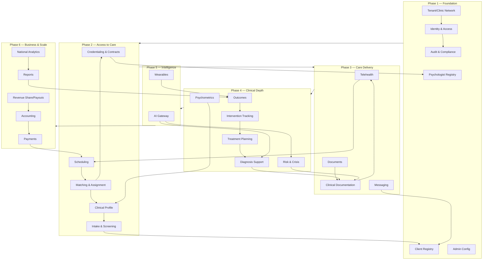
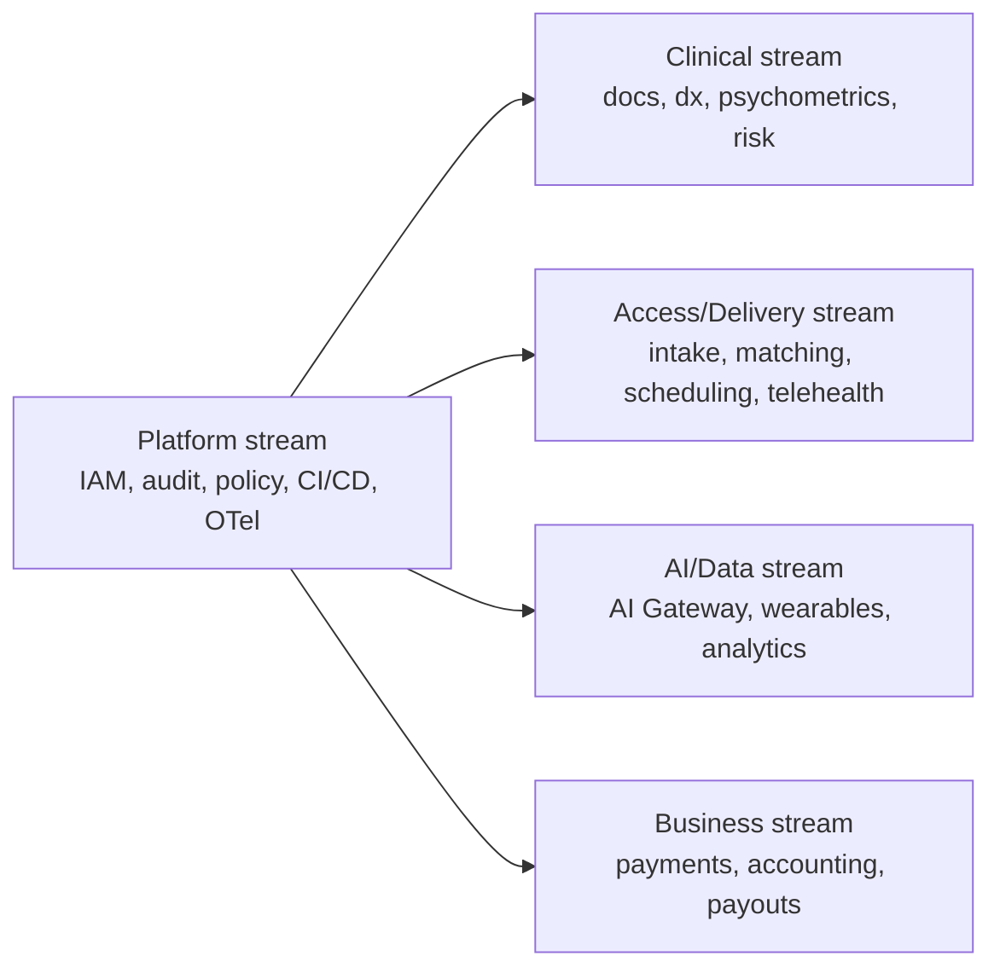

# 13 — Engineering Roadmap & Phases

> **VPSY OS** — Clinical Psychology Operating System
> **Core principle:** *AI assists, licensed clinicians decide. Every clinical action produces an audit event.*

This document maps the **6 product phases** to the **28 bounded contexts**, sequences epics by
dependency, defines a **definition-of-done per phase**, sets milestones, and gives
staffing/parallelization guidance. It is the bridge between product intent and the technical
architecture in the other docs (security `06`, observability/devops `10`, frontend `11`,
compliance `14`).

Stack anchors carry through: Turborepo + pnpm, NestJS modular monolith (hexagonal, DDD),
PostgreSQL + Prisma / TimescaleDB / OpenSearch / Redis, in-process event bus → NATS, Next.js
15 portals, OpenTelemetry, Vercel + Render.

---

## 1. Roadmap Philosophy

1. **Compliance and audit from line one** — the audit spine, RBAC/ABAC, and consent exist in
   Phase 1, not bolted on later.
2. **Vertical slices, not horizontal layers** — each phase ships a usable clinical capability
   end-to-end (portal → context → data → audit), never "just the backend."
3. **AI comes after the ground truth** — AI agents are only introduced once the clinical data
   they assist on exists, is governed, and is human-owned.
4. **The modular monolith stays a monolith** until scale forces extraction; NATS and K8s are
   readiness, not day-one complexity.
5. **Safety-critical contexts are hardened early** — Risk & Crisis is not a late add-on.

---

## 2. The 28 Bounded Contexts → Phase Assignment

| # | Bounded Context | Phase |
|---|-----------------|:-----:|
| 1 | Identity & Access | 1 |
| 2 | Tenant / Clinic Network | 1 |
| 3 | Client Registry | 1 |
| 4 | Psychologist Registry | 1 |
| 5 | Audit & Compliance | 1 |
| 6 | Admin Configuration | 1 |
| 7 | Credentialing & Contracts | 2 |
| 8 | Intake & Screening | 2 |
| 9 | Scheduling | 2 |
| 10 | Clinical Profile | 2 |
| 11 | Matching & Assignment | 2 |
| 12 | Telehealth | 3 |
| 13 | Clinical Documentation | 3 |
| 14 | Messaging | 3 |
| 15 | Documents | 3 |
| 16 | Psychometrics | 4 |
| 17 | Diagnosis Support | 4 |
| 18 | Treatment Planning | 4 |
| 19 | Intervention Tracking | 4 |
| 20 | Outcomes | 4 |
| 21 | Risk & Crisis | 4 |
| 22 | AI Gateway | 5 |
| 23 | Wearables | 5 |
| 24 | Payments | 6 |
| 25 | Accounting | 6 |
| 26 | Revenue Share / Payouts | 6 |
| 27 | Reports | 6 |
| 28 | National Analytics | 6 |
| 29 | CRM & Referrals | 2 |
| 30 | Communications Hub (telephony/SMS + async media) | 3 |

> Risk & Crisis lands in Phase 4 alongside the clinical core it must protect, but its
> *architecture* (priority lane, break-glass, escalation UX) is reserved from Phase 1.

---

## 3. Dependency Graph

---

## 4. Phase Detail

### Phase 1 — Foundation & Compliance Spine

**Goal:** A multi-tenant platform where identity, tenancy, and the audit/compliance spine exist
before any clinical data does.

| Epic | Contexts | Deliverable |
|------|----------|-------------|
| Monorepo + platform | — | Turborepo/pnpm, NestJS skeleton, Next.js shell, CI/CD, OTel, IaC |
| Identity & Access | 1 | JWT auth, refresh rotation, MFA, RBAC matrix + ABAC engine (`packages/policy`) |
| Tenant / Clinic Network | 2 | Tenant isolation, region/residency pinning, clinic hierarchy |
| Audit & Compliance | 5 | Append-only, hash-chained audit log + daily anchor + verification job |
| Client & Psychologist Registry | 3,4 | Core person records, encrypted PHI-basic fields |
| Admin Configuration | 6 | Per-tenant/jurisdiction config: retention, consent policy, feature flags |

**Ships:** Admin can stand up a tenant/clinic, create users with roles, and every action is
already audited. Public site + auth portals live.

**Definition of Done:**
- RBAC matrix fully unit-tested; ABAC predicates deterministic + covered.
- Audit chain verifies nightly; tamper detection proven in tests.
- Tenant isolation proven (cross-tenant access denied by test).
- Residency routing configurable; secrets in KMS; no PHI in logs/telemetry.
- SLOs + dashboards + on-call runbook skeleton exist.

---

### Phase 2 — Access to Care

**Goal:** A client can be intaked, screened, and matched to a credentialed clinician, and a
session can be scheduled.

| Epic | Contexts | Deliverable |
|------|----------|-------------|
| Credentialing & Contracts | 7 | License capture + verification, jurisdiction/scope mapping, contract terms → gates clinical write |
| Intake & Screening | 8 | Consent-gated intake forms (offline-capable), validated screening instruments |
| Clinical Profile | 10 | Structured, versioned client clinical profile (append-only) |
| Matching & Assignment | 11 | Match by need, jurisdiction, license scope, availability, language |
| Scheduling | 9 | Availability, booking, reminders, timezone + residency aware |
| CRM & Referrals | 29 | Lead capture, referrer registry (doctors/schools/employers/courts/institutions), pipeline, campaigns, engagement history; SMS/email reminders reuse the Communications Hub |

**Ships:** End-to-end "new client → intake → matched → booked" with license/jurisdiction gates
enforced.

**Definition of Done:**
- Clinical writes blocked when license inactive or jurisdiction/scope mismatched (ABAC proven).
- Consent versioning live; intake respects purpose scope.
- Offline intake syncs reliably; scheduling reminders delivered (push/email).
- FHIR-compatible mapping for client + practitioner resources.

---

### Phase 3 — Care Delivery

**Goal:** Clinicians deliver sessions via telehealth and document them, with secure messaging
and document handling.

| Epic | Contexts | Deliverable |
|------|----------|-------------|
| Telehealth | 12 | **In-house WebRTC SFU** video *and* voice sessions (HIPAA incl. audio-only fallback), presence, waiting room, network-adaptive |
| Clinical Documentation | 13 | Append-only, versioned notes, autosave, offline outbox, step-up sign-off |
| Messaging | 14 | Secure client↔clinician messaging + **async voice/video (MediaMessage)** store-and-forward, consent-scoped, audited |
| Communications Hub | 30 | **IP-phone (SIP) telephony + SMS/text hubs**, inbound/outbound + click-to-call, provider abstraction, unified comms log; powers appointment reminders from Phase 2 |
| Documents | 15 | Upload/store/share clinical documents, encrypted, watermarked exports |
| **Session Workspace v1** | 12,13 | First iteration of the single-screen clinical cockpit |

**Ships:** A clinician runs a real telehealth session and produces a signed, immutable note in
the Session Workspace.

**Definition of Done:**
- Telehealth resilient on poor networks; audio-only fallback works.
- Notes never lost (offline outbox tested); finalize creates signed immutable version.
- Session Workspace passes WCAG AA on core path; a11y CI green.
- Telehealth + Documentation SLOs met on staging load test.

---

### Phase 4 — Clinical Depth & Safety

**Goal:** Full clinical loop — assess, support diagnosis, plan, track interventions, measure
outcomes — with Risk & Crisis hardened.

| Epic | Contexts | Deliverable |
|------|----------|-------------|
| Psychometrics | 16 | Instrument library, scoring, versioned results, trend visualization |
| Diagnosis Support | 17 | Structured differential + coding (deterministic first; AI in P5) |
| Treatment Planning | 18 | Goal-based, versioned plans linked to diagnosis |
| Intervention Tracking | 19 | Interventions, homework, adherence |
| Outcomes | 20 | Outcome measures, change over time, effectiveness signals |
| Risk & Crisis | 21 | Risk assessment, escalation workflow, priority lane, break-glass, safety plan |

**Ships:** A complete, human-driven clinical record spanning assessment → diagnosis → plan →
intervention → outcome, with a hardened crisis pathway.

**Definition of Done:**
- Risk & Crisis meets its elevated SLO (99.95%) and priority-lane capacity reservation.
- All clinical facts append-only + versioned + audited; corrections are new versions.
- Outcomes computed from source of truth; de-identifiable for later analytics.
- Break-glass access flow audited + alerts DPO.

---

### Phase 5 — Intelligence (AI, governed)

**Goal:** Introduce AI assistance and wearables — clearly labeled, human-owned, governed.

| Epic | Contexts | Deliverable |
|------|----------|-------------|
| AI Gateway | 22 | Brokered inference, de-identification, recommendation + human-override logs, model registry |
| Differential-hypothesis agent | 22,17 | Assists Diagnosis Support — advisory, never auto-acts |
| Risk-triage agent | 22,21 | Surfaces risk signals to clinician — advisory, escalation stays human |
| Wearables | 23 | Signed ingestion → TimescaleDB, consent-scoped, into Outcomes |
| Bias/perf monitoring | 22 | Subgroup calibration, drift alerts, kill-switches, post-market file |

**Ships:** AI recommendations appear in the Session Workspace, each labeled, versioned, and
requiring clinician accept/modify/reject with rationale.

**Definition of Done:**
- Every AI agent ships via staged flag (off → shadow → advisory → active) with monitoring
  evidence and a kill-switch.
- 100% of AI calls logged with model version + input/output hash; overrides logged.
- EU AI Act risk classification + technical documentation per agent; FDA CDS non-device
  analysis complete (see `14`).
- No AI action executes without a licensed human decision — proven by design + tests.

---

### Phase 6 — Business, Reporting & National Scale

**Goal:** Monetization, financial integrity, reporting, and government-grade national analytics.

| Epic | Contexts | Deliverable |
|------|----------|-------------|
| Payments | 24 | Billing, invoicing, client payments (Stripe-class), reconciliation |
| Accounting | 25 | Ledger, NUMERIC money, financial reporting integrity |
| Revenue Share / Payouts | 26 | Clinician/clinic payouts, atomic + reconciled |
| Reports | 27 | Operational + clinical reporting, exports with watermarking |
| National Analytics | 28 | De-identified, aggregate population insights for Government/Executive |

**Ships:** Full commercial operation plus de-identified national analytics; scale-out readiness
(NATS extraction, K8s) where load demands.

**Definition of Done:**
- Money handled with NUMERIC, atomic writes, reconciliation, and audit.
- National Analytics is aggregate + de-identified only; no re-identification path.
- Load-tested to country scale; NATS/K8s migration path validated on staging.
- Full compliance posture (SOC2/ISO27001 controls, DPIA) evidenced (see `14`).

---

## 5. Milestones

| Milestone | Phase | Signal |
|-----------|:-----:|--------|
| M1 — Tenant live, fully audited | 1 | Admin onboards a clinic; audit chain verifies |
| M2 — First matched booking | 2 | Client intaked → matched → scheduled with license gates |
| M3 — First signed telehealth note | 3 | Real session documented in Session Workspace |
| M4 — Full clinical loop | 4 | Assessment→diagnosis→plan→outcome with crisis pathway |
| M5 — Governed AI live | 5 | Labeled AI recommendations + human override in production |
| M6 — Commercial + national scale | 6 | Payments/payouts reconciled; national analytics shipped |

---

## 6. Definition-of-Done (applies to every phase)

- Tests green (unit + integration + e2e) at threshold coverage; **browser-confirmed**.
- RBAC/ABAC policy tests updated for any new context/permission.
- Every new clinical action emits an audit event; append-only respected.
- SLOs defined + dashboards + alerts + runbook for new services.
- Prisma migrations expand/contract-safe; rollback rehearsed.
- Security review + threat-model update for the new context.
- Compliance mapping updated (controls, residency, consent) in `14`.
- No PHI in logs/telemetry/URLs; secrets in KMS.
- Documentation + NEXUS memory updated.

---

## 7. Staffing & Parallelization

The modular monolith lets bounded contexts be built by parallel streams that share the platform
core.

| Stream | Owns | Can parallelize after |
|--------|------|-----------------------|
| Platform | IAM, Audit, Policy, Tenant, Config, CI/CD, OTel, IaC | — (must lead Phase 1) |
| Access/Delivery | Intake, Matching, Scheduling, Telehealth, Messaging | Phase 1 core |
| Clinical | Documentation, Psychometrics, Diagnosis, Treatment, Intervention, Outcomes, Risk | Phase 3 documentation |
| AI/Data | AI Gateway, Wearables, National Analytics | Phase 4 clinical data exists |
| Business | Credentialing (finance side), Payments, Accounting, Payouts, Reports | Phase 2 scheduling |

Guidance:
- **Platform stream is the critical path** for Phase 1 and unblocks everyone.
- **Credentialing** is a cross-cutting dependency (gates all clinical writes) — staff it early
  even though its business features land in Phase 2/6.
- **AI/Data stream must not start agents before Phase 4** — no ground-truth data, no governance
  target.
- Shared `packages/contracts`, `packages/policy`, `packages/ui` are guardrails that let streams
  integrate without drift; changes to them are reviewed by the platform stream.

---

## 8. Risk Register (roadmap-level)

| Risk | Phase | Mitigation |
|------|:-----:|-----------|
| Compliance retrofit debt | 1 | Audit/RBAC/consent built first; DoD enforces per-phase compliance mapping |
| Crisis pathway under-tested | 4 | Reserve architecture from P1; dedicated load + tabletop tests |
| AI scope creep into decision-making | 5 | Hard invariant: advisory only + human override; enforced by design/tests |
| Money-handling defects | 6 | NUMERIC + atomic + reconciliation from first commit |
| Premature distribution complexity | 5–6 | Stay monolith; NATS/K8s only when load proven on staging |
| Residency violations at scale | 6 | Region pinning is IaC-enforced from P1; analytics de-identified |

---

## 9. Summary

The roadmap sequences VPSY OS across six phases that each ship a working vertical slice:
Foundation & compliance spine (Phase 1) → Access to care (2) → Care delivery and the Session
Workspace (3) → Clinical depth with a hardened Risk & Crisis pathway (4) → Governed AI and
wearables (5) → Business, reporting, and national-scale analytics (6). The 28 bounded contexts
map cleanly onto these phases along a dependency graph anchored by identity, tenancy, and the
append-only audit spine — all present from line one. Parallel platform/access/clinical/AI/
business streams share contract, policy, and UI packages to integrate without drift, while a
per-phase definition-of-done keeps compliance, auditability, and the *AI-assists-clinicians-
decide* invariant non-negotiable at every milestone.
