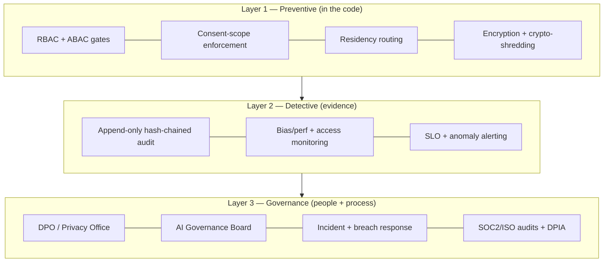
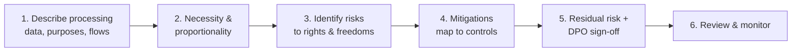
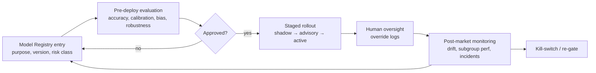

# 14 — Compliance & Governance

> **VPSY OS** — Clinical Psychology Operating System
> **Core principle:** *AI assists, licensed clinicians decide. Every clinical action produces an audit event.*

This document is the compliance and governance architecture for VPSY OS. It maps concrete
regulatory obligations — **HIPAA**, **GDPR**, the **EU AI Act**, **WHO 2025 guidance on AI for
health / large multi-modal models (LMMs)**, **FDA Clinical Decision Support (CDS) software
guidance**, and **SOC 2 / ISO 27001** — to specific technical controls implemented in the
platform. It complements the security model in `06-security-and-rbac.md` and the operational
controls in `10-observability-and-devops.md`.

> **Disclaimer:** This is an engineering compliance-architecture document, not legal advice.
> Jurisdiction-specific obligations are confirmed with qualified counsel and each tenant's
> regulatory context before go-live.

---

## 1. Governance Model

VPSY OS treats compliance as a system property, not a policy binder. Three enforcement layers:

Key governance bodies: a **Privacy Office (DPO)** owning HIPAA/GDPR obligations, an **AI
Governance Board** owning the model registry, EU AI Act obligations, and WHO LMM governance,
and **Security/SRE** owning technical controls and incident response.

---

## 2. HIPAA

VPSY implements the HIPAA Privacy, Security, and Breach Notification Rules, and honors HHS OCR
telehealth guidance (including **audio-only** telehealth) for US tenants.

### 2.1 Privacy Rule → controls

| Requirement | Implementation |
|-------------|----------------|
| Minimum necessary | ABAC `purpose` + `sensitivity` predicates; role matrix scopes access; de-identified aggregate views for Executive/Government |
| Individual rights (access, amendment, accounting of disclosures) | Client portal access; amendments create new versioned records (never overwrite); disclosure accounting derived from the audit chain |
| Uses & disclosures | Consent scopes (care/billing/research/cross-border/AI); purpose-limited access |
| Notice of Privacy Practices | Versioned, per-jurisdiction, surfaced in onboarding + consent flow |

### 2.2 Security Rule → controls

| Safeguard | Implementation |
|-----------|----------------|
| Administrative | Access recertification, workforce role assignment, security training, sanction policy, risk analysis (DPIA §11) |
| Physical | Managed cloud (Render/Vercel/cloud KMS) with provider physical controls; no on-prem PHI |
| Technical — access control | JWT + RBAC/ABAC, unique user IDs, automatic logoff, break-glass with justification |
| Technical — audit controls | Append-only, hash-chained audit log with daily anchor (`06` §5) |
| Technical — integrity | Append-only clinical store; tamper detection via chain verification |
| Technical — transmission security | TLS 1.3 external, mTLS internal (on split), signed wearable webhooks |
| Encryption | AES-256 at rest, field-level envelope encryption for special categories, per-tenant DEKs |

### 2.3 Breach Notification Rule

Breach workflow (`06` §11) meets HIPAA notification timelines (individuals without unreasonable
delay, ≤60 days; HHS + media per thresholds). The immutable audit chain provides the forensic
record of what PHI was accessed and by whom. Business Associate Agreements are in place with all
subprocessors (cloud, model providers, communications).

### 2.4 Telehealth (OCR)

Telehealth (`context 12`) uses compliant, encrypted video and supports **audio-only** sessions
for accessibility/low-bandwidth, consistent with OCR guidance; sessions are consent-scoped and
audited; PHI is not exposed to non-BAA third parties.

---

## 3. GDPR (EU/EEA tenants)

| Principle / right | Implementation |
|-------------------|----------------|
| Lawful basis | Explicit consent for health data (Art. 9) + contract/vital-interest bases where applicable; recorded per consent version |
| Purpose limitation & minimization | Consent scopes enforced by ABAC; only necessary fields collected/exposed |
| Data residency (Art. 44–49) | EU-region pinning via IaC; cross-border only with adequacy/SCCs + cross-border consent scope |
| Right of access / portability | Client portal export (FHIR-compatible), watermarked |
| Right to erasure | Crypto-shredding of field-level PHI where no legal retention compels retention; audit metadata retained where lawful |
| Right to rectification | New versioned record (append-only preserves history + correction) |
| Restriction / objection | Consent revocation suspends further processing incl. AI use |
| DPIA (Art. 35) | Mandatory for high-risk mental-health + AI processing (§11) |
| Breach (Art. 33/34) | ≤72h supervisory-authority notification via breach workflow |
| Automated decision-making (Art. 22) | **No solely-automated clinical decisions** — every AI output requires a licensed human decision; documented safeguard |

---

## 4. EU AI Act — Risk Classification per AI Agent

Mental-health AI intended to inform clinical decisions is treated as **high-risk** under the EU
AI Act's risk-based framework, triggering obligations: risk management, high-quality data
governance, **technical documentation**, logging/traceability, transparency, **human
oversight**, accuracy/robustness, and **post-market monitoring**. VPSY classifies each agent and
attaches the corresponding obligations.

| AI Agent | Intended purpose | Risk class | Key obligations met |
|----------|------------------|:----------:|---------------------|
| Differential-hypothesis agent | Suggest differential diagnoses to clinician | **High-risk** | Technical doc, data governance, logging (AI Gateway), human-in-the-loop override, accuracy monitoring, post-market surveillance |
| Risk-triage agent | Surface risk/crisis signals to clinician | **High-risk** | As above + elevated monitoring, kill-switch, escalation stays human |
| Psychometric scoring assist | Score/flag standardized instruments | **High-risk** (clinical use) | Deterministic-first, validated scoring, versioned, logged |
| Documentation drafting assist | Draft note text for clinician editing | **Limited-risk (transparency)** | Clearly labeled AI-generated; clinician edits + signs; logged |
| Matching suggestion | Suggest client-clinician matches | **Limited-risk** | Transparency, human approval of assignment |
| Intake triage summarization | Summarize intake for clinician | **Limited-risk (transparency)** | Labeled, source-linked, human-reviewed |

Cross-cutting EU AI Act implementation:

| Obligation | Implementation |
|------------|----------------|
| Risk management system | Per-agent risk file maintained by AI Governance Board |
| Data & data governance | Training/eval data provenance recorded in model registry; bias assessment |
| Technical documentation | Model registry entry: purpose, version, eval results, limitations, approved jurisdictions |
| Record-keeping / logging | AI Gateway logs every inference (model version, input/output hash, confidence) |
| Transparency | Every AI output labeled in the UI as a recommendation with model version |
| Human oversight | Accept/modify/reject + rationale → human-override log; no auto-action |
| Accuracy, robustness, cybersecurity | Eval gates, adversarial/prompt-injection defenses, kill-switch |
| Post-market monitoring | Subgroup calibration, drift alerts, incident feedback loop |

---

## 5. WHO 2025 Guidance — LMM Governance

WHO guidance on AI for health and large multi-modal models emphasizes governance across the
lifecycle: appropriate use, oversight, transparency, equity, and continuous evaluation. VPSY
adopts these as operating rules for any LMM used via the AI Gateway.

| WHO governance theme | Implementation |
|----------------------|----------------|
| Appropriate, defined use | Each agent has a documented intended use; off-label use blocked by design |
| Human oversight & accountability | Licensed-clinician decision mandatory; override log; clear accountability chain |
| Transparency & explainability | Outputs labeled, source-cited where possible, model version exposed |
| Equity & non-discrimination | Subgroup performance monitoring (age/sex/jurisdiction); bias gates |
| Data protection | De-identification at AI Gateway; consent scope for AI-assisted analysis; residency-aware inference |
| Continuous evaluation | Pre-deployment eval + post-market monitoring feeding the model registry |
| Safety & risk mitigation | Kill-switches, staged rollout (shadow→advisory→active), incident response |

---

## 6. FDA CDS Software — Device vs Non-Device Analysis

The FDA's CDS guidance distinguishes **non-device CDS** (excluded from device regulation when it
meets the four statutory criteria — notably that it enables a healthcare provider to
**independently review the basis** of the recommendation and does not merely direct treatment)
from **device CDS** (subject to FDA oversight). VPSY designs its clinical agents to remain
**non-device CDS** wherever possible, and to be transparent about the boundary.

### 6.1 Criteria analysis per agent

| Non-device CDS criterion | Differential-hypothesis agent | Risk-triage agent |
|--------------------------|-------------------------------|-------------------|
| Not acquiring/processing a signal from an in-vitro/imaging device | Met (uses clinical text/structured data) | Met (uses clinical + self-report data) |
| Displays/analyzes medical info to provide recommendations | Met | Met |
| Recommendations to a **healthcare provider** (not patient-directing) | Met (clinician-facing only) | Met (clinician-facing; escalation stays human) |
| Provider can **independently review the basis** (not to rely primarily on it) | **Met by design**: shows reasoning, sources, confidence, and requires explicit clinician decision | **Uncertain — see caveat below**: contributing factors + evidence are shown, but FDA reads this criterion as failing when the decision is **time-critical** and the provider realistically cannot review the basis first |
| Result | **Non-device CDS** (transparency-enabled) | **Provisional / undetermined** — treated as the higher-scrutiny case pending regulatory review |

> **Time-sensitivity caveat (Risk-triage / Crisis agent).** The FDA's CDS guidance
> treats software informing **time-critical** decisions as unlikely to satisfy the
> independent-review criterion — a crisis workflow is the paradigm case. VPSY therefore
> does **not** claim non-device status for the crisis path. Two mitigations shape the
> deployed design: (1) risk **detection is fully deterministic** (documented, reviewable
> item-score/keyword logic — not an ML model), and (2) the AI model only **assembles a
> situational summary after** a flag already exists and never re-assesses, re-classifies,
> escalates, or resolves risk. Whether that residual AI role is non-device CDS is a
> question for regulatory counsel **before any marketed claim**; until then the register
> records this classification as pending review.

### 6.2 Design controls that keep agents non-device

- Every recommendation exposes its **basis** (contributing factors, cited instruments/data,
  confidence) so the clinician independently reviews rather than relies.
- The system **never auto-executes** a clinical action; it presents recommendations for a
  licensed human decision.
- If any future agent processes a device signal (e.g., certain wearable-derived clinical
  inferences) or directs treatment, it is **re-classified** and routed through the appropriate
  regulatory pathway before release — the model registry records the classification decision.

---

## 7. SOC 2 & ISO 27001 Control Mapping

VPSY maps its controls to SOC 2 Trust Services Criteria and ISO 27001 Annex A themes. Selected
mappings:

| Control area | SOC 2 (TSC) | ISO 27001 (A.x) | Implementation |
|--------------|-------------|-----------------|----------------|
| Access control | CC6.1–6.3 | A.5/A.8 (access, identity) | RBAC + ABAC, least privilege, recertification |
| Authentication | CC6.1 | A.5.17 | MFA, short-lived JWT, refresh rotation, step-up |
| Encryption | CC6.7 | A.8.24 (cryptography) | TLS 1.3, AES-256, per-tenant DEKs, KMS |
| Change management | CC8.1 | A.8.32 | Gated CI/CD, migration expand/contract, IaC review |
| Logging & monitoring | CC7.2 | A.8.15/16 | Audit chain, OTel, SLO alerting |
| Incident response | CC7.3–7.4 | A.5.24–5.28 | Breach workflow, runbooks, post-mortems |
| Backup & recovery | A1.2 | A.8.13 | PITR, encrypted region-pinned backups, restore tests |
| Vendor management | CC9.2 | A.5.19–5.22 | BAAs, subprocessor register, data-residency clauses |
| Data classification | C1.1 | A.5.12 | PHI classification tags driving handling |
| Risk management | CC3.x | A.5.7 (threat intel), Clause 6 | Threat model, DPIA, AI risk files |
| Confidentiality | C1.x | A.5.12–5.14 | Tenant isolation, field encryption, redaction |

Evidence for audits is generated from the platform itself (audit chain, CI/CD gate logs, access
reviews, restore-test records) rather than manually assembled where possible.

---

## 8. Consent Management (compliance view)

Consent is versioned, purpose-scoped, and enforced at the ABAC layer (see `06` §6). Compliance
mapping:

| Obligation | Implementation |
|------------|----------------|
| Informed, specific consent (GDPR Art. 9 / HIPAA authorization) | Versioned consent tied to policy version + jurisdiction language |
| Granular purpose | Separate scopes: care, billing, research, wearables, cross-border, AI-assisted analysis |
| Withdrawable | Immediate revocation; downstream AI use suspended; historical facts retained per law |
| Minors / guardianship | Guardian relationship + jurisdiction age-of-consent rules captured |
| Auditable | Grant/modify/revoke events in the immutable chain |

---

## 9. Data Residency by Country

Residency is enforced by IaC region pinning per tenant; PHI stores (Postgres, Timescale,
OpenSearch, backups) and AI inference stay in-jurisdiction.

| Region | Residency rule | Cross-border |
|--------|----------------|--------------|
| EU/EEA | Data + inference in EU region | Only with adequacy/SCCs + cross-border consent |
| US | US region; state law layered | BAA-bound processors only |
| UK | UK/EU region | Adequacy-based |
| Canada | In-country region | Province rules layered |
| Other | Tenant-configured home region | Explicit legal basis required |

De-identified aggregate analytics (Executive/Government) are derived after Safe-Harbor / expert-
determination de-identification and carry no re-identification path.

---

## 10. Audit & Tamper-Evidence (compliance view)

The append-only, hash-chained audit log (`06` §5) is the evidentiary backbone for HIPAA audit
controls, GDPR accountability, EU AI Act logging, and SOC 2/ISO logging requirements. It
provides: attribution (who/role/license), authorization basis (purpose, consent, ABAC rule),
session forensics, and integrity proof via daily anchoring. Disclosure accounting and access
reports are queries over this log.

---

## 11. DPIA Outline (Data Protection Impact Assessment)

Because VPSY processes special-category health data at scale with AI assistance, a DPIA is
mandatory (GDPR Art. 35) and refreshed per major change.

| DPIA element | VPSY response |
|--------------|---------------|
| Nature/scope/context | Multi-tenant mental-health care + AI-assisted CDS, country-scale |
| Necessity/proportionality | Data minimization via ABAC + consent scoping; AI advisory-only |
| Risks | Re-identification, bias, unauthorized access, over-reliance on AI, cross-border leakage |
| Mitigations | Encryption + crypto-shredding, RBAC/ABAC, audit chain, human oversight, residency pinning, bias monitoring |
| Residual risk | Assessed + signed by DPO; high residual risk → consult supervisory authority |

---

## 12. Jurisdiction-Aware Clinical Licensing Verification

Clinical writes are gated by the Credentialing & Contracts context: license `ACTIVE`,
unexpired, covering the client's **jurisdiction** and the action's **scope of practice**.
Verification events are recorded and periodically re-checked; lapse auto-revokes clinical write
capability (attribute-driven, no code change). Cross-border telehealth requires an explicit
permitted jurisdiction pair + cross-border consent. This satisfies both professional-licensing
law and the EU AI Act / HIPAA requirement that clinical decisions rest with a duly authorized
human.

---

## 13. AI Governance — Registry, Evaluation, Oversight, Post-Market

| Governance control | Implementation |
|--------------------|----------------|
| Model registry | Single source of truth: model, version, purpose, risk class, eval, approved jurisdictions, rollout state |
| Evaluation | Pre-deployment accuracy/calibration/bias/robustness gates; documented results |
| Version tracking | Every recommendation stamps exact model version → retrospective recall possible |
| Human oversight | Mandatory accept/modify/reject + rationale; override log |
| Post-market monitoring | Subgroup calibration, drift alerts, override-rate trends, incident feedback |
| Kill-switch | Per-agent + per-provider; auto-gate to advisory/off on threshold breach |
| Transparency | UI labeling + provenance; disclosure to clinicians and (where relevant) clients |

---

## 14. Compliance Traceability Matrix (summary)

| Obligation source | Primary VPSY control(s) | Doc reference |
|-------------------|-------------------------|---------------|
| HIPAA Security Rule | RBAC/ABAC, encryption, audit chain, break-glass | `06` §3–5, §7 |
| HIPAA Breach Rule | Breach workflow + audit forensics | `06` §11 |
| HIPAA telehealth (OCR) | Compliant + audio-only telehealth | §2.4 |
| GDPR Art. 9/35/44/22 | Consent scopes, DPIA, residency, human decision | §3, §9, §11 |
| EU AI Act (high-risk) | Model registry, logging, human oversight, PMM | §4, §13 |
| WHO LMM governance | Lifecycle governance + equity monitoring | §5 |
| FDA CDS (non-device) | Transparent basis + human decision, no auto-action | §6 |
| SOC 2 / ISO 27001 | Control mapping + self-generating evidence | §7 |
| Data residency | IaC region pinning + de-identified analytics | §9 |

---

## 15. Summary

Compliance in VPSY OS is engineered, not appended. Preventive controls (RBAC/ABAC, consent
scoping, residency pinning, encryption with crypto-shredding) enforce HIPAA and GDPR at the code
level; the append-only, hash-chained audit log supplies detective evidence for HIPAA audit
controls, GDPR accountability, EU AI Act logging, and SOC 2/ISO 27001. Every AI agent is
risk-classified under the EU AI Act, governed per WHO LMM guidance, and deliberately kept within
**non-device CDS** boundaries by exposing its basis and requiring a licensed human decision —
operationalizing the core principle that *AI assists, licensed clinicians decide*. A model
registry, pre-deployment evaluation, staged rollout, human-override logging, and post-market
bias/drift monitoring close the AI governance loop, while a standing DPIA and jurisdiction-aware
licensing verification keep the platform defensible at country scale.
