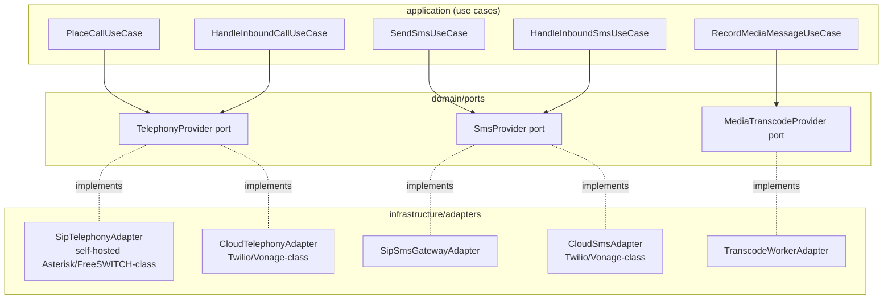
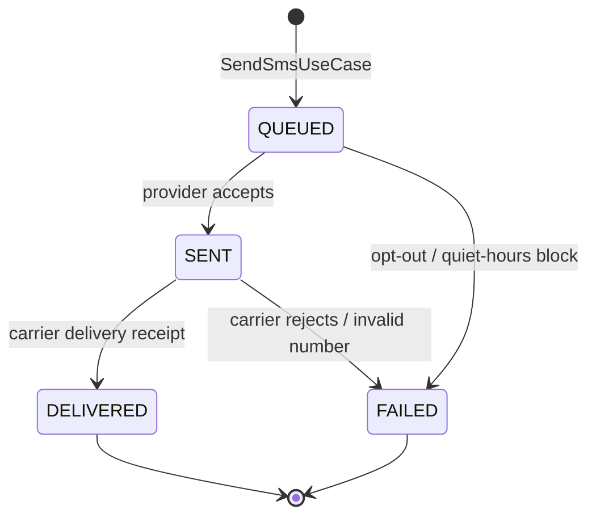
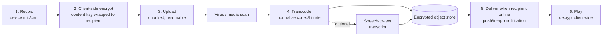

# 15 — Communications & Telephony (Communications Hub)

> **VPSY OS** — Clinical Psychology Operating System
> **Core principle:** *AI assists, licensed clinicians decide. Every clinical action produces an audit event.*

This document specifies **context 30, Communications Hub** (`docs/technical/01-bounded-contexts.md`):
IP-phone (SIP) telephony, SMS/text hubs, the shared real-time media infrastructure that also
powers Telehealth (context 12), and asynchronous store-and-forward voice/video messages
(`MediaMessage`, carried in Messaging, context 19). It complements `08-telehealth-and-realtime.md`
(scheduled clinical video/voice encounters), `06-security-and-rbac.md` (RBAC/ABAC, encryption),
and `14-compliance-and-governance.md` (HIPAA/consent). Data shapes are catalogued in
`02-data-model.md` Group I.

## 1. Scope and constraints

Communications Hub is **Supporting**, not a clinical-decision context: it moves voice, text, and
media between clients, clinicians, managers, and referral partners, and it feeds every one of
those touches into a single auditable timeline. It does not diagnose, triage, or decide — it
transports and records.

- **No vendor lock-in.** Every channel (voice, SMS) sits behind a provider-agnostic port. A
  self-hosted SIP/PBX stack and a cloud communications API (Twilio/Vonage-class) both satisfy the
  same interface; swapping providers is a configuration change, not a rewrite.
- **Consent-scoped, always.** Recording a call requires `recordingConsentId`. Sending marketing
  SMS requires marketing consent, distinct from care-coordination consent (`16-crm-and-referrals.md`
  §7). Async media messages are consent-scoped and PHI-encrypted.
- **Tamper-evident by construction.** Every call, SMS, and media message emits a domain event
  that lands in `EngagementActivity` (the unified comms log) and the append-only audit chain
  (`06` §5) — there is no side channel that talks to a client or referrer without a record.
- **HIPAA-safeguarded across every channel** — not just video. Telephony, SMS, and async media all
  carry PHI-adjacent content and are treated as such: encrypted in transit, access-controlled,
  logged, and BAA-covered end to end.
- **Quiet by default where the law requires it.** Quiet-hours windows, STOP/opt-out, and
  jurisdictional recording-consent rules (§10) are configuration, enforced structurally, not left
  to individual clinician judgment.

## 2. Provider-abstraction architecture

Communications Hub is built hexagonally, like every other bounded context (`00-architecture-overview.md`
§2): the domain defines **ports**; infrastructure adapters implement them per provider. No
application or domain code references a vendor SDK directly.



### 2.1 `TelephonyProvider` port (shape)

| Method | Purpose |
|--------|---------|
| `provisionNumber(spec)` | Acquire/assign a `PhoneNumber` (E.164, capabilities, region). |
| `placeCall(from, to, context)` | Originate an outbound call; returns `providerRef`. |
| `onInboundCall(handler)` | Register webhook/event handler for inbound call offers. |
| `routeCall(callId, target)` | Bridge/transfer/forward a live call (IVR, click-to-call). |
| `startRecording(callId, consentId)` | Begin recording; refuses without a valid consent id. |
| `stopRecording(callId)` | End recording, finalize storage object. |
| `hangup(callId, reason)` | Terminate a call. |

### 2.2 `SmsProvider` port (shape)

| Method | Purpose |
|--------|---------|
| `sendSms(to, from, body, templateId?)` | Queue an outbound SMS; returns `providerRef`. |
| `onInboundSms(handler)` | Register webhook/event handler for inbound SMS (replies, STOP). |
| `onDeliveryStatus(handler)` | Register webhook for delivery receipts. |
| `optOut(e164)` / `optIn(e164)` | Update the suppression list from a STOP/START keyword. |

### 2.3 Adapter catalogue

| Adapter | Kind | When used | Notes |
|---------|------|-----------|-------|
| **SipTelephonyAdapter** | Self-hosted SIP/IP-phone (Asterisk/FreeSWITCH-class PBX) | Clinics wanting on-prem/BAA-in-house voice, lowest per-minute cost at volume | Talks SIP/RTP to physical or soft IP phones; registers `PhoneNumber`s as SIP trunks/DIDs. |
| **CloudTelephonyAdapter** | Cloud communications API (Twilio/Vonage-class) | Fast provisioning, elastic scale, managed carrier relationships, PSTN bridge for telehealth (`08` §11) | BAA-covered subprocessor; webhooks drive inbound-call and status events. |
| **SipSmsGatewayAdapter** / **CloudSmsAdapter** | Text-hub adapters | Same self-hosted-vs-cloud trade-off, per tenant/jurisdiction | Both implement `SmsProvider`; a tenant may mix (e.g., cloud SMS + self-hosted voice). |

`Contract` tenant config (`Admin Configuration`, context 27) selects the active adapter per
capability, per tenant, per jurisdiction — enabling a country deployment to run fully in-house SIP
for data-residency reasons while another tenant uses a cloud hub for speed of onboarding.

## 3. IP-phone (SIP) telephony

### 3.1 Number provisioning

`PhoneNumber` (`02-data-model.md` §I) represents a provisioned E.164 number: `provider`
(`sip|twilio|vonage|self_hosted`), `capabilities[]` (`VOICE`, `SMS`), and `assignedTo` (a clinic,
a clinician's direct line, or an unassigned pool number used for click-to-call caller ID).
Provisioning is an admin action (`comms:configure` permission, §8) that emits
`PhoneNumberProvisioned` and is fully audited — numbers are a compliance surface (e.g., STIR/SHAKEN
attestation, local presence rules) as much as a technical one.

### 3.2 Inbound / outbound calls and click-to-call

- **Outbound, manual:** a clinician dials a client's on-file number from the cockpit. The client's
  real number is **never exposed** to the clinician's device — the call bridges through a
  provider-assigned proxy number (privacy-by-design), consistent with the masking pattern used for
  telehealth waiting-room identity checks.
- **Click-to-call:** a single button on the Client Registry / CRM timeline places a call from the
  clinician's registered extension to the client, with the target and purpose (`care`,
  `scheduling`, `billing`) attached to the resulting `CallSession` for audit and quiet-hours
  evaluation.
- **Inbound:** calls to a clinic's published number route through **call routing/IVR** (§3.3) to
  the correct destination — a specific clinician's extension, a shared intake queue, or an
  after-hours message.

```mermaid
sequenceDiagram
    participant Cl as Clinician (Cockpit)
    participant Core as VPSY Core (Comms Hub)
    participant TP as TelephonyProvider adapter
    participant Client as Client phone

    Cl->>Core: POST /v1/calls:click-to-call {clientId, purpose}
    Core->>Core: ABAC check (assigned clinician? consent active?)
    Core->>TP: placeCall(proxyNumber, client.e164, ctx)
    TP-->>Client: Ring (caller ID = clinic proxy number)
    Client-->>TP: Answer
    TP-->>Core: call.answered webhook
    Core->>Core: create CallSession (status=in_progress)
    Note over Core: EngagementActivity + audit event emitted
    TP-->>Core: call.completed webhook (duration, disposition)
    Core->>Core: CallSession.status = completed; emit CallCompleted
```

### 3.3 Call routing and IVR basics

A minimal, config-driven IVR sits in front of shared numbers:

1. **Greeting** (tenant/clinic-configured audio or TTS).
2. **Menu** — "For scheduling, press 1. For your clinician's direct line, press 2. If this is an
   emergency, press 3" (routes to the Risk & Crisis on-call escalation path, context 17 — never an
   AI voice bot for crisis content).
3. **Routing** — to an extension (`PhoneNumber.assignedTo`), a ring group (intake queue), or
   voicemail-to-transcript (transcribed via the same transcode pipeline as §6, then attached as an
   `EngagementActivity`).
4. **Business-hours / quiet-hours gate** — outside configured hours, inbound calls to non-crisis
   menu options route to a callback-request flow rather than ringing a clinician's personal device.

### 3.4 `CallSession` logging and recording

Every call, inbound or outbound, produces exactly one `CallSession`: `direction`, `fromE164`,
`toE164`, `clientId?`, `psychologistId?`, `startedAt`, `endedAt`, `durationSec`, `status`,
`recordingConsentId?`, `recordingStorageKey?`, `providerRef`.

- **Recording is off by default**, exactly as in Telehealth (`08` §9): it requires (a) a
  jurisdiction check (one-party vs. two-party consent law, §10), (b) an active, explicit
  `recordingConsentId`, and (c) a stated clinical/business justification. Only then does the
  `TelephonyProvider.startRecording` call succeed; the SIP/cloud adapter enforces the gate
  server-side so a misconfigured client cannot bypass it.
- Recordings are written to the same **encrypted-at-rest, per-recording-key** store as telehealth
  recordings, tagged with retention policy, access-controlled, and every access audited.
- `CallSession.status` transitions (`ringing → in_progress → completed | no_answer | failed |
  voicemail`) each emit an audit event; `CallCompleted` is the terminal event that also writes an
  `EngagementActivity` row.

## 4. SMS / text hubs

### 4.1 Templated messages

Outbound SMS is templated (`SmsMessage.templateId`), not freehand, for the two dominant use
cases:

| Template class | Example | Trigger | Consent required |
|----------------|---------|---------|-------------------|
| **Appointment reminder** | "Your session with Dr. R. is tomorrow at 3pm. Reply C to confirm." | Scheduling context (9), N hours before `Appointment.startsAt` | Care-coordination consent |
| **Safety check-in** | "Checking in — how are you feeling today? Reply if you'd like a call." | Risk & Crisis (17) follow-up cadence, clinician-triggered | Care-coordination consent; never auto-interprets the reply clinically |
| **Marketing / campaign** | "New evening slots now open at [Clinic]." | CRM Campaign (`16-crm-and-referrals.md` §4) | **Marketing consent** — kept separate from care consent |

Free-text clinician-authored SMS is also supported for 1:1 care coordination, but templates are
preferred because they are pre-reviewed for tone, are translatable per `preferredLanguage`, and
make quiet-hours/consent gating deterministic.

### 4.2 Inbound handling

Inbound SMS (replies, STOP/START keywords, unsolicited messages) arrives via the
`SmsProvider.onInboundSms` webhook. The handler:

1. Checks for **opt-out keywords** (`STOP`, `UNSUBSCRIBE`, jurisdiction-specific equivalents) —
   handled first, unconditionally, before any other routing (§4.4).
2. Matches the sender to a `Client`/`Lead` by E.164; unmatched numbers are queued for manual triage
   (never silently dropped, never auto-replied to with PHI).
3. Threads the reply against the originating `SmsMessage`/template context, surfaces it in the
   clinician's or CRM owner's inbox, and writes an `EngagementActivity`.

### 4.3 `SmsMessage` lifecycle



`SmsMessage`: `direction`, `toE164`, `fromE164`, `body`, `status`
(`QUEUED|SENT|DELIVERED|FAILED`), `providerRef`, `templateId?`, `clientId?`. Every status
transition emits an audit event; `SmsDelivered`/`SmsFailed` feed the unified comms log.

### 4.4 STOP/opt-out, consent, and quiet hours

- **STOP is absolute and channel-wide-by-default**: a `STOP` reply suppresses further *marketing*
  SMS immediately (TCPA/CAN-SPAM-style requirement in the US and equivalents elsewhere) and is
  itself a consent-revocation event (`ConsentRevoked`, scope `marketing`). Care-coordination
  messages (appointment reminders, safety check-ins) use a **separate opt-out scope** so a client
  can stop marketing texts without silencing operationally necessary reminders — the two consent
  scopes are never conflated (see `16` §7).
- **Quiet hours**: tenant/jurisdiction-configured window (e.g., no non-urgent SMS 21:00–08:00 local
  client time) enforced before send; safety check-ins tied to an open `Escalation` are the one
  exception, gated instead by clinician judgment and logged as such.
- All opt-out/opt-in state changes are audited with actor, channel, and scope.

## 5. In-house real-time video and voice (shared with Telehealth)

The Communications Hub does **not** duplicate the real-time media stack — it shares the
**self-hosted WebRTC SFU** (mediasoup/LiveKit-class) documented in full in
`08-telehealth-and-realtime.md`. That SFU serves two callers:

1. **Telehealth (context 12):** scheduled clinical encounters — waiting room, consent-gated
   recording, emergency-location capture, the full session lifecycle in `08`.
2. **Communications Hub (context 30):** ad hoc voice/video reached via click-to-call or a
   clinician-initiated "start video" action outside a scheduled encounter (e.g., a manager
   checking in with a clinician, a quick clarifying video call before a scheduled session).

Both paths terminate at the same SFU, the same signaling service, the same STUN/TURN
infrastructure, and the same DTLS-SRTP-mandatory / optional-E2EE encryption posture described in
`08` §§2–4 — there is exactly one in-house real-time media substrate in VPSY, not a third-party
video embed and a separate ad hoc calling tool. A `Session` created from this path still carries
`mediaRoomId`, `sfuRegion`, and `connectionQuality` (`02-data-model.md`, Group C note), and still
degrades **video → audio-only → async** exactly as in `08` §11 — the audio-only and PSTN
phone-bridge fallback for these ad hoc calls **is** the SIP/IP-phone telephony described in §3
above, i.e., Telehealth's phone-bridge and the Communications Hub's SIP trunk are the same
infrastructure, not two implementations of the same idea.

**Waiting room, network-adaptive simulcast, and audio-only fallback** for this path behave
identically to `08` §§6, 11 (client lands unauthenticated-to-media until admitted; bitrate/packet
loss surfaced; automatic and manual downgrade to audio-only). Recording, if enabled, uses the same
consent-gated (`recordingConsentId`), jurisdiction-checked path as `08` §9 and §3.4 above.

## 6. Async (store-and-forward) voice/video messages

`MediaMessage` (Messaging, context 19; `02-data-model.md` §I) lets a client and clinician exchange
**offline voice or video messages** when a real-time call isn't necessary or possible — closer to
a secure voicemail/video-memo than a live session.



### 6.1 Lifecycle

1. **Record** — client or clinician records a short voice/video note in the messaging thread UI
   (device mic/camera, no server-side capture until the user finalizes).
2. **Client-side encrypt** — the media blob is encrypted on-device before upload; the content key
   is wrapped to the recipient's key material, so the object store never holds plaintext (defense
   in depth beyond at-rest encryption).
3. **Upload** — chunked/resumable upload to object storage; a **virus/media scan** runs before the
   object is marked deliverable (malformed or malicious payloads are quarantined, never delivered).
4. **Transcode** — normalizes codec/container/bitrate for cross-device playback and produces a
   lower-bitrate preview for constrained connections.
5. **Deliver-when-online** — the recipient is notified (push/in-app); the message sits encrypted
   at rest until fetched — this is the defining "store-and-forward" property that distinguishes it
   from the real-time path in §5.
6. **Play** — the recipient's client fetches and decrypts locally; `deliveredAt`/`readAt` receipts
   are recorded and surfaced to the sender (never to anyone outside the thread).

### 6.2 `MediaMessage` fields and governance

`threadId`, `senderId`, `kind` (`VOICE|VIDEO`), `storageKey` (encrypted at rest), `durationSec`,
`mimeType`, `transcript?`, `sizeBytes`, `deliveredAt?`, `readAt?`, `consentId?`.

| Concern | Rule |
|---------|------|
| Consent | Requires an active messaging/telehealth-adjacent consent scope; a client can decline async media specifically while keeping text messaging. |
| Retention | Governed by the same per-tenant `retentionClass`/`retainUntil` engine as clinical records (`06` §10); not indefinite by default. |
| Size / duration limits | Tenant-configured caps (e.g., 5 min / 50 MB) enforced at upload; oversized recordings are rejected client-side before encryption to avoid wasted upload. |
| Optional transcript | Speech-to-text runs through the governed AI Gateway (context 25) if enabled; transcript is stored alongside, labeled as AI-generated, and is a *convenience*, never a substitute for the audio/video as the record of truth. |
| Read/delivered receipts | `deliveredAt`, `readAt` — visible only to the sender and the thread's participants, never aggregated for engagement scoring without separate consent. |
| Scanning | Every uploaded object passes virus/media scanning before `deliveredAt` is set; failures quarantine the object and notify the sender without exposing scan internals. |

## 7. Unified comms log, audit, and RBAC/ABAC

### 7.1 `EngagementActivity` — one timeline, every channel

Every call, SMS, media message, email, note, and meeting — whether initiated from the CRM
(`16-crm-and-referrals.md`), the clinician cockpit, or an inbound client action — writes one
`EngagementActivity`: `subjectType/Id` (a `Lead`, `Referrer`, or `Client`), `kind`
(`CALL|SMS|EMAIL|MEDIA_MESSAGE|NOTE|MEETING`), `direction` (`INBOUND|OUTBOUND`), `summary`,
`occurredAt`, `actorId`. This is the single place a Manager or clinician sees the full
communication history with a person, regardless of channel or which context originated it.

### 7.2 Audit

Every state transition in this document — number provisioning, call start/end/recording,
SMS send/deliver/fail, opt-out, media-message record/deliver/read — emits a domain event that is
(a) projected into `EngagementActivity` for humans, and (b) written to the append-only,
hash-chained audit log (`06` §5) for compliance. There is no communications action in VPSY that
is invisible to audit.

### 7.3 RBAC/ABAC — who can call, text, and see recordings

| Action | Client | Psychologist | Supervisor | Manager | Admin | Finance |
|--------|:------:|:------------:|:----------:|:-------:|:-----:|:-------:|
| Place/receive call (own thread) | R(own) | RC | RC | R | — | — |
| Click-to-call a client | — | C(assigned) | C(assigned+supervisee) | C | — | — |
| Send templated SMS (care) | — | C | C | C | — | — |
| Send campaign SMS (marketing) | — | — | — | C(CRM role) | — | — |
| Read call/SMS content (own) | R(own) | R(assigned) | R(supervisee) | R(meta only) | — | — |
| **Access call/media recording** | R(own, consented) | R(own session) | R(supervisee, with reason) | — | R(compliance, break-glass) | — |
| Provision numbers / configure IVR | — | — | — | — | RCUG | — |
| Configure quiet-hours / templates | — | — | — | RU | RCUG | — |
| Read unified comms log (`EngagementActivity`) | R(own) | R(assigned) | R(team) | R | R | R(billing-relevant) |

This mirrors and extends the RBAC matrix in `06` §4.3 (row 19, Messaging, plus the new context-30
capabilities); the authoritative artifact remains `policy/rbac.matrix.ts`. **Recording access is
always ABAC-gated on the presence of a valid `recordingConsentId`** — RBAC alone never grants
recording playback.

## 8. Data residency

Call metadata, SMS content, and media-message blobs are PHI-adjacent-to-PHI and follow the same
residency rules as clinical data (`06` §10, `14` §9): storage and any transcoding/transcription
compute stay in the tenant's pinned region. A cloud telephony/SMS adapter is only enabled for a
tenant if that provider's regional deployment satisfies the tenant's residency requirement and a
BAA (or jurisdiction equivalent) is in place; otherwise the tenant is configured to the self-hosted
SIP/PBX adapter, which runs entirely inside VPSY's own infrastructure boundary.

## 9. Compliance: HIPAA, consent, and recording law by jurisdiction

| Jurisdiction | Call recording consent rule | SMS marketing rule | VPSY control |
|--------------|------------------------------|---------------------|--------------|
| US (federal baseline) | Varies by state: one-party (majority) vs. **two-party/all-party consent** (e.g., CA, FL, PA, WA) | TCPA: prior express written consent for marketing texts; STOP honored immediately | Tenant config carries the state's consent class; `recordingConsentId` required in all states, two-party states additionally require *all* participants' explicit consent captured before `startRecording` succeeds |
| EU/EEA | Recording generally requires informed consent of all parties (ePrivacy Directive + national law) + GDPR Art. 9 lawful basis for health-related content | GDPR + national ePrivacy rules: opt-in consent for marketing SMS, granular and withdrawable | Consent scope model (`06` §6) captures recording + marketing as distinct, versioned scopes |
| UK | Similar to EU (PECR + UK GDPR); recording of calls involving health data needs explicit consent | PECR opt-in for marketing SMS | Same consent-scope engine, UK-region residency |
| Canada | Federal one-party consent baseline; some provinces (Quebec) closer to all-party in practice for sensitive contexts | CASL: opt-in consent for commercial electronic messages, unsubscribe honored promptly | Tenant config selects province-level consent class |
| All jurisdictions (HIPAA, where applicable) | Recordings and SMS/media containing PHI require a BAA with every subprocessor (telephony, SMS, transcode, storage) and are encrypted, access-controlled, and audited | — | `14` §2.2 Technical safeguards apply uniformly across all comms channels, not just video |

> This table is illustrative, not legal advice (see the disclaimer in `14-compliance-and-governance.md`).
> Each tenant's Admin Configuration encodes its jurisdiction's actual consent class, verified with
> counsel before go-live.

## 10. Sample endpoint specs and event catalogue

### 10.1 Place a call (click-to-call)

```http
POST /v1/calls:click-to-call
Authorization: Bearer <jwt>
X-VPSY-Tenant: ten_01H...
Idempotency-Key: 9c1a...-uuid

{
  "clientId": "pat_01HZ...",
  "purpose": "care",
  "recordingRequested": false
}
```

```json
201 Created
{ "id": "call_01HZ...", "status": "ringing", "fromNumberId": "num_01H...", "createdAt": "2026-07-05T09:00:00Z" }
```

### 10.2 Start/stop call recording (consent-gated)

```http
POST /v1/calls/call_01HZ...:start-recording
{ "recordingConsentId": "cons_01H..." }
```

`403 FORBIDDEN` (`CONSENT_MISSING`) if no active `RECORDING`-scope consent exists, or `451
LEGAL_HOLD`-style `RECORDING_NOT_PERMITTED` if the jurisdiction requires all-party consent and not
all participants have consented.

### 10.3 Send a templated SMS

```http
POST /v1/sms-messages
Idempotency-Key: 4b2e...-uuid
{
  "clientId": "pat_01HZ...",
  "templateId": "tmpl_appt_reminder_v2",
  "context": { "appointmentId": "appt_01H..." }
}
```

```json
202 Accepted
{ "id": "sms_01HZ...", "status": "QUEUED" }
```

### 10.4 Record and send an async media message

```http
POST /v1/threads/thr_01H.../media-messages
Idempotency-Key: 1f0a...-uuid
{ "kind": "VOICE", "durationSec": 42, "mimeType": "audio/webm", "sizeBytes": 812344, "consentId": "cons_01H..." }
```

```json
202 Accepted
{ "id": "mm_01HZ...", "uploadUrl": "https://storage.vpsy.health/...(signed)", "status": "pending_upload" }
```

### 10.5 Event catalogue (subset)

`PhoneNumberProvisioned`, `CallRinging`, `CallAnswered`, `CallCompleted`, `CallRecordingStarted`,
`CallRecordingStopped`, `SmsQueued`, `SmsSent`, `SmsDelivered`, `SmsFailed`, `SmsOptedOut`,
`MediaMessageUploaded`, `MediaMessageTranscoded`, `MediaMessageSent`, `MediaMessageDelivered`,
`MediaMessageRead`. Each follows the CloudEvents envelope in `04-api-design.md` §12 and is
HMAC-signed for any external webhook projection.

## 11. Summary

Communications Hub gives VPSY exactly one way to reach a person by voice or text and exactly one
way to hold real-time or asynchronous audio/video with them — never two competing implementations.
A `TelephonyProvider`/`SmsProvider` port keeps self-hosted SIP and cloud communications APIs
interchangeable per tenant and jurisdiction; IP-phone calls and SMS are logged, consent-gated for
recording, and quiet-hours/opt-out aware; the in-house WebRTC SFU from `08` is shared, not
duplicated, for ad hoc voice/video; and async `MediaMessage` store-and-forward voice/video closes
the gap when a live connection isn't the right tool. Every touch — inbound or outbound, live or
async — lands in one `EngagementActivity` timeline and one hash-chained audit log, so the
Manager's four governing questions (`business/00-vision-and-category.md` §5) can always be
answered for *how* a person was reached, not just *that* they were.
