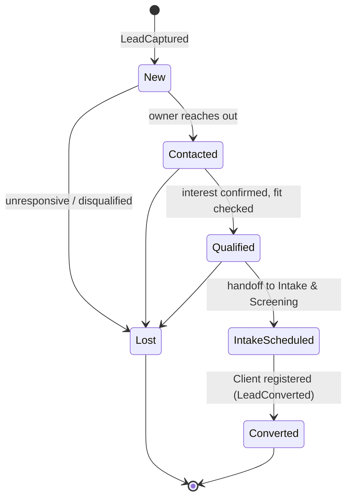
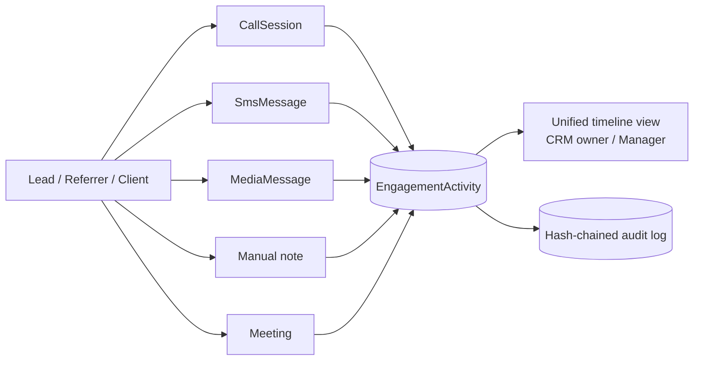
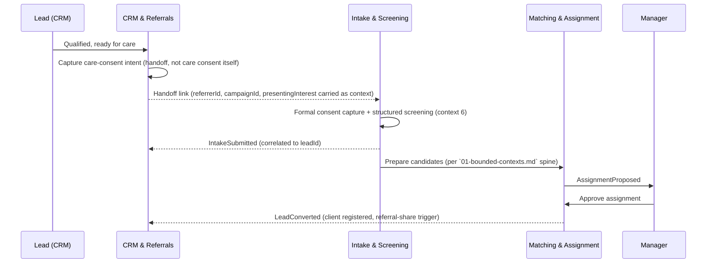
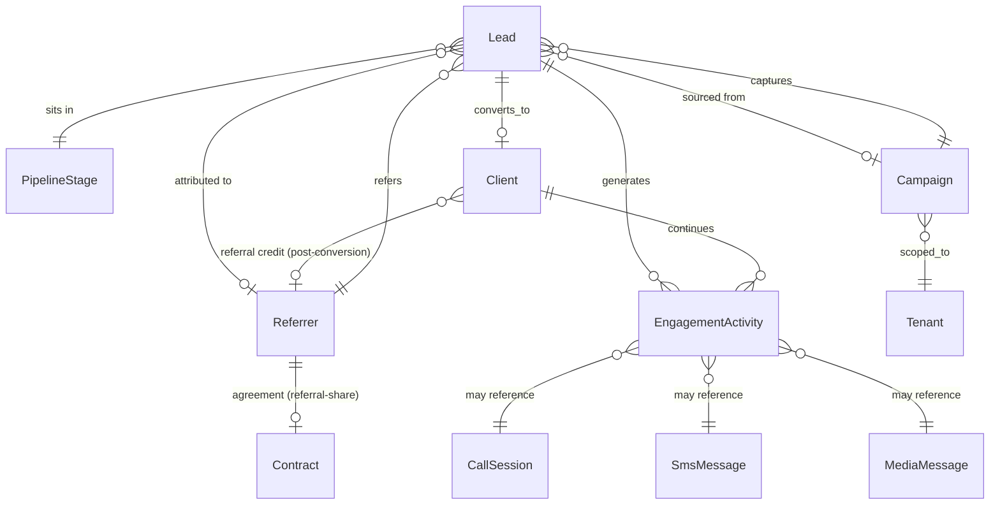

# 16 — CRM & Referrals

> **VPSY OS** — Clinical Psychology Operating System
> **Core principle:** *AI assists, licensed clinicians decide. Every clinical action produces an audit event.*

This document specifies **context 29, CRM & Referrals** (`docs/technical/01-bounded-contexts.md`):
lead capture and pipeline, the referrer registry (doctors, schools, employers, courts,
institutions), campaigns, the unified engagement timeline, and the governed handoff from
"prospect" to "consented, triaged clinical case." It is the acquisition-side counterpart to
Intake & Screening (context 6) and shares its communications infrastructure with
`15-communications-and-telephony.md`. Data shapes are catalogued in `02-data-model.md` Group I;
the business framing lives in `business/01-product-overview.md` (Layer 1) and
`business/05-monetization-and-contracts.md` (referral-share economics).

## 1. Scope and the marketing/care boundary

CRM & Referrals owns everything **before** a person is a governed clinical case: how they were
found or referred, how they were nurtured, and the moment they convert. It deliberately stops at
the conversion boundary — once a `Lead` becomes a `Client`, ownership of that person's care passes
to Intake & Screening (context 6) and everything downstream, and CRM & Referrals reverts to
tracking *engagement*, not *clinical content*.

- **Core, not Generic** (`01-bounded-contexts.md` §Catalogue) — the referral network and
  attributed acquisition pipeline are a structural moat (`business/00-vision-and-category.md` §2.2:
  "referral network... create switching costs and demand liquidity"), not a commodity CRM.
- **CRM data is never clinical data.** A `Lead`'s `presentingInterest` is a marketing-qualified
  interest signal ("looking for anxiety support for a teenager"), not a clinical intake — it holds
  no diagnostic content, no risk score, and is never treated as a substitute for the Intake &
  Screening pipeline once a person actually enters care.
- **Two separate consents, always** (§7): marketing consent (may we contact you about services?)
  and care consent (treatment, data processing, telehealth, recording) are distinct, independently
  revocable objects. A person can be a fully consented CRM lead with zero care consent, and vice
  versa.
- **Attribution feeds real money.** A `Referrer`'s attribution on a converted `Lead` can trigger
  `RevenueShareRule.referralSharePct` (`02-data-model.md` Group G) — so identity, dedupe, and
  attribution integrity in this context are a financial-integrity concern, not just a marketing
  one.

## 2. Lead lifecycle and pipeline stages

A `Lead` (`02-data-model.md` §I) is a prospective client before registration: `source`
(`WEB|REFERRAL|CAMPAIGN|INSTITUTION`), `contact` (JSON), `presentingInterest`, `pipelineStageId`,
`ownerId`, `status`. It moves through a **configurable funnel** of `PipelineStage` rows
(`order`, `name`, `isWon`, `isLost`) — tenant/clinic-network administrators define their own stage
names and order (e.g., `New → Contacted → Qualified → Intake Scheduled → Converted`, or a shorter
institutional variant), rather than a hardcoded funnel.



- Every stage transition is a domain event (`LeadStageChanged`) and an `EngagementActivity` entry
  — the pipeline is itself part of the unified timeline, not a separate silent state machine.
- `isWon` / `isLost` flags on `PipelineStage` let reporting (§9) compute conversion rate and
  time-in-stage without hardcoding stage names, since networks in different countries name their
  funnels differently.
- A **stalled-lead** rule (tenant-configured max days per stage) surfaces overdue leads to the
  owning role — this is an operational nudge, not a clinical escalation; it never touches Risk &
  Crisis (context 17).

## 3. Referrer registry

A `Referrer` (`02-data-model.md` §I) is an external referring entity: `type`
(`DOCTOR|SCHOOL|EMPLOYER|COURT|INSTITUTION|SELF`), `organizationName`, `contact` (JSON),
`agreementId?`. Referrers are the technical backbone of the business's "referral network" moat
(`business/01-product-overview.md` Layer 1 — "Referral pages... dedicated, trackable referral
portals for doctors, schools, companies (EAP), courts, and institutions").

### 3.1 Agreements and attribution

- Each `Referrer` may hold an `agreementId` referencing a `Contract` (context 5, Credentialing &
  Contracts) of type that encodes referral-share terms — a `RevenueShareRule.referralSharePct`
  (`02-data-model.md` Group G) — so the commercial terms of a referral relationship live in the
  same governed contract model as clinician compensation, not a side spreadsheet.
- Every `Lead` sourced via a referrer carries a `referrerId` (part of `Lead.contact`/attribution
  metadata) captured at first touch — via a branded referral portal link, a referral code, or an
  institutional intake channel — and that attribution is **immutable once set**: later touches
  cannot silently reassign a lead's referral credit, protecting both revenue-share integrity and
  auditability.
- `ReferralReceived` is emitted the moment a referrer-attributed `Lead` is captured; `LeadConverted`
  (§6) is the event that ultimately triggers referral-share computation downstream in Revenue
  Share / Payouts (context 22).
- Where legally required (§4 institutional constraints, e.g., court-ordered assessments or an
  EAP session cap), the `Referrer`'s agreement also encodes reporting-back obligations — a
  consented, structured report to the originating referrer (see `business/04-user-journeys.md`
  Journey 5) — distinct from, and governed independently of, revenue-share terms.

### 3.2 Referrer types and what they imply

| Type | Typical relationship | Consent/legal note |
|------|----------------------|---------------------|
| `DOCTOR` | Medical referral (PCP, psychiatrist) | May require referral-back clinical summary; FHIR-compatible referral resource (`03-tech-stack-and-decisions.md` ADR-004) |
| `SCHOOL` | Counselor/institution referring a minor | Guardian consent flow (Intake, context 6); referral-share may be legally restricted for minors' care in some jurisdictions |
| `EMPLOYER` | EAP program referring an employee | Session-cap / population-contract constraints (`Contract` type `INSTITUTIONAL`); aggregate-only reporting back to preserve employee privacy |
| `COURT` | Court-ordered assessment or treatment | Reporting-back scope is court-defined and narrow; referral-share on court referrals may be legally restricted or prohibited (see `business/08-risk-register.md` risk L5) |
| `INSTITUTION` | Government/NGO/health-system partner | Often population-level contracting; feeds National Analytics (context 28) in aggregate only |
| `SELF` | Self-referred (no attributed partner) | No referral-share; standard marketing/care consent flow |

## 4. Campaigns and channels

A `Campaign` (`02-data-model.md` §I) is an acquisition/engagement campaign: `channel`,
`audience`, `startsAt/endsAt`, `metrics` (JSON). Campaigns are the CRM's demand-generation lever
alongside organic referral flow:

- **Channels**: SEO/organic landing pages (Layer 1 specialty × location × condition pages),
  paid/social, email, and SMS (via the Communications Hub, `15` §4.1 "campaign SMS" template
  class) — all routed through the same provider-abstracted `SmsProvider`/email adapters so a
  campaign is channel-agnostic at the domain level.
- Campaign performance rolls up to Reports (context 24) as aggregate lead/conversion counts by
  campaign and channel — never raw PHI.
- Sending a campaign message to a lead **requires marketing consent** (§7) — a campaign can never
  reach someone who has not opted in, and a `STOP` reply (`15` §4.4) immediately suppresses that
  lead from every active and future campaign, logged as a consent-revocation event.
- `Campaign.metrics` (impressions, clicks, leads captured, cost-per-lead where applicable) feeds
  the CAC/LTV framing in `business/05-monetization-and-contracts.md` §"unit economics."

## 5. `EngagementActivity` — the unified timeline

Every touch with a `Lead`, `Referrer`, or (post-conversion) `Client` — call, SMS, email, media
message, manual note, or meeting — writes exactly one `EngagementActivity`
(`02-data-model.md` §I): `subjectType/Id`, `kind`
(`CALL|SMS|EMAIL|MEDIA_MESSAGE|NOTE|MEETING`), `direction` (`INBOUND|OUTBOUND`), `summary`,
`occurredAt`, `actorId`. This is the same entity described in `15-communications-and-telephony.md`
§7.1 — CRM & Referrals and Communications Hub **share one timeline model** so a Manager or CRM
owner sees a single chronological record of every interaction with a person, regardless of which
bounded context initiated it (a click-to-call from the cockpit, a campaign SMS, a manual "left a
voicemail" note).



`EngagementActivity` is **read-only projection + write-once record** — it is never edited after
the fact (a correction is a new note, not a rewritten summary), consistent with the append-only
posture of clinical facts elsewhere in the platform.

## 6. Conversion: Lead → Client, dedupe, and identity

### 6.1 Conversion

`LeadConverted` fires when a `Lead` completes registration and becomes a `Client` (Client
Registry, context 3). At that moment:

- The `Lead.id` is retained as a historical reference on the resulting `Client` (for attribution
  and reporting), but the `Client` record is the new source of clinical truth — CRM data does not
  leak into the clinical record beyond the attribution link and the non-clinical
  `presentingInterest` text (useful context for the Manager, never a substitute for the Intake &
  Screening (context 6) structured screen).
- `pipelineStageId` moves to a terminal `isWon` stage; the lead's `EngagementActivity` history
  remains attached and visible on the resulting client's unified timeline (§5), giving the Manager
  full context on how this person arrived without re-asking them.
- If the lead carried a `referrerId`, `LeadConverted` is the trigger event Revenue Share / Payouts
  (context 22) consumes to compute the referral-share disbursement (`business/05` §"referral-share
  disbursement is triggered by the attributed referral source captured at Stage A").

### 6.2 Dedupe and identity resolution

Because leads arrive from many channels (organic web, campaigns, multiple referrers, walk-in
self-referral), the same person can generate multiple `Lead` rows before converting.

- **Deterministic match first**: phone (E.164) + email are the primary dedupe keys, normalized at
  capture. An exact match on either merges into the existing `Lead` (updating `EngagementActivity`
  rather than creating a duplicate pipeline).
- **Fuzzy match, human-reviewed**: name + partial contact overlap surfaces a **suggested merge**
  to the CRM owner — merges are never automatic beyond the deterministic case, because merging the
  wrong two people would corrupt both attribution (revenue-share integrity) and, post-conversion,
  clinical identity.
- **Conversion-time re-check**: before a `Lead` converts to a `Client`, identity resolution
  re-checks against the existing `Client` registry (has this person been a client before, under a
  different lead?) to prevent duplicate client records — the same identity-integrity concern that
  protects the clinical registry from fragmentation.
- Every merge is an audited action (`LeadMerged`) with the surviving id, the merged-away id, and
  the actor who confirmed it.

## 7. Consent: marketing vs. care, kept separate

This is the most important invariant in this context, restated from §1:

| Consent scope | Governs | Owned by | Revocation effect |
|----------------|---------|----------|---------------------|
| **Marketing consent** | Campaign emails/SMS, newsletter, promotional outreach | CRM & Referrals | Immediate suppression from all campaigns (`STOP` handling, `15` §4.4); does **not** affect care-coordination contact |
| **Care consent** (`Consent` context, `02-data-model.md` §B) | Treatment, telehealth, recording, data processing, cross-border | Client Registry / Intake | Governed by the full versioned-consent lifecycle (`06-security-and-rbac.md` §6); revocation suspends care-related processing, not marketing |

A `Lead` can exist, be nurtured, and be counted in pipeline reporting with **zero** care consent —
consent for care is never requested or implied at the CRM stage; it is captured explicitly during
Intake & Screening (context 6) once the person is entering the clinical pipeline. This separation
is enforced at the ABAC layer: no CRM action can read or write a `Consent` (care) record, and no
Intake/clinical action can read or write marketing-consent state, beyond the shared, minimal
contact-identity fields needed for the handoff (§8).

## 8. CRM ↔ Intake ↔ Matching handoff



The handoff carries **non-clinical context only** — attribution (`referrerId`, `campaignId`) and
the lead's stated interest — into Intake's triage packet as background, never as a substitute for
the screening instruments and risk screen Intake performs independently. If a person arrives via
an institutional referrer with constraints (e.g., an EAP session cap, a court-ordered assessment
scope), those constraints ride along as structured metadata the Manager sees at assignment time
(`business/04-user-journeys.md` Journey 5).

## 9. Reporting hooks

CRM & Referrals feeds Reports (context 24) and, in aggregate, Executive/Government views, without
ever exposing clinical content:

- **Funnel/conversion reporting**: lead volume, stage conversion rates, time-in-stage, source/
  campaign/referrer attribution — all derivable from `PipelineStage` transitions and
  `EngagementActivity`, no clinical fields involved.
- **Referral-partner reporting**: volume and (where contracted and consented) outcome-aggregate
  reporting back to a `Referrer` — read from de-identified/aggregate projections, never a raw
  client-level export, consistent with the de-identification posture that governs Executive/
  Government views elsewhere (`06-security-and-rbac.md` §9).
- **CAC/LTV inputs**: `Campaign.metrics` + conversion counts feed the unit-economics model in
  `business/05-monetization-and-contracts.md`.

## 10. RBAC — who sees CRM vs. PHI

| Bounded context capability | Client | CRM Owner (Manager/Marketing role) | Psychologist | Manager | Finance | Executive |
|-----------------------------|:------:|:-----------------------------------:|:------------:|:-------:|:-------:|:---------:|
| Read/write `Lead`, `Campaign`, `PipelineStage` | — | RCU | — | R | — | Σ |
| Read/write `Referrer` + agreement | — | RCU | — | RU | R(referral-share) | Σ |
| Read `EngagementActivity` (pre-conversion) | — | R | — | R | — | Σ |
| Read `EngagementActivity` (post-conversion, on Client) | R(own) | R(meta only) | R(assigned) | R | R(billing-relevant) | Σ |
| Read `Consent` (care) | R(own) | — | RCU | — | — | — |
| Read `Consent` (marketing) | R(own) | RCU | — | R | — | — |
| Trigger `LeadConverted` handoff | — | C | — | — | — | — |
| View referral-share computation | — | R | — | R | RCUA | Σ |

This extends the RBAC matrix in `06-security-and-rbac.md` §4.3 with a CRM-specific role (a
Manager-scoped or dedicated Marketing/Growth role, `Admin Configuration`-assignable); the hard
line remains: **no CRM role gains PHI/clinical access through this context** — conversion is a
one-way, audited handoff, not a shared record.

## 11. Data model



| Entity | Key fields | Notes |
|--------|-----------|-------|
| `Lead` | `source`, `contact` (JSON), `presentingInterest`, `pipelineStageId`, `ownerId`, `status` | Converts into `Client`; non-clinical |
| `Referrer` | `type`, `organizationName`, `contact` (JSON), `agreementId?` | Feeds revenue share via `Contract`/`RevenueShareRule` |
| `Campaign` | `channel`, `audience`, `startsAt/endsAt`, `metrics` (JSON) | Multi-channel, including Communications Hub SMS |
| `PipelineStage` | `order`, `name`, `isWon`, `isLost` | Tenant-configurable funnel |
| `EngagementActivity` | `subjectType/Id`, `kind`, `direction`, `summary`, `occurredAt`, `actorId` | Shared with Communications Hub (`15` §7.1) |

## 12. Sample endpoint specs and event catalogue

### 12.1 Capture a lead

```http
POST /v1/leads
Idempotency-Key: 7a2c...-uuid
{
  "source": "REFERRAL",
  "referrerId": "ref_01H...",
  "contact": { "firstName": "J.", "phone": "+1555...", "email": "j@example.com" },
  "presentingInterest": "couples counseling"
}
```

```json
201 Created
{ "id": "lead_01HZ...", "pipelineStageId": "stage_new", "status": "active", "createdAt": "2026-07-05T09:00:00Z" }
```

### 12.2 Advance a lead's pipeline stage

```http
POST /v1/leads/lead_01HZ...:advance-stage
{ "toStageId": "stage_qualified", "note": "Confirmed fit, ready for intake handoff" }
```

### 12.3 Hand off a qualified lead to Intake

```http
POST /v1/leads/lead_01HZ...:handoff-to-intake
```

```json
200 OK
{ "intakeRequestDraftUrl": "/v1/intake-requests:from-lead?leadId=lead_01HZ..." }
```

### 12.4 Register a referrer agreement

```http
POST /v1/referrers/ref_01H....agreements
{ "contractId": "con_01H...", "referralSharePct": 8.0, "reportingBackScope": "aggregate_only" }
```

### 12.5 Event catalogue (subset)

`LeadCaptured`, `LeadStageChanged`, `LeadMerged`, `LeadConverted`, `ReferralReceived`,
`ReferrerAgreementActivated`, `CampaignLaunched`, `CampaignMetricsUpdated`. Each follows the
CloudEvents envelope in `04-api-design.md` §12; `LeadConverted` and `ReferralReceived` are the two
events Revenue Share / Payouts (context 22) subscribes to for referral-share computation.

## 13. Summary

CRM & Referrals turns "how did this person find us, and who gets credit" into a governed,
auditable pipeline rather than a spreadsheet bolted onto a marketing tool: a configurable
`PipelineStage` funnel carries a `Lead` from first touch to conversion; a `Referrer` registry with
attached `Contract`/`RevenueShareRule` agreements turns institutional trust (doctors, schools,
employers, courts) into correctly-attributed, auditable revenue share; `Campaign`s drive
acquisition across every channel, including the shared Communications Hub SMS infrastructure; and
one `EngagementActivity` timeline unifies every touch — call, text, email, async media, note —
regardless of which context originated it. The one invariant that protects both compliance and
trust: marketing consent and care consent never mix, and the handoff from Lead to Client is a
one-way, audited, non-clinical bridge into Intake & Screening, never a shortcut around it.
